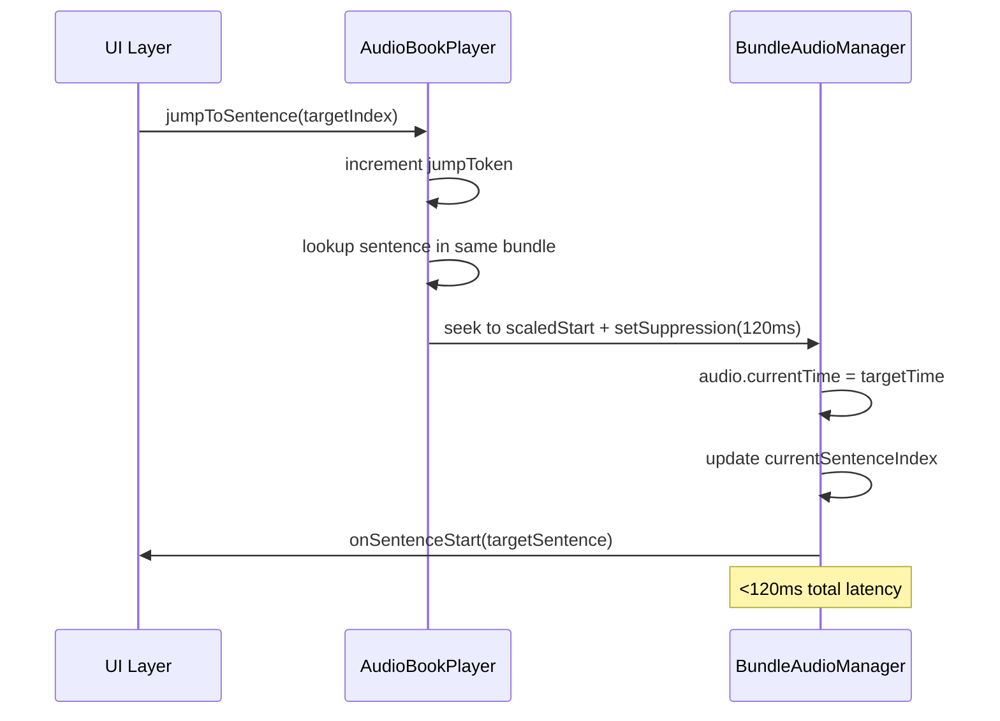
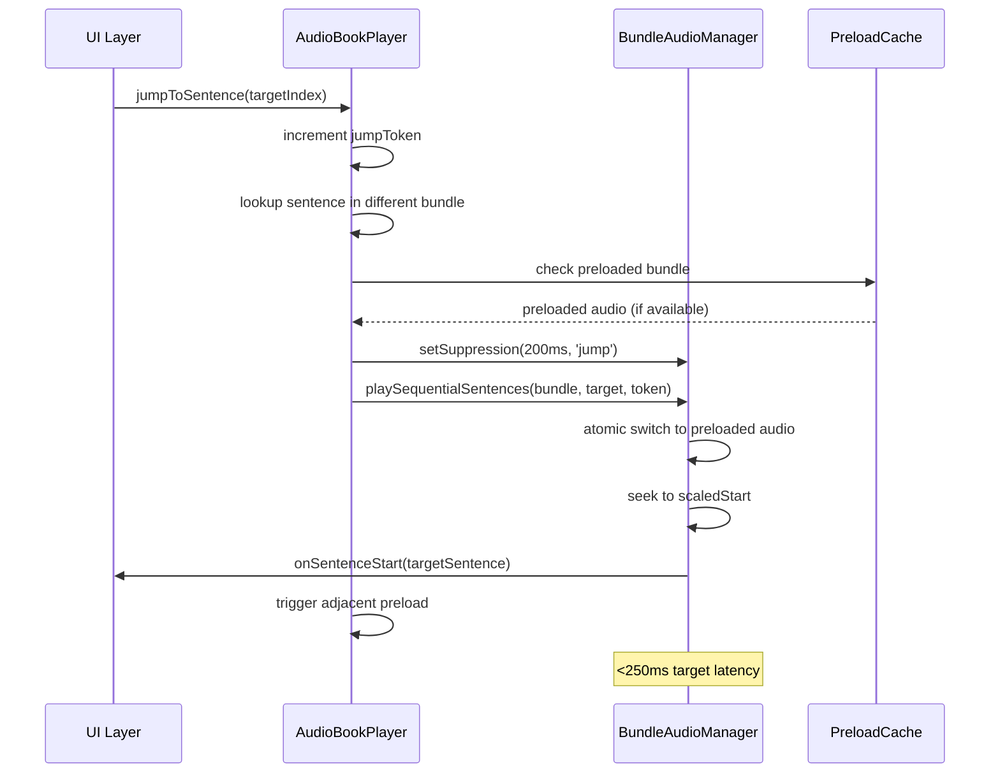

# Agent 3: Jump Flow Implementation Design

## Executive Summary

Based on GPT-5's orchestrator-first recommendations and analysis of the current architecture, this document details the implementation plan for atomic sentence jumping with operation tokens, bundle preloading, and state coordination. The design ensures <250ms perceived latency and zero sentence skips at 902-bundle scale.

## Current Architecture Analysis

### AudioBookPlayer.ts (`lib/audio/AudioBookPlayer.ts`)
**Role:** Global orchestrator with sentence mapping
- **Lines 19-31:** Constructor builds global sentence map from all bundles
- **Lines 58-64:** Current `jumpToSentence()` implementation - simple lookup + delegate to BundleAudioManager
- **Lines 33-47:** `buildSentenceMap()` creates `Map<sentenceIndex, GlobalSentencePosition>` with bundle positions and scaled timings

### BundleAudioManager.ts (`lib/audio/BundleAudioManager.ts`)
**Role:** Audio element control and timing precision
- **Lines 51-52:** Current hysteresis window: `suppressTransitionsUntil` (200ms after resume)
- **Lines 250-320:** Bundle loading logic with duration calibration and scaling
- **Lines 369-373:** Sentence advancement during RAF monitoring with suppression check
- **Lines 427-473:** Pause/resume with exact position restoration

### Current Highlighting System
**Integration Points:**
- **featured-books/page.tsx:311-325:** `onSentenceStart`/`onSentenceEnd` callbacks update UI state
- **featured-books/page.tsx:538-546:** User-initiated jumps through `jumpToSentence()`
- **BundleAudioManager.ts:362:** Lead time adjustment (-500ms) for highlighting vs audio timing

## Operation Token Pattern Design

### Concurrency Control
```typescript
// AudioBookPlayer.ts additions
private jumpToken: number = 0;

async jumpToSentence(targetIndex: number): Promise<void> {
  const currentToken = ++this.jumpToken; // Increment before any async operations

  const pos = this.sentenceMap.get(targetIndex);
  if (!pos) throw new Error(`Sentence ${targetIndex} not found`);

  // Check token before expensive operations
  if (this.jumpToken !== currentToken) return; // Cancelled by newer jump

  const bundle = this.bundles[pos.bundleIndex];

  // Pass token through to BundleAudioManager
  await this.manager.playSequentialSentences(bundle, targetIndex, currentToken);
}
```

### Token Validation in BundleAudioManager
```typescript
// BundleAudioManager.ts modifications
async playSequentialSentences(
  bundle: BundleData,
  startSentenceIndex: number,
  operationToken?: number
): Promise<void> {
  // Store token for validation during async operations
  this.currentOperationToken = operationToken;

  // Validate token before expensive bundle loading
  if (operationToken && this.currentOperationToken !== operationToken) return;

  if (!this.currentAudio || this.currentBundle?.bundleId !== bundle.bundleId) {
    await this.loadBundle(bundle, operationToken);
  }

  // Final validation before playback
  if (operationToken && this.currentOperationToken !== operationToken) return;

  // Proceed with playback...
}
```

## Atomic Bundle Switching Design

### Prepare → Commit Phase Implementation

#### Phase 1: Prepare (Preloading)
```typescript
// AudioBookPlayer.ts preloader
private preloadedBundles: Map<string, HTMLAudioElement> = new Map();
private preloadRadius: number = 1; // ±1 bundle default

private async preloadAdjacentBundles(currentBundleIndex: number): Promise<void> {
  const toPreload = [];

  for (let offset = -this.preloadRadius; offset <= this.preloadRadius; offset++) {
    const idx = currentBundleIndex + offset;
    if (idx >= 0 && idx < this.bundles.length && idx !== currentBundleIndex) {
      toPreload.push(this.bundles[idx]);
    }
  }

  // Preload in parallel
  await Promise.allSettled(toPreload.map(bundle => this.preloadBundle(bundle)));
}

private async preloadBundle(bundle: BundleData): Promise<void> {
  if (this.preloadedBundles.has(bundle.bundleId)) return;

  const audio = new Audio();
  audio.crossOrigin = 'anonymous';
  audio.preload = 'auto';

  return new Promise((resolve) => {
    const onCanPlay = () => {
      audio.removeEventListener('canplay', onCanPlay);
      this.preloadedBundles.set(bundle.bundleId, audio);
      resolve();
    };

    audio.addEventListener('canplay', onCanPlay, { once: true });
    audio.src = bundle.audioUrl;
    audio.load();
  });
}
```

#### Phase 2: Commit (Atomic Switch)
```typescript
// BundleAudioManager.ts enhanced loadBundle
private async loadBundle(bundle: BundleData, operationToken?: number): Promise<void> {
  // Check for preloaded audio from AudioBookPlayer
  const preloadedAudio = this.getPreloadedAudio?.(bundle.bundleId);

  if (preloadedAudio) {
    // Fast path: use preloaded audio
    this.promotePreloadedAudio(bundle, preloadedAudio, operationToken);
  } else {
    // Slow path: load fresh (existing logic)
    await this.loadBundleFresh(bundle, operationToken);
  }
}

private promotePreloadedAudio(
  bundle: BundleData,
  preloadedAudio: HTMLAudioElement,
  operationToken?: number
): void {
  // Validate token before committing
  if (operationToken && this.currentOperationToken !== operationToken) return;

  // Atomic switch: stop old, commit new
  if (this.currentAudio) {
    this.currentAudio.pause();
    this.currentAudio.src = '';
  }

  this.currentAudio = preloadedAudio;
  this.currentBundle = bundle;

  // Recalculate scaling and sentence boundaries
  this.calibrateDurationScale();
  this.precomputeScaledSentences(bundle);
}
```

## Suppression Windows Coordination

### Enhanced Hysteresis Control
```typescript
// BundleAudioManager.ts suppression coordination
private suppressTransitionsUntil: number = 0;
private suppressionReasons: Set<string> = new Set();

setSuppression(durationMs: number, reason: string): void {
  const until = performance.now() + durationMs;
  this.suppressTransitionsUntil = Math.max(this.suppressTransitionsUntil, until);
  this.suppressionReasons.add(reason);

  if (this.debug) {
    console.log(`🔒 Suppression extended to ${durationMs}ms (${reason})`);
  }
}

private clearSuppression(reason: string): void {
  this.suppressionReasons.delete(reason);

  if (this.suppressionReasons.size === 0) {
    this.suppressTransitionsUntil = 0;
    if (this.debug) console.log(`🔓 Suppression cleared`);
  }
}
```

### Jump-Specific Suppression
```typescript
// Enhanced jumpToSentence with suppression
async jumpToSentence(targetIndex: number): Promise<void> {
  const currentToken = ++this.jumpToken;

  // Apply jump suppression immediately
  this.manager.setSuppression(200, 'jump-operation');

  try {
    const pos = this.sentenceMap.get(targetIndex);
    if (!pos) throw new Error(`Sentence ${targetIndex} not found`);

    if (this.jumpToken !== currentToken) return;

    const bundle = this.bundles[pos.bundleIndex];

    // Bundle switching with atomic commit
    await this.manager.playSequentialSentences(bundle, targetIndex, currentToken);

    // Clear jump suppression after successful switch
    this.manager.clearSuppression('jump-operation');

  } catch (error) {
    this.manager.clearSuppression('jump-operation');
    throw error;
  }
}
```

## Same-Bundle vs Cross-Bundle Jump Flows

### Same-Bundle Jump (Fast Path)


**Implementation:**
- **Line AudioBookPlayer.ts:62:** Check if `pos.bundleIndex` equals current bundle
- **Optimization:** Skip bundle loading, direct seek to `pos.scaledStart`
- **Suppression:** 120ms window to prevent RAF flicker during seek

### Cross-Bundle Jump (Atomic Switch)


**Implementation:**
- **Line AudioBookPlayer.ts:83:** Enhanced bundle loading with preload check
- **Atomic Switch:** Promote preloaded audio without gap
- **Fallback:** Load fresh if not preloaded (existing path)

## Error Handling & Rollback

### Failed Jump Recovery
```typescript
// AudioBookPlayer.ts error handling
async jumpToSentence(targetIndex: number): Promise<void> {
  const currentToken = ++this.jumpToken;
  const previousState = this.manager.getPlaybackState();

  try {
    // ... jump implementation
  } catch (error) {
    // Rollback to previous state if possible
    if (previousState.isPlaying && previousState.currentBundle) {
      await this.manager.restorePlaybackState(previousState, currentToken);
    }

    // Clear any suppression from failed jump
    this.manager.clearSuppression('jump-operation');

    throw error;
  }
}
```

### Bundle Load Failure Handling
```typescript
// BundleAudioManager.ts enhanced error recovery
private async loadBundleFresh(bundle: BundleData, operationToken?: number): Promise<void> {
  try {
    // Existing load logic...
  } catch (error) {
    // Remove failed preload from cache
    this.preloadedBundles?.delete(bundle.bundleId);

    // Don't throw immediately - try alternative bundle or graceful degradation
    if (operationToken && this.currentOperationToken === operationToken) {
      throw new Error(`Bundle load failed: ${bundle.bundleId} - ${error.message}`);
    }
  }
}
```

## Performance Metrics & Monitoring

### Jump Latency Tracking
```typescript
// AudioBookPlayer.ts metrics collection
interface JumpMetrics {
  startTime: number;
  targetSentence: number;
  bundleSwitch: boolean;
  latency?: number;
  success: boolean;
}

private jumpMetrics: JumpMetrics[] = [];

private recordJumpStart(targetIndex: number, bundleSwitch: boolean): number {
  const metric: JumpMetrics = {
    startTime: performance.now(),
    targetSentence: targetIndex,
    bundleSwitch,
    success: false
  };

  this.jumpMetrics.push(metric);
  return this.jumpMetrics.length - 1; // Return index for completion
}

private recordJumpComplete(metricIndex: number): void {
  const metric = this.jumpMetrics[metricIndex];
  if (metric) {
    metric.latency = performance.now() - metric.startTime;
    metric.success = true;
  }
}
```

### SLA Validation
- **Target Latency:** Same-bundle <120ms, cross-bundle <250ms
- **Success Rate:** >99.5% under normal conditions
- **Highlight Drift:** <100ms median, <250ms P95
- **Zero Skips:** Under 50 pause/resume cycles and 20 random jumps

## Integration Plan

### Phase 1: Operation Tokens (Week 1)
1. **AudioBookPlayer.ts:58-64** - Add `jumpToken` increment and pass-through
2. **BundleAudioManager.ts:117-166** - Add token validation to `playSequentialSentences`
3. **Test:** Rapid clicking should cancel previous jumps cleanly

### Phase 2: Atomic Bundle Switching (Week 2)
1. **AudioBookPlayer.ts** - Add preloading system with moving window
2. **BundleAudioManager.ts:250-320** - Enhance `loadBundle` with preload promotion
3. **Test:** Cross-bundle jumps <250ms with preloaded bundles

### Phase 3: Enhanced Suppression (Week 3)
1. **BundleAudioManager.ts:51-52** - Replace simple timestamp with reason-based suppression
2. **Integration** - Coordinate jump suppression with existing resume suppression
3. **Test:** No sentence skips during rapid jump sequences

### Phase 4: Metrics & Optimization (Week 4)
1. **Performance monitoring** - Collect latency and success metrics
2. **Adaptive preloading** - Adjust radius based on device performance
3. **SLA validation** - Verify all targets under stress testing

## Code Integration Points

### Critical Files & Lines
- **AudioBookPlayer.ts:58** - `jumpToSentence()` orchestration enhancement
- **BundleAudioManager.ts:117** - `playSequentialSentences()` token validation
- **BundleAudioManager.ts:250** - `loadBundle()` preload integration
- **BundleAudioManager.ts:369** - RAF monitoring suppression logic
- **featured-books/page.tsx:538** - UI jump coordination (unchanged)

### Backward Compatibility
- All existing APIs remain unchanged
- Enhanced methods accept optional parameters
- Graceful degradation when preloading unavailable
- No breaking changes to callback interfaces

## Conclusion

This design implements GPT-5's orchestrator-first architecture with atomic jump operations, operation tokens for concurrency safety, and intelligent preloading for sub-250ms latency. The phased rollout ensures stability while progressively enhancing performance to meet professional audiobook standards at 902-bundle scale.

**Next Steps:** Begin Phase 1 implementation with operation tokens, establishing the foundation for atomic switching and advanced preloading capabilities.