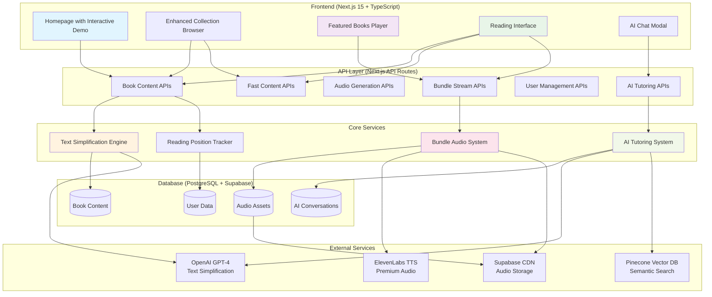
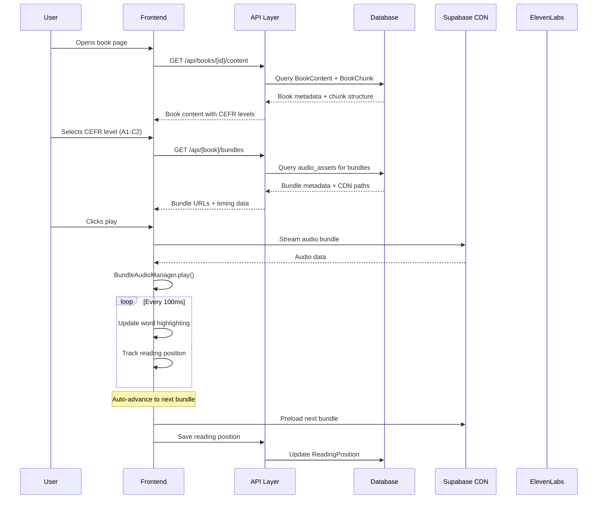
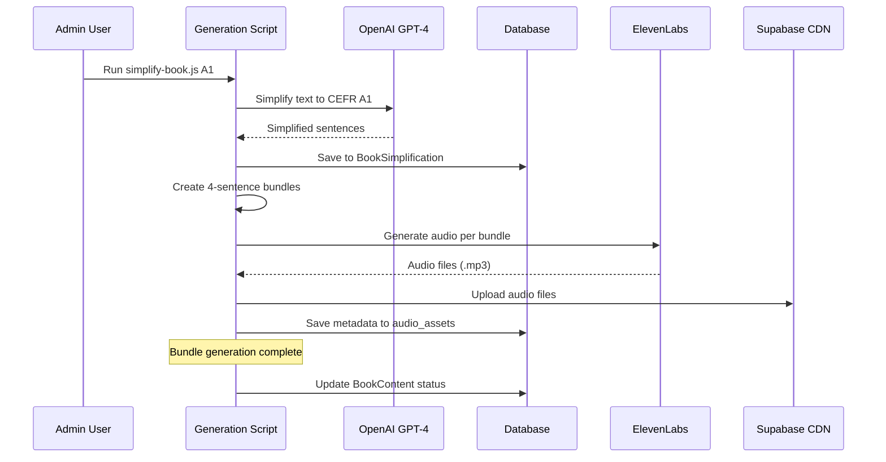
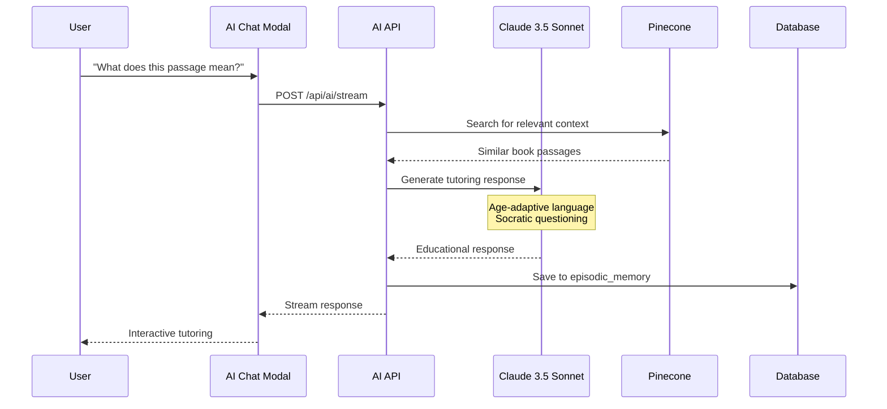
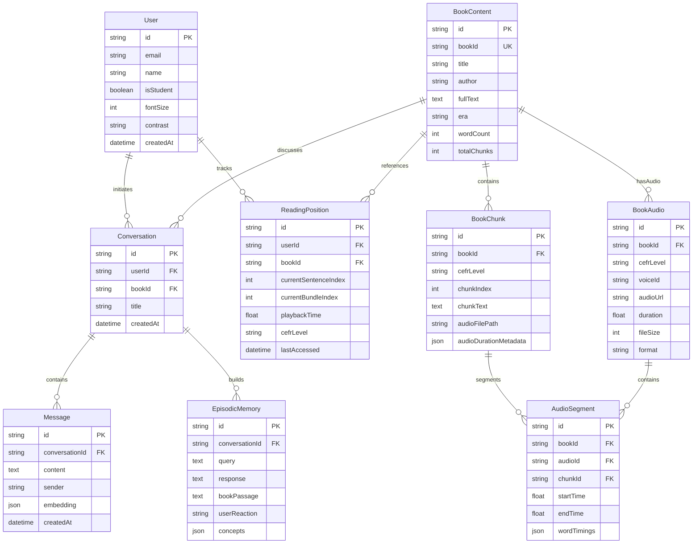
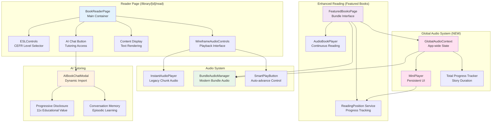

# 📚 BookBridge ESL - Architecture Overview

> **Quick Start Guide for New Developers**: Understanding how the entire BookBridge ESL platform works from start to finish

---

## 🎯 Purpose

This document provides new developers with a comprehensive 10-minute overview of BookBridge's architecture before diving into specific implementation files. BookBridge transforms classic literature into accessible ESL learning content through AI-powered text simplification, premium TTS audio generation, and a mobile-first reading experience.

**Target Audience**: New developers joining the project
**Reading Time**: ~10 minutes
**Focus**: Golden paths and core workflows, not edge cases

---

## 🏗️ System Overview



**Key Architecture Principles:**
- **Mobile-First**: Responsive design optimized for 2GB RAM devices and 3G networks (*PWA features temporarily disabled*)
- **Bundle Architecture**: 4-sentence audio bundles for seamless continuous reading
- **Dual Content Systems**: Enhanced books (bundle-based) + Traditional books (chunk-based)
- **AI-Powered**: GPT-4 for text simplification + Claude 3.5 Sonnet for tutoring

---

## 🔄 Core Flows

### 1. Reading Flow (Primary User Journey)



### 2. Text Simplification Flow (Content Generation)



### 3. AI Tutoring Flow (Educational Support)



---

## 🗄️ Data Model (Core Tables)



**Key Relationships:**
- **Users** track reading positions across multiple books
- **BookContent** contains chunked text at different CEFR levels with associated audio
- **BookChunk** stores text content with audio metadata for bundle playback
- **BookAudio** manages voice-specific audio files with duration and format info
- **AudioSegment** provides precise word-level timing data for synchronization
- **Conversations** build episodic memory for personalized tutoring

---

## 🧩 Component Architecture (Reader Screen)



**Component Responsibilities:**
- **BookReaderPage**: Legacy reading interface for 76K+ books
- **FeaturedBooksPage**: Premium audiobook experience for enhanced books
- **BundleAudioManager**: Seamless audio transitions with word-level sync
- **AIBookChatModal**: Socratic tutoring with conversation memory
- **GlobalAudioContext**: App-wide audio state with single BundleAudioManager instance
- **MiniPlayer**: Spotify-like persistent player that follows user across routes

---

## 📱 Key Screen Wireframes

### 1. Enhanced Collection Page (`/enhanced-collection`) - Neo-Classic Academic Prestige Theme

```
┌─────────────────────────────────────┐
│ BookBridge (Playfair Display)   [≡] │ ← [1] Navigation with theme switcher
│ [Light] [Dark] [Sepia]              │ ← [2] Three theme variations
├─────────────────────────────────────┤
│ Enhanced Collection                 │ ← [3] Playfair Display heading
│ Premium simplified reading          │ ← [4] Source Serif Pro subtitle
├─────────────────────────────────────┤
│ [🔍 Search enhanced books...    ] │ ← [5] Theme-aware search input
├─────────────────────────────────────┤
│ ┌─P&P─────────┐ ┌─EM──────────┐   │
│ │Bronze border │ │Bronze border │   │ ← [6] Book cards with Neo-Classic
│ │A1-C2 Levels │ │A1-B2 Levels │   │     bronze/gold borders
│ │[Ask AI][Read]│ │[Ask AI][Read]│   │ ← [7] Theme-aware buttons
│ └─────────────┘ └─────────────┘   │
│                                     │
│ ┌─GG──────────┐ ┌─SH──────────┐   │ ← [8] Academic card styling with
│ │Oxford Blue   │ │Parchment bg │   │     CSS variables (--accent-primary)
│ │A2 Level     │ │A1 Level     │   │
│ │[Ask AI][Read]│ │[Ask AI][Read]│   │
│ └─────────────┘ └─────────────┘   │
│                                     │
│ [Load More Books...] (Theme colors) │ ← [9] Theme-aware pagination
└─────────────────────────────────────┘

Color Scheme (Light Theme):
• Background: #F4F1EB (Warm parchment)
• Text: #002147 (Oxford blue)
• Borders: #CD7F32 (Bronze accents)
• Cards: #FFFFFF with bronze borders
```

### 2. Reading Interface (`/featured-books`) - Neo-Classic Bundle Audio System

```
┌─────────────────────────────────────┐
│ [←] Pride & Prejudice Ch 3/12  [Aa] │ ← [1] Theme-aware circular buttons
│ [Light] [Dark] [Sepia]              │ ← [2] Theme switcher (Bronze/Gold)
├─────────────────────────────────────┤
│ Chapter III: First Impressions      │ ← [3] Playfair Display chapter title
│ (Playfair Display, Oxford Blue)     │
├─────────────────────────────────────┤
│                                     │
│ Elizabeth could not but smile at    │ ← [4] Source Serif Pro body text
│ ████████████████████████████████    │     with Neo-Classic highlighting:
│ such a beginning. Mr. Bennet had    │     • Light: Brown/bronze (#8B4513)
│ always promised her that he would   │     • Dark: Gray/blue (#5A6B7D)
│ never speak to any of the family... │     • Sepia: Light gray (#9E9E9E)
│                                     │ ← [5] Left border accent for academic look
│ ████████████░░░░░░░░░░░░░░░░        │ ← [6] Theme-aware progress bar
│                                     │
├─────────────────────────────────────┤
│ [1.0x] [⏮] [⏸/▶] [⏭] [Ch] [Voice] │ ← [7] Neo-Classic audio controls:
│                                     │     • Bronze/gold gradients
│                                     │     • Theme-aware borders
│                                     │     • Source Serif Pro labels
└─────────────────────────────────────┘

Typography System:
• Headings: Playfair Display, 800 weight
• Body: Source Serif Pro, 400 weight
• Controls: Source Serif Pro, 600 weight

Mobile Enhancements:
• Text size: 1.4em base, 1.5em highlighted (40-50% larger)
• Hamburger menu: Theme-aware across all variations
• Touch targets: 44px minimum for accessibility
```

### 3. AI Tutoring Modal - Neo-Classic Academic Style

```
┌─────────────────────────────────────┐
│ AI Reading Tutor                [✕] │ ← [1] Playfair Display header
│ (Playfair Display, Oxford Blue)     │     with theme-aware close button
├─────────────────────────────────────┤
│ 👤 What does "prejudice" mean?      │ ← [2] User question in Source Serif Pro
│    (Source Serif Pro, Rich Brown)   │
│                                     │
│ 🤖 Great question! Let me help you  │ ← [3] AI response with progressive
│    understand "prejudice"...        │     disclosure, theme-aware colors
│    (Source Serif Pro, Text Primary) │
│                                     │
│    [Show More Detail] [Examples]    │ ← [4] Bronze/gold themed buttons
│    (Bronze borders, Theme accents)  │     with Neo-Classic styling
│                                     │
│ ┌─ Related Context ──────────────────┐ │
│ │ "First impressions" in Chapter 1  │ │ ← [5] Theme-aware context box:
│ │ connects to prejudice theme...    │ │     • Background: var(--bg-secondary)
│ │ (Bronze border, Academic styling) │ │     • Border: var(--accent-primary)
│ └────────────────────────────────────┘ │
│                                     │
│ [Type your question...]             │ ← [6] Theme-styled input field
│ (Parchment background, Bronze focus) │     with academic appearance
└─────────────────────────────────────┘

Theme Integration:
• Light: Parchment bg (#F4F1EB), Oxford blue text (#002147)
• Dark: Dark navy (#1A1611), Gold accents (#FFD700)
• Sepia: Warm sepia (#F5E6D3), Sepia accents (#8D4004)
• Consistent with ThemeContext.tsx implementation
```

---

## ⚓ Code Anchors

### Core Reading Experience
- **Main Reading Page**: `app/library/[id]/read/page.tsx:29-100` - Legacy chunk-based reader
- **Featured Books**: `app/featured-books/page.tsx:40-120` - Modern bundle-based player
- **Bundle Audio Manager**: `lib/audio/BundleAudioManager.ts:40-300` - Seamless audio system

### Text Processing Pipeline
- **Database Schema**: `prisma/schema.prisma:48-300` - Complete data model
- **Book Simplification**: `prisma/schema.prisma:216-235` - CEFR simplification storage
- **Audio Metadata**: `prisma/schema.prisma:273-289` - Bundle timing cache

### API Layer
- **Book Content API**: `app/api/books/[id]/content/route.ts` - Legacy book data
- **Fast Content API**: `app/api/books/[id]/content-fast/route.ts` - Optimized book loading
- **Bundle APIs**: Multiple per-book routes (`app/api/*/bundles/route.ts`) + Generic (`app/api/featured-books/bundles/route.ts`)
- **AI Tutoring**: `app/api/ai/stream/route.ts` - Educational chat system

### Content Generation Scripts
- **Master Prevention**: `docs/MASTER_MISTAKES_PREVENTION.md:1-100` - Audiobook generation guidelines
- **Pipeline Guide**: `docs/audiobook-pipeline-complete.md:1-200` - Complete implementation process
- **Book Processor**: `lib/precompute/book-processor.ts` - Background simplification

### Neo-Classic Theme System
- **Theme Context**: `contexts/ThemeContext.tsx` - Light/Dark/Sepia theme management with localStorage persistence
- **Theme Switcher**: `components/theme/ThemeSwitcher.tsx` - Interactive theme selection component
- **CSS Variables**: `app/globals.css` - Complete CSS custom properties system (--bg-primary, --text-accent, etc.)
- **Typography**: Google Fonts integration (Playfair Display + Source Serif Pro)

### Mobile & Performance
- **PWA Configuration**: `public/manifest.json` - Progressive Web App manifest (*Note: PWA features intentionally disabled pending safer re-implementation*)
- **Mobile Hooks**: `hooks/useIsMobile.ts` - Responsive design utilities
- **Reading Position**: `lib/services/reading-position.ts` - Cross-session continuity
- **Mobile Optimizations**: Enhanced text readability (40-50% larger fonts), theme-aware hamburger menu

### Global Audio System (NEW - Feature 2 ✅)
- **Global Audio Context**: `contexts/GlobalAudioContext.tsx` - App-wide audio state management with single BundleAudioManager instance
- **Mini Player**: `components/audio/MiniPlayer.tsx` - Spotify-like persistent mini player with total story progress
- **Total Progress Tracking**: Calculates position across all bundles for complete story progress visualization
- **Auto-Save**: Saves reading position every 5 seconds while playing, syncs to database
- **Documentation**: `docs/implementation/GLOBAL_MINI_PLAYER_IMPLEMENTATION.md` - Complete implementation guide

---

## 🔄 Update Rules

**When to Update This Document:**

1. **Major Architecture Changes** (High Priority)
   - New data models or significant schema changes
   - New external service integrations
   - Core flow modifications (reading, audio, AI)

2. **Component Restructuring** (Medium Priority)
   - New pages or major component refactoring
   - API endpoint reorganization
   - Bundle architecture enhancements

3. **Feature Additions** (Low Priority)
   - New user-facing features
   - Additional CEFR levels or languages
   - Performance optimizations

**Update Process:**
1. Update relevant Mermaid diagrams first
2. Refresh code anchors with current line numbers
3. Add new components to wireframes if UI changes
4. Test all diagram rendering in GitHub/docs viewer
5. Update reading time estimate if content significantly changes

**Maintenance Schedule:**
- **Monthly**: Verify code anchors are accurate
- **Quarterly**: Review architecture alignment with actual implementation
- **Major Releases**: Full diagram and content review

---

## 📈 Next Steps for New Developers

1. **Start Here**: Read this overview (✅ Complete)
2. **Explore Codebase**: Use code anchors to navigate to key files
3. **Run Locally**: Follow README.md setup instructions
4. **Understand Data**: Query database using Prisma Studio
5. **Try Features**: Test reading experience with enhanced books
6. **Read Documentation**: Deep-dive into implementation guides

**Key Files to Read Next:**
- `/docs/implementation/CODEBASE_OVERVIEW.md` - Detailed file descriptions
- `/docs/audiobook-pipeline-complete.md` - Content generation process
- `/docs/MASTER_MISTAKES_PREVENTION.md` - Critical implementation guidelines

---

*Last Updated: January 2025 | Next Review: April 2025*