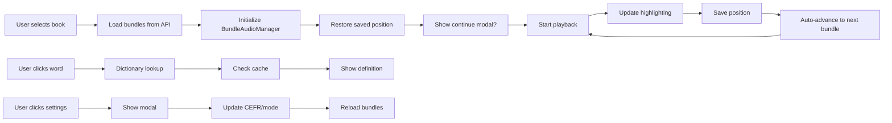
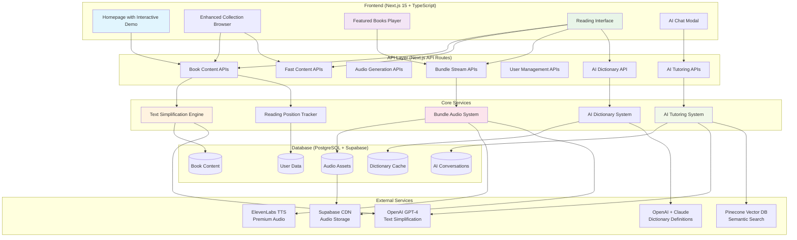
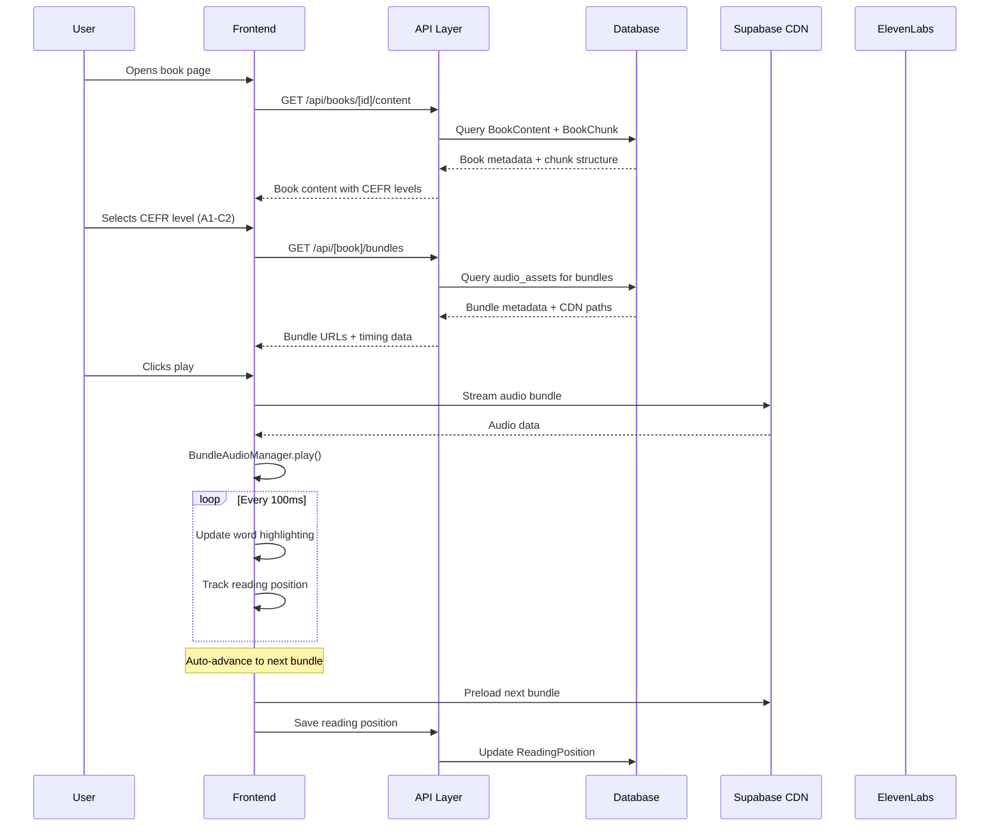
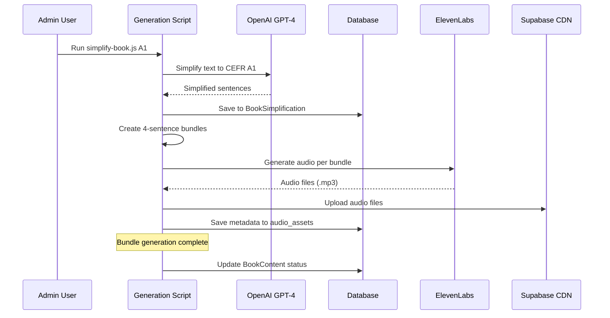
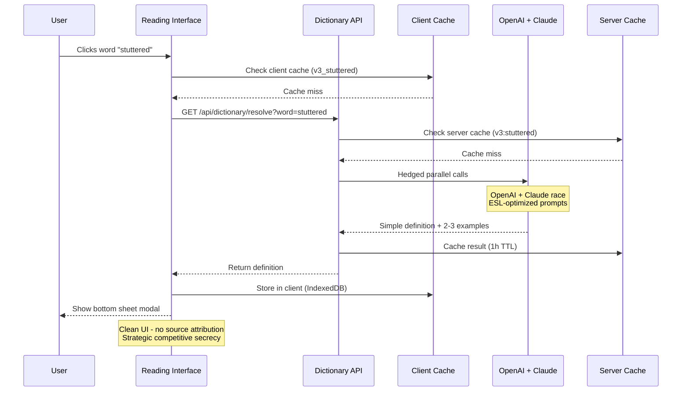
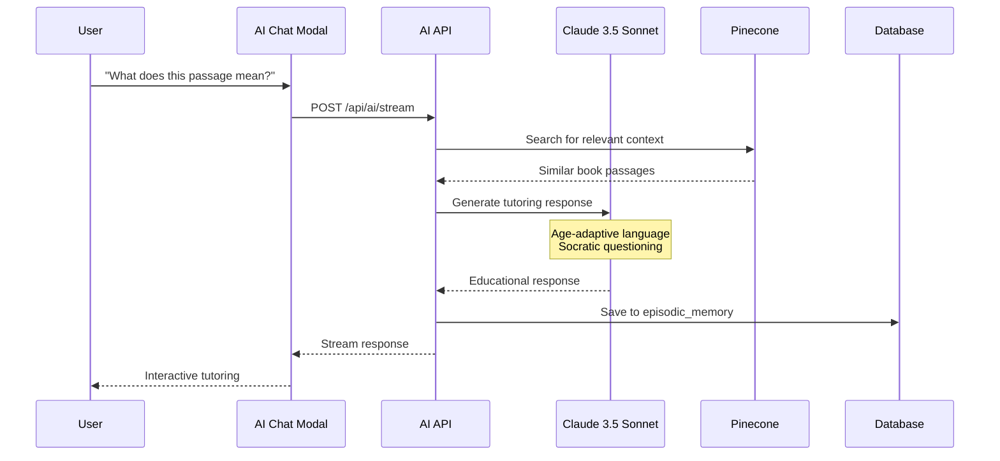
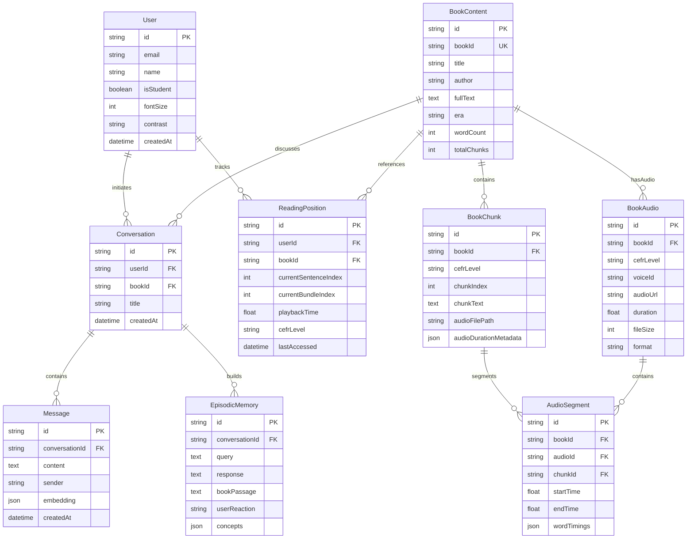
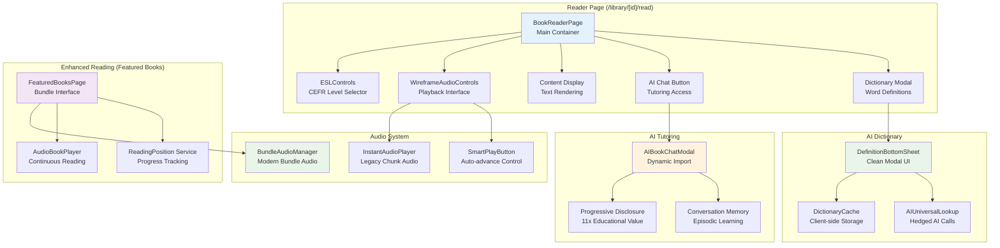

# 📚 BookBridge ESL - Architecture Overview

> **Quick Start Guide for New Developers**: Understanding how the entire BookBridge ESL platform works from start to finish

---

## 🎯 Purpose

This document provides new developers with a comprehensive 10-minute overview of BookBridge's architecture before diving into specific implementation files. BookBridge transforms classic literature into accessible ESL learning content through AI-powered text simplification, premium TTS audio generation, and a mobile-first reading experience.

**Target Audience**: New developers joining the project
**Reading Time**: ~10 minutes
**Focus**: Golden paths and core workflows, not edge cases

---

## ⚡ CRITICAL: Two Reading Systems (Read This First!)

BookBridge has **TWO DISTINCT reading systems**. Understanding which is which prevents costly implementation mistakes:

### 🎯 PRIMARY SYSTEM: Featured Books (Bundle-Based Audiobooks)
**Location**: `/featured-books/page.tsx`
**Purpose**: Premium audiobook experience with synchronized audio + text
**Architecture**: Bundle-based (4 sentences per bundle)
**Audio**: BundleAudioManager with word-level sync
**Data**: Solution 1 (measured durations + cached metadata in `audioDurationMetadata`)
**Technology**: ElevenLabs TTS + eleven_monolingual_v1 model
**Performance**: 2-3 second loads (cached metadata)
**User Experience**: Netflix/Speechify-level quality

**Key Components:**
- `BundleAudioManager.ts` - Seamless audio playback
- `AudioBookPlayer` - Continuous reading
- `ReadingPosition` service - Sentence-level position tracking
- `/api/featured-books/bundles/route.ts` - Bundle API endpoints

**When to Use This System:**
- ✅ Implementing new audiobook features
- ✅ Adding reading position memory
- ✅ Working with audio synchronization
- ✅ Building premium ESL learning experiences

### 📚 LEGACY SYSTEM: Library Reader (Chunk-Based Text)
**Location**: `/library/[id]/read/page.tsx`
**Purpose**: Text-only reader for 76K+ classic books (no audio)
**Architecture**: Chunk-based pagination (1500 characters per chunk)
**Audio**: None
**Data**: BookChunk records without audio metadata
**Technology**: Text simplification only
**Performance**: Instant (no audio to load)
**User Experience**: Basic reading with CEFR level switching

**Key Components:**
- `ESLControls` - CEFR level selector
- localStorage - Simple position tracking
- Text simplification cache

**When to Use This System:**
- ⚠️ Rarely - this is maintained for backward compatibility only
- ⚠️ Text-only features without audio requirements

### 🚨 Common Mistake to Avoid
**DON'T** implement audio features in `/library/[id]/read/page.tsx` (legacy chunk system)
**DO** implement audio features in `/featured-books/page.tsx` (modern bundle system)

The bundle-based system is the **PRIMARY** focus for all new feature development.

---

## 📱 Featured Books Page - Deep Dive (Most Critical Page)

**Location**: `/app/featured-books/page.tsx`
**Purpose**: Premium audiobook reading experience - the flagship feature of BookBridge
**Complexity**: 35+ integrated features, 2,500+ lines of code
**State Management**: 20+ useState hooks managing audio, UI, position, dictionary, AI chat

### UI Layout & Controls

```
┌─────────────────────────────────────────────────────────────┐
│ BookBridge    Home  Enhanced  Simplified  Browse   Premium  │ ← Navigation
│                     Books     Books       All      $5.99    │
│              [L] [D] [S] [F]  ← Theme switcher (4 themes)   │
├─────────────────────────────────────────────────────────────┤
│  [←]                                              [Aa]      │ ← Back + Settings
│                                                              │
│                    The Necklace                              │ ← Book title
│                 by Guy de Maupassant                         │
│                                                              │
│              Chapter 1: The Invitation                       │ ← Chapter header
│                                                              │
│  She is a pretty girl from a family of clerks.              │ ← Text content
│  It feels like fate's mistake. She has no money...          │   with real-time
│                                                              │   highlighting
│  [📖 Dictionary tooltip: "Press words for dictionary"]      │ ← Long-press words
│                                                              │
├─────────────────────────────────────────────────────────────┤
│ Mobile Bottom Bar:                                          │
│ ━━━━━━━━━━━━━━━━━━━━━━━━━ 45% ━━━━━━━━━━━━━━━━━━━━━        │ ← Progress bar
│ 1:23        Sentence 8/20 • Chapter 1 of 5        3:45      │ ← Time + Position
│                                                              │
│   [1x]        [⏸]        [📖]      [🎙️]                    │ ← Audio controls
│   Speed     Play/Pause   Chapter   Voice                    │
│                                                              │
│ Desktop Floating Bar (centered bottom):                     │
│ ╔═══════════════════════════════════════════╗              │
│ ║  [1x]  [⏮]  [⏸/▶]  [⏭]  [📖]  [🎙️]  ║              │
│ ╚═══════════════════════════════════════════╝              │
└─────────────────────────────────────────────────────────────┘
```

### Feature Categories (35+ Features)

#### **1. Core Reading System** (`lines 1050-1400`)
- ✅ Bundle-based audiobook with 4-sentence bundles
- ✅ Real-time word-level text highlighting during playback
- ✅ Chapter headers displayed within text flow
- ✅ Auto-scroll following audio (with pause capability)
- ✅ Seamless bundle transitions (no gaps between audio)
- ✅ Book selection grid with gradient covers
- ✅ Back button to return to book selection

**Code Anchors:**
- Bundle loading: `featured-books/page.tsx:1050-1150`
- Audio initialization: `featured-books/page.tsx:1070-1097`
- Highlighting logic: Uses BundleAudioManager callbacks

#### **2. Audio Playback Controls** (`lines 2330-2475`)
- ✅ Play/Pause (large center button)
- ✅ Speed control (0.8x, 0.9x, 1.0x, 1.1x, 1.2x, 1.5x)
- ✅ Chapter navigation (📖 button → modal)
- ✅ Voice selector UI (🎙️ button)
- ✅ Progress bar with visual feedback
- ✅ Time display (current / total)
- ✅ Sentence counter ("Sentence X/Y • Chapter N of M")
- ✅ Responsive layouts (mobile bottom bar, desktop floating)

**Code Anchors:**
- Mobile controls: `featured-books/page.tsx:2332-2410`
- Desktop controls: `featured-books/page.tsx:2412-2475`
- Speed cycling: `cycleSpeed()` function
- Play/pause handlers: `handlePlaySequential()`, `handlePause()`, `handleResume()`

#### **3. Settings Modal** (`lines 2095-2288`)
- ✅ CEFR level selector (A1, A2, B1, B2, C1, C2)
- ✅ Content mode toggle (Simplified ↔ Original)
- ✅ Text size adjustment (Aa button)
- ✅ Settings persist across sessions
- ✅ Modal with Neo-Classic theme styling

**Code Anchors:**
- Settings modal UI: `featured-books/page.tsx:2095-2288`
- State: `cefrLevel`, `contentMode`, `showSettingsModal`

#### **4. Neo-Classic Theme System** (4 themes)
- ✅ Light theme (L button) - Parchment bg, Oxford blue text
- ✅ Dark theme (D button) - Dark navy, gold accents
- ✅ Sepia theme (S button) - Warm sepia, brown accents
- ✅ Focus theme (F button) - Fourth variation
- ✅ CSS variables for all colors (--bg-primary, --text-accent, etc.)
- ✅ Persistent theme selection (localStorage)
- ✅ Theme switcher in top-right corner

**Code Anchors:**
- Theme context: `contexts/ThemeContext.tsx`
- Theme switcher: `components/theme/ThemeSwitcher.tsx`
- CSS variables: `app/globals.css`

#### **5. AI Dictionary System** (`lines 1289-1330, 2478-2496`)
- ✅ Long-press word lookup (mobile touch interaction)
- ✅ Click word lookup (desktop)
- ✅ Bottom sheet modal with clean ESL-optimized definitions
- ✅ Client-side cache (IndexedDB + memory) for instant lookups
- ✅ Hedged AI calls (OpenAI + Claude in parallel)
- ✅ Strategic design (no source attribution for competitive secrecy)
- ✅ Debug indicator showing selected word
- ✅ Performance tracking (cache hit rate, response times)

**Code Anchors:**
- Dictionary interaction: `featured-books/page.tsx:1289-1330`
- Bottom sheet: `components/dictionary/DefinitionBottomSheet.tsx`
- Cache system: `lib/dictionary/DictionaryCache.ts`
- AI lookup: `lib/dictionary/AIUniversalLookup.ts`
- Hook: `useDictionaryInteraction()` from `hooks/useDictionaryInteraction.tsx`

#### **6. AI Chat Tutor** (`lines 1412-1430, 2498-2505`)
- ✅ Book-specific AI chat modal
- ✅ Socratic tutoring conversations
- ✅ Episodic memory system
- ✅ Context-aware responses about book content
- ✅ Progressive disclosure (11x educational value)
- ✅ Claude 3.5 Sonnet integration

**Code Anchors:**
- Modal trigger: `featured-books/page.tsx:1412-1430`
- Modal component: `lib/dynamic-imports.tsx` → `AIBookChatModal`
- API: `app/api/ai/stream/route.ts`

#### **7. Reading Position Memory** (`lines 1098-1140, 2290-2330`)
- ✅ Auto-save position during playback (sentence, chapter, bundle, time)
- ✅ Database + localStorage persistence
- ✅ Continue reading modal (shown if last read < 24 hours)
- ✅ Start over option
- ✅ Auto-scroll to saved position
- ✅ Restore all settings (CEFR, speed, mode)
- ⚠️ **BROKEN**: Requires manual book selection after page refresh

**Code Anchors:**
- Position restore: `featured-books/page.tsx:1098-1140`
- Continue modal: `featured-books/page.tsx:2290-2330`
- Service: `lib/services/reading-position.ts`
- Auto-save: Integrated in AudioBookPlayer callbacks

#### **8. Chapter Navigation** (`lines 640, 2395-2400`)
- ✅ Chapter picker modal
- ✅ Jump to specific chapter
- ✅ Current chapter highlighting
- ✅ Chapter progress display
- ✅ Chapter headers in text flow

**Code Anchors:**
- Chapter modal state: `showChapterModal` at line 639
- Modal trigger: `featured-books/page.tsx:2395-2400`
- Chapter logic: `getCurrentChapter()` function

#### **9. System Integration Features**
- ✅ Wake lock (prevents screen sleep during reading)
- ✅ Media session (system media controls)
- ✅ Mobile/desktop responsive layouts
- ✅ Auto-scroll with pause capability
- ✅ Keyboard shortcuts (potentially)
- ✅ Bundle preloading for seamless playback

**Code Anchors:**
- Wake lock: `useWakeLock()` hook
- Media session: `useMediaSession()` hook

---

## 🎯 State Management Architecture (Phase 1 Refactor - Jan 2025)

### Overview: AudioContext as Single Source of Truth

**Problem Solved (The "Dueling Loaders" Anti-Pattern):**
- Featured Books page and AudioContext both fetched book data independently
- Race conditions when both tried to load simultaneously
- State became inconsistent between page and context
- Global Mini Player feature failed because audio state was page-scoped (died on navigation)

**Solution: Single Source of Truth Pattern**
- AudioContext is now the SOLE owner of all book/audio state
- Page only reads state and dispatches actions (no fetching, no state mutations)
- Audio state is app-scoped (survives navigation between pages)
- Foundation laid for Global Mini Player feature

**Refactor Metrics:**
| Metric | Before | After | Change |
|--------|--------|-------|--------|
| Lines of Code | 2,228 | 1,814 | **-414 lines (-18.6%)** |
| State Variables | 12 local | 0 local | All moved to context |
| Data Fetch Locations | 2 (page + context) | 1 (context only) | -50% |
| Race Conditions | Multiple | 0 | ✅ Fixed |
| Bundle Size | 23 kB | 21.7 kB | -1.3 kB (-5.6%) |

**Implementation:** Branch `refactor/featured-books-phase-1` (13 commits)
**Documentation:** `docs/architecture/AUDIO_CONTEXT_PATTERN.md`

---

### AudioContext State Machine

AudioContext uses a state machine to prevent invalid states (e.g., `loading=true` + `error!=null`):

```
State Transitions:
┌──────┐
│ idle │ Initial state, no book selected
└──┬───┘
   │ User selects book
   ↓
┌─────────┐
│ loading │ Fetching bundles, checking levels
└───┬─┬───┘
    │ │
    │ └──→ ❌ error   (fetch failed)
    │
    └────→ ✅ ready   (bundles loaded)
           └──┬───┘
              │ User switches level
              ↓
           loading (reload bundles)
```

**Valid Transitions:**
- `idle` → `loading` (user selects book)
- `loading` → `ready` (data loaded successfully)
- `loading` → `error` (fetch failed)
- `ready` → `loading` (user changes level/mode)
- `error` → `loading` (user retries)

**Benefits:**
- ✅ Invalid states impossible (cannot be loading + error simultaneously)
- ✅ Clear transition tracking in telemetry
- ✅ Easier debugging (state history is explicit)

---

### Data Flow: Book Selection & Audio Playback

```
User Actions → AudioContext (SSoT) → Page Rendering
────────────────────────────────────────────────────

┌─────────────────────────────────────────────────────────┐
│ 1. USER SELECTS BOOK                                    │
└─────────────────────────────────────────────────────────┘
   │
   ├─→ Page calls: audioContext.selectBook(book, level)
   │
   └─→ AudioContext:
       ├─ Cleans up previous audio (pause, destroy)
       ├─ Sets selectedBook, cefrLevel
       ├─ Transitions: idle → loading
       ├─ Generates requestId (race condition guard)
       ├─ Fetches /api/featured-books/bundles
       ├─ Checks available levels (parallel)
       ├─ Loads saved reading position (atomic restore)
       │  └─ Sets: currentSentenceIndex, currentChapter, playbackSpeed
       ├─ Sets bundleData
       ├─ Transitions: loading → ready
       └─ Sets resumeInfo (for Continue Reading modal)

┌─────────────────────────────────────────────────────────┐
│ 2. PAGE RENDERS (Read-Only)                            │
└─────────────────────────────────────────────────────────┘
   │
   ├─→ const { selectedBook, bundleData, loadState } = useAudioContext()
   │
   ├─→ Early returns:
   │   ├─ if (!selectedBook) → show book grid
   │   ├─ if (loadState === 'loading') → show spinner
   │   ├─ if (loadState === 'error') → show error
   │   └─ if (loadState === 'ready' && bundleData) → render reader
   │
   └─→ useEffect: Initialize audio manager (page-local side effect only)
       ├─ BundleAudioManager.init(bundleData)
       ├─ Scroll to saved position (if resumeInfo exists)
       └─ FORBIDDEN: No fetching, no setBundleData(), no clearing state

┌─────────────────────────────────────────────────────────┐
│ 3. USER PLAYS AUDIO                                     │
└─────────────────────────────────────────────────────────┘
   │
   ├─→ Page calls: audioContext.play(sentenceIndex?)
   │
   └─→ AudioContext:
       ├─ Sets isPlaying = true
       ├─ Updates currentSentenceIndex
       └─ (Future: Triggers BundleAudioManager.play())

┌─────────────────────────────────────────────────────────┐
│ 4. USER SWITCHES LEVEL                                  │
└─────────────────────────────────────────────────────────┘
   │
   ├─→ Page calls: audioContext.switchLevel('B1')
   │
   └─→ AudioContext:
       ├─ Validates level availability
       ├─ Pauses audio
       ├─ Cleans up audio lifecycle
       ├─ Persists level (localStorage + future DB)
       ├─ Transitions: ready → loading
       ├─ Fetches new bundles for B1 level
       ├─ Resets currentSentenceIndex to 0
       ├─ Transitions: loading → ready
       └─ Auto-switches contentMode to 'simplified'
```

**Key Pattern: Dispatch, Don't Mutate**
```typescript
// ❌ BAD (Old pattern - page mutates state)
const handleBookClick = (book) => {
  setSelectedBook(book);
  setLoading(true);
  fetchData(book);
};

// ✅ GOOD (New pattern - page dispatches to context)
const handleBookClick = async (book) => {
  await audioContext.selectBook(book);
  // Context handles all state updates
};
```

---

### Race Condition Prevention: RequestId Pattern

**Problem:** User rapidly clicks between books/levels → stale responses overwrite newer data

**Solution:** Generate unique requestId for each operation, guard all state updates

```typescript
// Inside AudioContext.loadBookData()

const loadBookData = async (bookId: string, level: CEFRLevel, mode: ContentMode) => {
  // 1. Generate unique request token
  const reqId = crypto.randomUUID();
  currentRequestIdRef.current = reqId;

  logTelemetry({ type: 'load_started', bookId, level, requestId: reqId });

  try {
    // 2. Check availability (async operation)
    const availability = await checkAvailableLevels(bookId, signal, reqId);

    // 3. GUARD: Only proceed if request is still current
    if (currentRequestIdRef.current !== reqId) {
      logTelemetry({
        type: 'stale_apply_prevented',
        requestId: reqId,
        reason: 'Request superseded after availability check'
      });
      return; // Abort silently - stale request
    }

    // 4. Fetch bundles (async operation)
    const response = await fetch(apiUrl, { signal: abortController.signal });
    const data = await response.json();

    // 5. GUARD: Only apply state if request is STILL current
    if (currentRequestIdRef.current !== reqId) {
      logTelemetry({
        type: 'stale_apply_prevented',
        requestId: reqId,
        reason: 'Request superseded before setting bundle data'
      });
      return; // Abort - newer request already started
    }

    // 6. Safe to apply state (request is current)
    if (currentRequestIdRef.current === reqId) {
      setBundleData(data);
      setLoadState('ready');
      logTelemetry({ type: 'load_completed', requestId: reqId });
    }

  } catch (err) {
    if (err.name === 'AbortError') {
      // Previous request was aborted - this is expected
      return;
    }
    setLoadState('error');
    setError(err.message);
  }
};
```

**Benefits:**
- ✅ Stale responses cannot overwrite newer data
- ✅ No spinner loops from race conditions
- ✅ Telemetry logs all prevented updates for debugging
- ✅ Multiple guards throughout async pipeline (defense in depth)

**Telemetry Output Example:**
```
🔄 [AudioContext] load_started { bookId: 'pride-prejudice', level: 'A1', requestId: 'abc123' }
🛑 [AudioContext] stale_apply_prevented { requestId: 'abc123', reason: 'Request superseded after availability check' }
🔄 [AudioContext] load_started { bookId: 'pride-prejudice', level: 'B1', requestId: 'xyz789' }
✅ [AudioContext] load_completed { requestId: 'xyz789', elapsed: 342 }
```

---

### Resume Logic: Atomic Position Restore

**Problem:** Page-scoped resume logic caused flashing (wrong content briefly shown during restore)

**Solution:** AudioContext atomically restores position during bundle load (Commit 5)

```typescript
// Inside AudioContext.loadBookData() - after bundles fetched

// Load saved reading position (atomically with requestId guard)
try {
  const savedPosition = await readingPositionService.loadPosition(bookId);

  // Guard: Only apply if request is still current
  if (currentRequestIdRef.current === reqId && savedPosition) {
    console.log(`🔄 Loading saved position: sentence ${savedPosition.currentSentenceIndex}`);

    // Atomically restore position (all at once - no flashing)
    setCurrentSentenceIndex(savedPosition.currentSentenceIndex);
    setCurrentChapter(savedPosition.currentChapter);

    if (savedPosition.playbackSpeed) {
      setPlaybackSpeed(savedPosition.playbackSpeed);
    }

    // Calculate hours since last read for UI
    const hoursSinceLastRead = savedPosition.lastAccessed
      ? (Date.now() - new Date(savedPosition.lastAccessed).getTime()) / (1000 * 60 * 60)
      : 999;

    // Set resume info for UI modal/toast
    setResumeInfo({
      sentenceIndex: savedPosition.currentSentenceIndex,
      chapter: savedPosition.currentChapter,
      totalSentences: data.totalSentences,
      playbackSpeed: savedPosition.playbackSpeed,
      hoursSinceLastRead
    });
  }
} catch (error) {
  console.warn('Failed to load saved position:', error);
  // Non-fatal - continue without resume
}
```

**Benefits:**
- ✅ Book + level + position + speed restored atomically (one operation)
- ✅ No flash of wrong content during navigation
- ✅ Resume state survives navigation (app-scoped, not page-scoped)
- ✅ RequestId guards prevent stale position restores
- ✅ Resume modal shows correct info immediately

**Page Changes (Commit 5):**
- ❌ Removed: 43 lines of page-level resume logic
- ✅ Added: Computed `showContinueReading = resumeInfo !== null && hoursSinceLastRead < 24`
- ✅ Added: `continueReading()` calls `contextClearResumeInfo()`
- ✅ Simplified: Scroll logic uses `context.currentSentenceIndex` directly

---

### AudioContext API Reference

**State (Read-Only for Pages):**
```typescript
interface AudioContextState {
  // Book Selection
  selectedBook: FeaturedBook | null;
  cefrLevel: CEFRLevel;
  contentMode: ContentMode;
  bundleData: RealBundleApiResponse | null;
  availableLevels: { [key: string]: boolean };
  currentBookAvailableLevels: string[];

  // Load State Machine
  loadState: 'idle' | 'loading' | 'ready' | 'error';
  loading: boolean; // Computed: loadState === 'loading'
  error: string | null;

  // Resume State
  resumeInfo: ResumeInfo | null; // For Continue Reading modal

  // Audio Playback (read-only)
  isPlaying: boolean;
  currentSentenceIndex: number;
  currentChapter: number;
  currentBundle: string | null;
  playbackTime: number;
  totalTime: number;
  playbackSpeed: number;
}
```

**Actions (Dispatch Pattern):**
```typescript
// Book/Level Selection
await audioContext.selectBook(book: FeaturedBook, initialLevel?: CEFRLevel)
await audioContext.switchLevel(newLevel: CEFRLevel)
await audioContext.switchContentMode(mode: ContentMode)

// Audio Playback
await audioContext.play(sentenceIndex?: number)
audioContext.pause()
audioContext.resume()
audioContext.seek(sentenceIndex: number)
audioContext.setSpeed(speed: number)

// Chapter Navigation
audioContext.nextChapter()
audioContext.previousChapter()
audioContext.jumpToChapter(chapter: number)

// Resume State
audioContext.clearResumeInfo() // Dismiss Continue Reading modal

// Cleanup
audioContext.unload() // Stop audio, clear state
```

**Usage Example:**
```typescript
export default function FeaturedBooksPage() {
  const {
    // Read state (never mutate directly!)
    selectedBook,
    bundleData,
    loadState,
    error,
    resumeInfo,

    // Dispatch actions
    selectBook,
    switchLevel,
    play,
    pause,
  } = useAudioContext();

  // Early return if not ready
  if (!selectedBook || loadState !== 'ready' || !bundleData) {
    return <LoadingSpinner />;
  }

  // Page-local side effects only
  useEffect(() => {
    // ✅ OK: Initialize audio manager (uses bundleData from context)
    initializeAudioManager(bundleData);

    // ✅ OK: Scroll to saved position
    scrollToSentence(currentSentenceIndex);

    // ❌ FORBIDDEN: No fetching, no setBundleData(), no clearing state
  }, [selectedBook, bundleData, loadState]);

  return (
    <div>
      <button onClick={() => selectBook(book)}>Select Book</button>
      <button onClick={() => switchLevel('A2')}>Switch to A2</button>
      <button onClick={() => play()}>Play</button>
    </div>
  );
}
```

---

### Key Learnings & Best Practices

**1. Single Source of Truth is Critical**
- Having two owners for the same state causes impossible-to-debug race conditions
- Global Mini Player failed for 2 days because page-scoped state died on navigation

**2. State Machines Prevent Invalid States**
- Before: Could have `loading=true` + `error!=null` (invalid)
- After: LoadState machine enforces valid transitions only

**3. RequestId Pattern Solves Race Conditions**
- Generate unique ID for each operation
- Guard all async state updates
- Log prevented updates for debugging

**4. Incremental Refactoring Works**
- 13 small commits beat 1 large rewrite
- Each commit buildable and testable
- Easy to review and revert if needed

**5. Atomic Operations Matter**
- Resume state must be restored atomically to prevent flashing
- Book + level + position + speed applied together

**References:**
- **Pattern Guide:** `docs/architecture/AUDIO_CONTEXT_PATTERN.md` (337 lines)
- **Completion Report:** `docs/architecture/PHASE_1_COMPLETION_REPORT.md` (493 lines)
- **Implementation:** Branch `refactor/featured-books-phase-1` (13 commits, all pushed)

---

### State Management Overview (DEPRECATED - See Phase 1 Refactor Above)

> **⚠️ DEPRECATED:** This section describes the old page-scoped state management that has been replaced by AudioContext (see Phase 1 Refactor section above). Keeping for historical reference only.

**Old State Variables** (20+ useState hooks - now moved to AudioContext):

```typescript
// Book & Content
const [selectedBook, setSelectedBook] = useState<FeaturedBook | null>(null);
const [bundleData, setBundleData] = useState<RealBundleApiResponse | null>(null);
const [contentMode, setContentMode] = useState<'original' | 'simplified'>('simplified');
const [cefrLevel, setCefrLevel] = useState<'A1' | 'A2' | 'B1' | 'B2' | 'C1' | 'C2'>('A1');

// Audio Playback
const [isPlaying, setIsPlaying] = useState(false);
const [currentSentenceIndex, setCurrentSentenceIndex] = useState(0);
const [currentBundle, setCurrentBundle] = useState<string | null>(null);
const [playbackTime, setPlaybackTime] = useState(0);
const [totalTime, setTotalTime] = useState(0);
const [playbackSpeed, setPlaybackSpeed] = useState(1.0);

// UI Modals
const [showBookSelection, setShowBookSelection] = useState(true);
const [showSettingsModal, setShowSettingsModal] = useState(false);
const [showChapterModal, setShowChapterModal] = useState(false);
const [showContinueReading, setShowContinueReading] = useState(false);

// Dictionary
const [isDictionaryOpen, setIsDictionaryOpen] = useState(false);
const [currentDefinition, setCurrentDefinition] = useState<any>(null);
const [definitionLoading, setDefinitionLoading] = useState(false);

// AI Chat
const [isAIChatOpen, setIsAIChatOpen] = useState(false);
const [selectedAIBook, setSelectedAIBook] = useState<ExternalBook | null>(null);

// Navigation
const [currentChapter, setCurrentChapter] = useState(1);
const [autoScrollPaused, setAutoScrollPaused] = useState(false);
```

### Data Flow



### Performance Characteristics

- **Initial Load**: 2-3 seconds (cached audioDurationMetadata)
- **Bundle Transitions**: Seamless (0ms gap)
- **Dictionary Lookups**: <50ms (cached), <500ms (fresh AI)
- **Theme Switching**: Instant (CSS variables)
- **Position Save**: Debounced (5-second intervals)

### Known Issues & Limitations

1. **Reading Position Memory**: Broken on page refresh (requires manual book selection)
2. **Voice Selector**: UI present but functionality unclear
3. **Original Mode**: Audio disabled (only simplified text has audio)
4. **Mobile Auto-scroll**: Can be disruptive, has pause mechanism

---

## 🏗️ System Overview



**Key Architecture Principles:**
- **Mobile-First**: Responsive design optimized for 2GB RAM devices and 3G networks (*PWA features temporarily disabled*)
- **Bundle Architecture**: 4-sentence audio bundles for seamless continuous reading
- **Dual Content Systems**: Enhanced books (bundle-based) + Traditional books (chunk-based)
- **AI-Powered**: GPT-4 for text simplification + Claude 3.5 Sonnet for tutoring

---

## 🔄 Core Flows

### 1. Reading Flow (Primary User Journey)



### 2. Text Simplification Flow (Content Generation)



### 3. AI Dictionary Flow (Vocabulary Support)



### 4. AI Tutoring Flow (Educational Support)



---

## 🗄️ Data Model (Core Tables)



**Key Relationships:**
- **Users** track reading positions across multiple books
- **BookContent** contains chunked text at different CEFR levels with associated audio
- **BookChunk** stores text content with audio metadata for bundle playback
- **BookAudio** manages voice-specific audio files with duration and format info
- **AudioSegment** provides precise word-level timing data for synchronization
- **Conversations** build episodic memory for personalized tutoring

---

## 🧩 Component Architecture (Reader Screen)



**Component Responsibilities:**
- **BookReaderPage**: Legacy reading interface for 76K+ books
- **FeaturedBooksPage**: Premium audiobook experience for enhanced books
- **BundleAudioManager**: Seamless audio transitions with word-level sync
- **AIBookChatModal**: Socratic tutoring with conversation memory
- **DefinitionBottomSheet**: Clean dictionary modal without source attribution
- **DictionaryCache**: Client-side storage with v3 versioning for cache busting
- **AIUniversalLookup**: Parallel OpenAI + Claude calls for ESL-optimized definitions

---

## 📱 Key Screen Wireframes

### 1. Enhanced Collection Page (`/enhanced-collection`) - Neo-Classic Academic Prestige Theme

```
┌─────────────────────────────────────┐
│ BookBridge (Playfair Display)   [≡] │ ← [1] Navigation with theme switcher
│ [Light] [Dark] [Sepia]              │ ← [2] Three theme variations
├─────────────────────────────────────┤
│ Enhanced Collection                 │ ← [3] Playfair Display heading
│ Premium simplified reading          │ ← [4] Source Serif Pro subtitle
├─────────────────────────────────────┤
│ [🔍 Search enhanced books...    ] │ ← [5] Theme-aware search input
├─────────────────────────────────────┤
│ ┌─P&P─────────┐ ┌─EM──────────┐   │
│ │Bronze border │ │Bronze border │   │ ← [6] Book cards with Neo-Classic
│ │A1-C2 Levels │ │A1-B2 Levels │   │     bronze/gold borders
│ │[Ask AI][Read]│ │[Ask AI][Read]│   │ ← [7] Theme-aware buttons
│ └─────────────┘ └─────────────┘   │
│                                     │
│ ┌─GG──────────┐ ┌─SH──────────┐   │ ← [8] Academic card styling with
│ │Oxford Blue   │ │Parchment bg │   │     CSS variables (--accent-primary)
│ │A2 Level     │ │A1 Level     │   │
│ │[Ask AI][Read]│ │[Ask AI][Read]│   │
│ └─────────────┘ └─────────────┘   │
│                                     │
│ [Load More Books...] (Theme colors) │ ← [9] Theme-aware pagination
└─────────────────────────────────────┘

Color Scheme (Light Theme):
• Background: #F4F1EB (Warm parchment)
• Text: #002147 (Oxford blue)
• Borders: #CD7F32 (Bronze accents)
• Cards: #FFFFFF with bronze borders
```

### 2. Reading Interface (`/featured-books`) - Neo-Classic Bundle Audio System

```
┌─────────────────────────────────────┐
│ [←] Pride & Prejudice Ch 3/12  [Aa] │ ← [1] Theme-aware circular buttons
│ [Light] [Dark] [Sepia]              │ ← [2] Theme switcher (Bronze/Gold)
├─────────────────────────────────────┤
│ Chapter III: First Impressions      │ ← [3] Playfair Display chapter title
│ (Playfair Display, Oxford Blue)     │
├─────────────────────────────────────┤
│                                     │
│ Elizabeth could not but smile at    │ ← [4] Source Serif Pro body text
│ ████████████████████████████████    │     with Neo-Classic highlighting:
│ such a beginning. Mr. Bennet had    │     • Light: Brown/bronze (#8B4513)
│ always promised her that he would   │     • Dark: Gray/blue (#5A6B7D)
│ never speak to any of the family... │     • Sepia: Light gray (#9E9E9E)
│                                     │ ← [5] Left border accent for academic look
│ ████████████░░░░░░░░░░░░░░░░        │ ← [6] Theme-aware progress bar
│                                     │
├─────────────────────────────────────┤
│ [1.0x] [⏮] [⏸/▶] [⏭] [Ch] [Voice] │ ← [7] Neo-Classic audio controls:
│                                     │     • Bronze/gold gradients
│                                     │     • Theme-aware borders
│                                     │     • Source Serif Pro labels
└─────────────────────────────────────┘

Typography System:
• Headings: Playfair Display, 800 weight
• Body: Source Serif Pro, 400 weight
• Controls: Source Serif Pro, 600 weight

Mobile Enhancements:
• Text size: 1.4em base, 1.5em highlighted (40-50% larger)
• Hamburger menu: Theme-aware across all variations
• Touch targets: 44px minimum for accessibility
```

### 3. AI Dictionary Modal - Strategic Clean Design

```
┌─────────────────────────────────────┐
│                stuttered        [✕] │ ← [1] Word title with close button
│                                     │     (no source attribution)
├─────────────────────────────────────┤
│ [🔊] verb                          │ ← [2] Pronunciation + part of speech
│                                     │
│ 📖 To speak with short, repeated    │ ← [3] Simple, ESL-friendly definition
│    sounds at the start of words    │     optimized by AI (no mention)
│                                     │
│ 💭 Examples:                       │ ← [4] Clean examples section
│ "The nervous student stuttered     │     2-3 examples from AI system
│  when the teacher called on him."  │
│                                     │
│ "My little brother sometimes       │ ← [5] Additional examples
│  stutters when he is excited."     │     formatted cleanly
│                                     │
│ [📌 Add to My Words]               │ ← [6] Future feature button
│                                     │     (strategically placed)
└─────────────────────────────────────┘

Strategic Design Choices:
• No "Source: AI Dictionary" attribution (competitive secrecy)
• No cache version indicators (v3_ prefix hidden)
• Clean, educational appearance without technical details
• ESL-optimized content without revealing AI implementation
• Consistent with theme system for professional appearance
```

### 4. AI Tutoring Modal - Neo-Classic Academic Style

```
┌─────────────────────────────────────┐
│ AI Reading Tutor                [✕] │ ← [1] Playfair Display header
│ (Playfair Display, Oxford Blue)     │     with theme-aware close button
├─────────────────────────────────────┤
│ 👤 What does "prejudice" mean?      │ ← [2] User question in Source Serif Pro
│    (Source Serif Pro, Rich Brown)   │
│                                     │
│ 🤖 Great question! Let me help you  │ ← [3] AI response with progressive
│    understand "prejudice"...        │     disclosure, theme-aware colors
│    (Source Serif Pro, Text Primary) │
│                                     │
│    [Show More Detail] [Examples]    │ ← [4] Bronze/gold themed buttons
│    (Bronze borders, Theme accents)  │     with Neo-Classic styling
│                                     │
│ ┌─ Related Context ──────────────────┐ │
│ │ "First impressions" in Chapter 1  │ │ ← [5] Theme-aware context box:
│ │ connects to prejudice theme...    │ │     • Background: var(--bg-secondary)
│ │ (Bronze border, Academic styling) │ │     • Border: var(--accent-primary)
│ └────────────────────────────────────┘ │
│                                     │
│ [Type your question...]             │ ← [6] Theme-styled input field
│ (Parchment background, Bronze focus) │     with academic appearance
└─────────────────────────────────────┘

Theme Integration:
• Light: Parchment bg (#F4F1EB), Oxford blue text (#002147)
• Dark: Dark navy (#1A1611), Gold accents (#FFD700)
• Sepia: Warm sepia (#F5E6D3), Sepia accents (#8D4004)
• Consistent with ThemeContext.tsx implementation
```

---

## ⚓ Code Anchors

### Core Reading Experience
- **Main Reading Page**: `app/library/[id]/read/page.tsx:29-100` - Legacy chunk-based reader
- **Featured Books**: `app/featured-books/page.tsx:40-120` - Modern bundle-based player
- **Bundle Audio Manager**: `lib/audio/BundleAudioManager.ts:40-300` - Seamless audio system

### Text Processing Pipeline
- **Database Schema**: `prisma/schema.prisma:48-300` - Complete data model
- **Book Simplification**: `prisma/schema.prisma:216-235` - CEFR simplification storage
- **Audio Metadata**: `prisma/schema.prisma:273-289` - Bundle timing cache

### API Layer
- **Book Content API**: `app/api/books/[id]/content/route.ts` - Legacy book data
- **Fast Content API**: `app/api/books/[id]/content-fast/route.ts` - Optimized book loading
- **Bundle APIs**: Multiple per-book routes (`app/api/*/bundles/route.ts`) + Generic (`app/api/featured-books/bundles/route.ts`)
- **AI Tutoring**: `app/api/ai/stream/route.ts` - Educational chat system
- **AI Dictionary**: `app/api/dictionary/resolve/route.ts` - ESL-optimized word definitions

### Content Generation Scripts
- **Master Prevention**: `docs/MASTER_MISTAKES_PREVENTION.md:1-100` - Audiobook generation guidelines
- **Pipeline Guide**: `docs/audiobook-pipeline-complete.md:1-200` - Complete implementation process
- **Book Processor**: `lib/precompute/book-processor.ts` - Background simplification

### AI Dictionary System
- **Dictionary API**: `app/api/dictionary/resolve/route.ts` - AI-only lookup with cache busting
- **AI Lookup Engine**: `lib/dictionary/AIUniversalLookup.ts` - Hedged OpenAI + Claude calls
- **Client Cache**: `lib/dictionary/DictionaryCache.ts` - Versioned IndexedDB + memory storage
- **Server Cache**: `lib/dictionary/cache.ts` - Edge caching with TTL management
- **UI Component**: `components/dictionary/DefinitionBottomSheet.tsx` - Clean modal interface
- **Implementation Plan**: `LEARNER_DICTIONARY_IMPLEMENTATION_PLAN.md` - Complete architecture docs

### Neo-Classic Theme System
- **Theme Context**: `contexts/ThemeContext.tsx` - Light/Dark/Sepia theme management with localStorage persistence
- **Theme Switcher**: `components/theme/ThemeSwitcher.tsx` - Interactive theme selection component
- **CSS Variables**: `app/globals.css` - Complete CSS custom properties system (--bg-primary, --text-accent, etc.)
- **Typography**: Google Fonts integration (Playfair Display + Source Serif Pro)

### Mobile & Performance
- **PWA Configuration**: `public/manifest.json` - Progressive Web App manifest (*Note: PWA features intentionally disabled pending safer re-implementation*)
- **Mobile Hooks**: `hooks/useIsMobile.ts` - Responsive design utilities
- **Reading Position**: `lib/services/reading-position.ts` - Cross-session continuity
- **Mobile Optimizations**: Enhanced text readability (40-50% larger fonts), theme-aware hamburger menu

---

## 🔄 Update Rules

**When to Update This Document:**

1. **Major Architecture Changes** (High Priority)
   - New data models or significant schema changes
   - New external service integrations
   - Core flow modifications (reading, audio, AI)

2. **Component Restructuring** (Medium Priority)
   - New pages or major component refactoring
   - API endpoint reorganization
   - Bundle architecture enhancements

3. **Feature Additions** (Low Priority)
   - New user-facing features
   - Additional CEFR levels or languages
   - Performance optimizations

**Update Process:**
1. Update relevant Mermaid diagrams first
2. Refresh code anchors with current line numbers
3. Add new components to wireframes if UI changes
4. Test all diagram rendering in GitHub/docs viewer
5. Update reading time estimate if content significantly changes

**Maintenance Schedule:**
- **Monthly**: Verify code anchors are accurate
- **Quarterly**: Review architecture alignment with actual implementation
- **Major Releases**: Full diagram and content review

---

## 📈 Next Steps for New Developers

1. **Start Here**: Read this overview (✅ Complete)
2. **Explore Codebase**: Use code anchors to navigate to key files
3. **Run Locally**: Follow README.md setup instructions
4. **Understand Data**: Query database using Prisma Studio
5. **Try Features**: Test reading experience with enhanced books
6. **Read Documentation**: Deep-dive into implementation guides

**Key Files to Read Next:**
- `/docs/implementation/CODEBASE_OVERVIEW.md` - Detailed file descriptions
- `/docs/audiobook-pipeline-complete.md` - Content generation process
- `/docs/MASTER_MISTAKES_PREVENTION.md` - Critical implementation guidelines

---

*Last Updated: January 2025 | Next Review: April 2025*