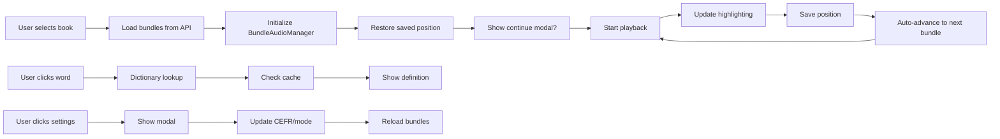
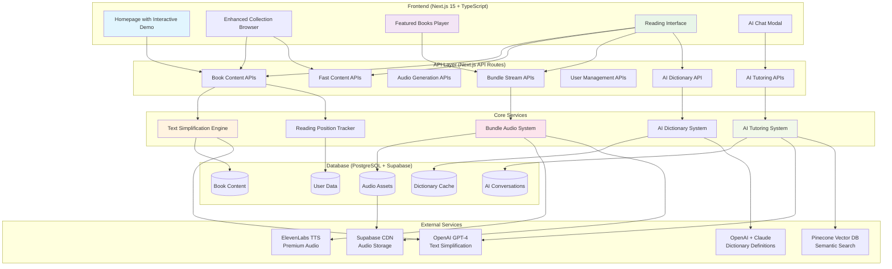
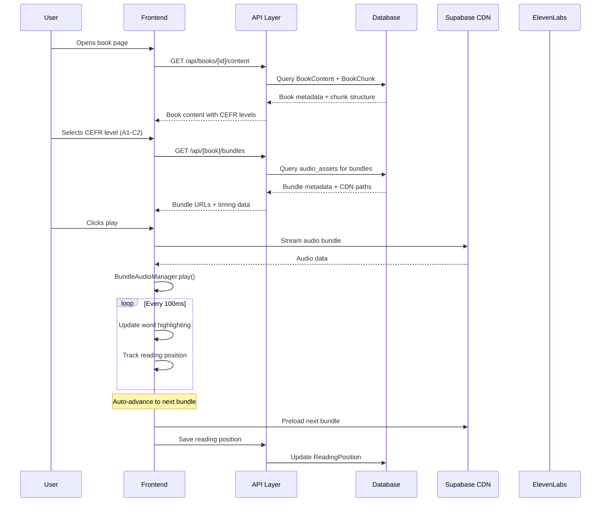
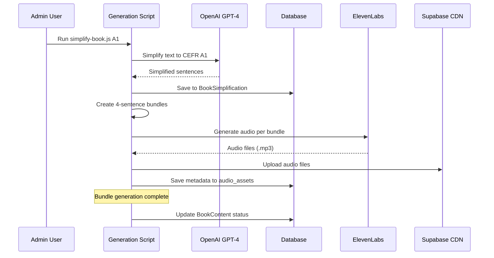
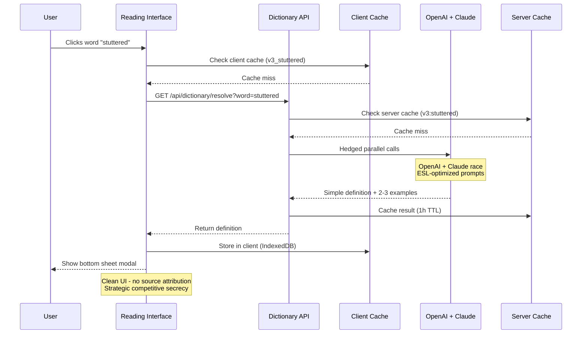
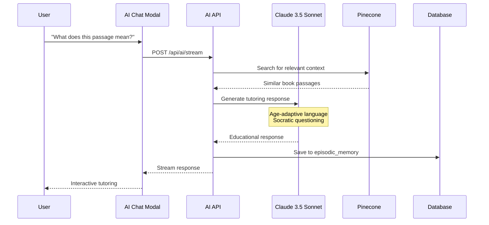
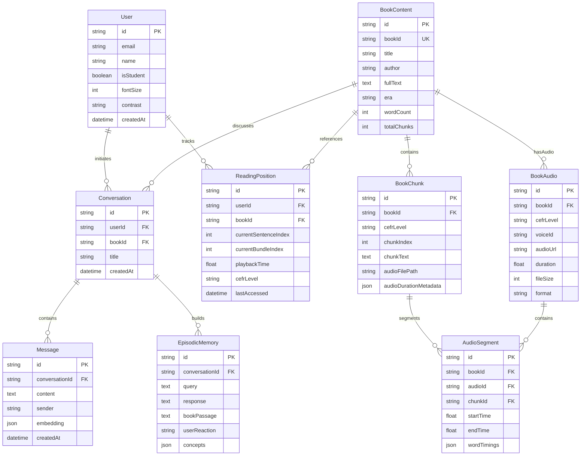
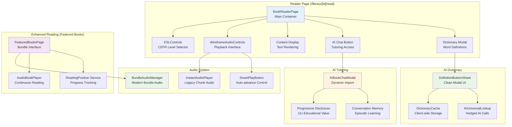

# 📚 BookBridge ESL - Architecture Overview

> **Quick Start Guide for New Developers**: Understanding how the entire BookBridge ESL platform works from start to finish

---

## 🎯 Purpose

This document provides new developers with a comprehensive 10-minute overview of BookBridge's architecture before diving into specific implementation files. BookBridge transforms classic literature into accessible ESL learning content through AI-powered text simplification, premium TTS audio generation, and a mobile-first reading experience.

**Target Audience**: New developers joining the project
**Reading Time**: ~10 minutes
**Focus**: Golden paths and core workflows, not edge cases

---

## ⚡ CRITICAL: Two Reading Systems (Read This First!)

BookBridge has **TWO DISTINCT reading systems**. Understanding which is which prevents costly implementation mistakes:

### 🎯 PRIMARY SYSTEM: Featured Books (Bundle-Based Audiobooks)
**Location**: `/featured-books/page.tsx`
**Purpose**: Premium audiobook experience with synchronized audio + text
**Architecture**: Bundle-based (4 sentences per bundle)
**Audio**: BundleAudioManager with word-level sync
**Data**: Solution 1 (measured durations + cached metadata in `audioDurationMetadata`)
**Technology**: ElevenLabs TTS + eleven_monolingual_v1 model
**Performance**: 2-3 second loads (cached metadata)
**User Experience**: Netflix/Speechify-level quality

**Key Components:**
- `BundleAudioManager.ts` - Seamless audio playback
- `AudioBookPlayer` - Continuous reading
- `ReadingPosition` service - Sentence-level position tracking
- `/api/featured-books/bundles/route.ts` - Bundle API endpoints

**When to Use This System:**
- ✅ Implementing new audiobook features
- ✅ Adding reading position memory
- ✅ Working with audio synchronization
- ✅ Building premium ESL learning experiences

### 📚 LEGACY SYSTEM: Library Reader (Chunk-Based Text)
**Location**: `/library/[id]/read/page.tsx`
**Purpose**: Text-only reader for 76K+ classic books (no audio)
**Architecture**: Chunk-based pagination (1500 characters per chunk)
**Audio**: None
**Data**: BookChunk records without audio metadata
**Technology**: Text simplification only
**Performance**: Instant (no audio to load)
**User Experience**: Basic reading with CEFR level switching

**Key Components:**
- `ESLControls` - CEFR level selector
- localStorage - Simple position tracking
- Text simplification cache

**When to Use This System:**
- ⚠️ Rarely - this is maintained for backward compatibility only
- ⚠️ Text-only features without audio requirements

### 🚨 Common Mistake to Avoid
**DON'T** implement audio features in `/library/[id]/read/page.tsx` (legacy chunk system)
**DO** implement audio features in `/featured-books/page.tsx` (modern bundle system)

The bundle-based system is the **PRIMARY** focus for all new feature development.

---

## 💰 Monetization Strategy (Pilot Phase)

**Current Status**: PILOT/BETA - Focus on feedback collection, not revenue

**Navigation Link**: "Support Us" (replaces "Premium $5.99")
**URL**: `https://donorbox.org/bookbridge-make-books-accessible-to-everyone-regardless-of-their-their-situation`
**Opens**: External link (new tab) to Donorbox donation page

**Why Donation vs Payment (October 2025):**
- Pilot phase prioritizes user feedback over monetization
- Removes price barrier anxiety ($5.99 seen as "too cheap" by some, potentially "too expensive" for ESL learners in developing countries)
- Mission-aligned: Donation model reinforces "accessible to everyone" messaging
- Validates product-market fit before committing to pricing strategy
- Allows passionate early adopters to support voluntarily

**Future Payment Implementation:**
When ready to transition from pilot to production (post product-market fit):
1. **Keep Freemium Model**: Free core features (3 books/month, basic AI), paid unlimited ($14.99/month suggested)
2. **Implement Stripe Checkout**: `/app/api/checkout/route.ts` (create new)
3. **Subscription Management**: Use existing `/subscription` page, integrate with Stripe customer portal
4. **Navigation Update**: Change "Support Us" → "Upgrade" or "Premium" with pricing
5. **Feature Gating**: Add subscription checks in AudioContext, AI services
6. **A/B Test Pricing**: $9.99 vs $14.99 vs $19.99 to find optimal price point

**Code Location**: `/components/Navigation.tsx:35-38`

---

## 📱 Featured Books Page - Deep Dive (Most Critical Page)

**Location**: `/app/featured-books/page.tsx`
**Purpose**: Premium audiobook reading experience - the flagship feature of BookBridge
**Complexity**: 35+ integrated features, 2,500+ lines of code
**State Management**: 20+ useState hooks managing audio, UI, position, dictionary, AI chat

### UI Layout & Controls

```
┌─────────────────────────────────────────────────────────────┐
│ BookBridge    Home  Enhanced  Simplified  Browse  Support   │ ← Navigation
│                     Books     Books       All       Us      │
│              [L] [D] [S] [F]  ← Theme switcher (4 themes)   │
├─────────────────────────────────────────────────────────────┤
│  [←]                                              [Aa]      │ ← Back + Settings
│                                                              │
│                    The Necklace                              │ ← Book title
│                 by Guy de Maupassant                         │
│                                                              │
│              Chapter 1: The Invitation                       │ ← Chapter header
│                                                              │
│  She is a pretty girl from a family of clerks.              │ ← Text content
│  It feels like fate's mistake. She has no money...          │   with real-time
│                                                              │   highlighting
│  [📖 Dictionary tooltip: "Press words for dictionary"]      │ ← Long-press words
│                                                              │
├─────────────────────────────────────────────────────────────┤
│ Mobile Bottom Bar:                                          │
│ ━━━━━━━━━━━━━━━━━━━━━━━━━ 45% ━━━━━━━━━━━━━━━━━━━━━        │ ← Progress bar
│ 1:23        Sentence 8/20 • Chapter 1 of 5        3:45      │ ← Time + Position
│                                                              │
│   [1x]        [⏸]        [📖]      [🎙️]                    │ ← Audio controls
│   Speed     Play/Pause   Chapter   Voice                    │
│                                                              │
│ Desktop Floating Bar (centered bottom):                     │
│ ╔═══════════════════════════════════════════╗              │
│ ║  [1x]  [⏮]  [⏸/▶]  [⏭]  [📖]  [🎙️]  ║              │
│ ╚═══════════════════════════════════════════╝              │
└─────────────────────────────────────────────────────────────┘
```

### Feature Categories (35+ Features)

#### **1. Core Reading System** (`lines 1050-1400`)
- ✅ Bundle-based audiobook with 4-sentence bundles
- ✅ Real-time word-level text highlighting during playback
- ✅ Chapter headers displayed within text flow
- ✅ Auto-scroll following audio (with pause capability)
- ✅ Seamless bundle transitions (no gaps between audio)
- ✅ Book selection grid with gradient covers
- ✅ Back button to return to book selection

**Code Anchors:**
- Bundle loading: `featured-books/page.tsx:1050-1150`
- Audio initialization: `featured-books/page.tsx:1070-1097`
- Highlighting logic: Uses BundleAudioManager callbacks

#### **2. Audio Playback Controls** (`lines 2330-2475`)
- ✅ Play/Pause (large center button)
- ✅ Speed control (0.8x, 0.9x, 1.0x, 1.1x, 1.2x, 1.5x)
- ✅ Chapter navigation (📖 button → modal)
- ✅ Voice selector UI (🎙️ button)
- ✅ Progress bar with visual feedback
- ✅ Time display (current / total)
- ✅ Sentence counter ("Sentence X/Y • Chapter N of M")
- ✅ Responsive layouts (mobile bottom bar, desktop floating)

**Code Anchors:**
- Mobile controls: `featured-books/page.tsx:2332-2410`
- Desktop controls: `featured-books/page.tsx:2412-2475`
- Speed cycling: `cycleSpeed()` function
- Play/pause handlers: `handlePlaySequential()`, `handlePause()`, `handleResume()`

#### **2.3. Audio Speed Pilot Test (Jan 2025)**

**Problem:** Multiple users reported audio is "too fast" for comfortable ESL learning.

**Root Cause:**
- Audio generated at ElevenLabs `speed: 0.90` (ESL-optimized pace with natural pauses)
- Default playback: `1.0x` → plays 11% faster than intended (1.0 / 0.9 = 1.111x)
- Result: Students can't follow word-level highlighting, reduces comprehension

**Solution (GPT-5 Validated):**
- Change default playback speed: `1.0x` → `0.9x`
- Relabel UI: `0.9x` = "1× Normal", `1.0x` = "1.1× Faster"
- Add 0.9x to speed options, remove extremes (0.5x, 2.0x)
- Run 2-week A/B test before classroom pilots

**Why Sync Stays Perfect:**
- `playbackRate` scales `currentTime` uniformly (HTML5 Audio API)
- Word timing metadata (in seconds) remains valid at any playback rate
- No audio regeneration needed (generation speed 0.90 locked as M1 proven formula)

**Implementation Plan:**
- A/B test: Control (1.0x default) vs Treatment (0.9x default, relabeled UI)
- Success metrics: +10-20% completion rate, 60%+ stay at 0.9x default
- Timeline: 2 weeks → deploy winner before Jan 20, 2026 pilots

**Status:** ✅ Plan approved by GPT-5 | ⏸️ Implementation pending

**Full Documentation:** `docs/AUDIO_SPEED_PILOT_TEST.md` (1,250 lines: A/B test design, analytics, risk assessment, 7-phase rollout)

**Code Impact:**
- `app/featured-books/page.tsx:740` - Default speed
- `app/featured-books/page.tsx:1443` - SPEED_OPTIONS array
- `app/featured-books/page.tsx:1458` - formatSpeedLabel() for relabeling

---

#### **2.5. Audio-Text Synchronization System** (Enhanced Timing v3)
- ✅ Perfect audio-text sync across all sentence complexities (validated user: "unbelievable, it works perfect")
- ✅ Character-count proportion + punctuation penalties (commas 150ms, semicolons 250ms, colons 200ms, em-dashes 180ms, ellipses 120ms)
- ✅ Pause-budget-first approach (subtracts pause budget before distributing time - GPT-5 validated)
- ✅ Renormalization ensures sum equals measured duration exactly
- ✅ Safeguards: max 600ms penalty/sentence, min 250ms duration, overflow handling
- ✅ Metadata version v3 with enhanced timing data
- ✅ Demo voices regenerated: B1 Jane/James, B2 Zara/David, C1 Sally/Frederick, C2 Vivie (7/8 complete)
- ✅ Fixes critical sync failures on complex Victorian prose (30-50 word sentences, 4+ commas)

**Problem Solved:**
Word-count proportional timing failed for complex sentences with punctuation, causing 1/2 sentence lag on B1/C1 levels. Enhanced Timing v3 accounts for natural speech pauses, achieving Speechify-quality sync.

**Code Anchors:**
- Generation script: `scripts/generate-multi-voice-demo-audio.js:351-479`
- Metadata format: `.mp3.metadata.json` files with `version: 3`, `timingStrategy: 'character-proportion-with-punctuation-penalties-pause-budget-first'`
- Demo audio files: `public/audio/demo/pride-prejudice-{level}-{voice}-enhanced.mp3`
- Technical documentation: `docs/AUDIO_SYNC_IMPLEMENTATION_GUIDE.md`
- Regeneration tracking: `docs/AUDIO_REGENERATION_PLAN.md`

#### **3. Settings Modal** (`lines 2095-2288`)
- ✅ CEFR level selector (A1, A2, B1, B2, C1, C2)
- ✅ Content mode toggle (Simplified ↔ Original)
- ✅ Text size adjustment (Aa button)
- ✅ Settings persist across sessions
- ✅ Modal with Neo-Classic theme styling

**Code Anchors:**
- Settings modal UI: `featured-books/page.tsx:2095-2288`
- State: `cefrLevel`, `contentMode`, `showSettingsModal`

#### **4. Neo-Classic Theme System** (4 themes)
- ✅ Light theme (L button) - Parchment bg, Oxford blue text
- ✅ Dark theme (D button) - Dark navy, gold accents
- ✅ Sepia theme (S button) - Warm sepia, brown accents
- ✅ Focus theme (F button) - Fourth variation
- ✅ CSS variables for all colors (--bg-primary, --text-accent, etc.)
- ✅ Persistent theme selection (localStorage)
- ✅ Theme switcher in top-right corner

**Code Anchors:**
- Theme context: `contexts/ThemeContext.tsx`
- Theme switcher: `components/theme/ThemeSwitcher.tsx`
- CSS variables: `app/globals.css`

#### **5. AI Dictionary System** (`lines 1289-1330, 2478-2496`)
- ✅ Long-press word lookup (mobile touch interaction)
- ✅ Click word lookup (desktop)
- ✅ Bottom sheet modal with clean ESL-optimized definitions
- ✅ Client-side cache (IndexedDB + memory) for instant lookups
- ✅ Hedged AI calls (OpenAI + Claude in parallel)
- ✅ Strategic design (no source attribution for competitive secrecy)
- ✅ Debug indicator showing selected word
- ✅ Performance tracking (cache hit rate, response times)

**Code Anchors:**
- Dictionary interaction: `featured-books/page.tsx:1289-1330`
- Bottom sheet: `components/dictionary/DefinitionBottomSheet.tsx`
- Cache system: `lib/dictionary/DictionaryCache.ts`
- AI lookup: `lib/dictionary/AIUniversalLookup.ts`
- Hook: `useDictionaryInteraction()` from `hooks/useDictionaryInteraction.tsx`

#### **6. AI Chat Tutor** (`lines 1412-1430, 2498-2505`)
- ✅ Book-specific AI chat modal
- ✅ Socratic tutoring conversations
- ✅ Episodic memory system
- ✅ Context-aware responses about book content
- ✅ Progressive disclosure (11x educational value)
- ✅ Claude 3.5 Sonnet integration

**Code Anchors:**
- Modal trigger: `featured-books/page.tsx:1412-1430`
- Modal component: `lib/dynamic-imports.tsx` → `AIBookChatModal`
- API: `app/api/ai/stream/route.ts`

#### **7. Reading Position Memory** (`lines 1098-1140, 2290-2330`)
- ✅ Auto-save position during playback (sentence, chapter, bundle, time)
- ✅ Database + localStorage persistence
- ✅ Continue reading modal (shown if last read < 24 hours)
- ✅ Start over option
- ✅ Auto-scroll to saved position
- ✅ Restore all settings (CEFR, speed, mode)
- ⚠️ **BROKEN**: Requires manual book selection after page refresh

**Code Anchors:**
- Position restore: `featured-books/page.tsx:1098-1140`
- Continue modal: `featured-books/page.tsx:2290-2330`
- Service: `lib/services/reading-position.ts`
- Auto-save: Integrated in AudioBookPlayer callbacks

#### **8. Chapter Navigation** (`lines 640, 2395-2400`)
- ✅ Chapter picker modal
- ✅ Jump to specific chapter
- ✅ Current chapter highlighting
- ✅ Chapter progress display
- ✅ Chapter headers in text flow

**Code Anchors:**
- Chapter modal state: `showChapterModal` at line 639
- Modal trigger: `featured-books/page.tsx:2395-2400`
- Chapter logic: `getCurrentChapter()` function

#### **9. System Integration Features**
- ✅ Wake lock (prevents screen sleep during reading)
- ✅ Media session (system media controls)
- ✅ Mobile/desktop responsive layouts
- ✅ Auto-scroll with pause capability
- ✅ Keyboard shortcuts (potentially)
- ✅ Bundle preloading for seamless playback

**Code Anchors:**
- Wake lock: `useWakeLock()` hook
- Media session: `useMediaSession()` hook

---

## 🎬 Hero Interactive Demo (Homepage)

**Location**: Homepage hero section (`app/page.tsx` + `components/hero/InteractiveReadingDemo.tsx`)
**Purpose**: Voice preference testing + instant value demonstration before sign-up
**Strategic Goal**: Test user preferences on $10 demos before committing $500+ to full book generation

### Overview

Interactive reading demo showcasing Pride & Prejudice with:
- **12 voices** across 6 CEFR levels (A1-C2) + Original
- **Real-time audio-text synchronization** with Enhanced Timing v3
- **Voice analytics tracking** (9 events: voice_switch, retention, engagement, CTA clicks)
- **Level-filtered voice selection** (shows only 2 voices per level)

### Architecture

**Components:**
- Main: `components/hero/InteractiveReadingDemo.tsx` (1400+ lines)
- Config: `lib/config/demo-voices.ts` - Voice configuration and level mappings
- Audio: `/public/audio/demo/pride-prejudice-{level}-{voice}-enhanced.mp3`
- Metadata: `.mp3.metadata.json` files with Enhanced Timing v3 sentence timings

**Voice Configuration:**
```typescript
// lib/config/demo-voices.ts
export const LEVEL_TO_VOICES: Record<CEFRLevel, { female: DemoVoiceId; male: DemoVoiceId }> = {
  'A1': { female: 'hope', male: 'daniel' },      // Soothing + British authority
  'A2': { female: 'arabella', male: 'grandpa_spuds' },  // Young + warm storyteller
  'B1': { female: 'jane', male: 'james' },       // Professional + engaging
  'B2': { female: 'zara', male: 'david_castlemore' },   // Modern + educator
  'C1': { female: 'sally_ford', male: 'frederick_surrey' }, // Elegant + documentary
  'C2': { female: 'vivie', male: 'john_doe' },   // Cultured + deep authority
  'Original': { female: 'sarah', male: 'david_castlemore' } // Baseline + educator
};
```

### Analytics Tracking

**9 Events Tracked** (enabled via `NEXT_PUBLIC_ENABLE_HERO_ANALYTICS=true`):

1. **demo_impression** - Demo loads
2. **play_clicked** - User starts playback (tracks voice_id, name, gender)
3. **pause_clicked** - User pauses
4. **level_switch** - User changes CEFR level (tracks from/to voice details)
5. **voice_switch** - User manually changes voice (tracks from/to voice + gender)
6. **retention_8s** - 8-second engagement milestone (progressive CTA trigger)
7. **retention_15s** - 15-second deep engagement
8. **audio_completed** - User finishes full demo
9. **cta_clicked** - Conversion event (sign-up/start learning)

**Data Collection:**
- Console logs for development
- Google Analytics (gtag) for production
- All events include: voice_id, voice_name, gender, level, enhanced_mode, ab_test_variant

### Audio Sync Technology

**Enhanced Timing v3** - Fixes sync issues with complex sentences:
- Character-count proportion (not word-count)
- Punctuation penalties: commas (150ms), semicolons (250ms), colons (200ms)
- Pause-budget-first approach (subtracts pauses before time distribution)
- Renormalization ensures sum equals measured duration
- **Result**: Perfect sync for Victorian prose with 30-50 word sentences, 4+ commas

**See**: `docs/AUDIO_SYNC_IMPLEMENTATION_GUIDE.md` for deep technical details

### Code Anchors

**Voice Tracking Analytics:**
- Track function: `InteractiveReadingDemo.tsx:52-74` (trackDemoEvent)
- Level switch: `InteractiveReadingDemo.tsx:329-339`
- Voice switch: `InteractiveReadingDemo.tsx:365-375`
- Retention milestones: `InteractiveReadingDemo.tsx:576-599`
- Audio completion: `InteractiveReadingDemo.tsx:616-624`

**Voice Configuration:**
- All voices: `lib/config/demo-voices.ts:26-131` (DEMO_VOICES)
- Level mappings: `lib/config/demo-voices.ts:155-184` (LEVEL_TO_VOICES)
- Helper functions: `getVoiceFor`, `getVoicesForLevel`, `getVoicesByGender`

**Audio Generation:**
- Script: `scripts/generate-multi-voice-demo-audio.js:351-479`
- Enhanced Timing: Lines 351-401 (punctuation penalties + renormalization)
- Demo content: `/public/data/demo/pride-prejudice-demo-9sentences.json`

### Success Metrics

**Phase 4 Completion (Dec 2024):**
- ✅ 12 voices generated with <5% drift validation
- ✅ Perfect audio-text sync across all levels (user: "it works perfect")
- ✅ Level-filtered voice selection (2 voices per level)
- ✅ Production analytics tracking live

**Business Goal:**
- Identify top 3 male + top 3 female voices through real usage data
- Use winning voices for $500+ full book production
- ROI: $10 demo testing vs $500+ blind production = 98% cost reduction

---

## 🎯 State Management Architecture (Phase 1 Refactor - Jan 2025)

### Overview: AudioContext as Single Source of Truth

**Problem Solved (The "Dueling Loaders" Anti-Pattern):**
- Featured Books page and AudioContext both fetched book data independently
- Race conditions when both tried to load simultaneously
- State became inconsistent between page and context
- Global Mini Player feature failed because audio state was page-scoped (died on navigation)

**Solution: Single Source of Truth Pattern**
- AudioContext is now the SOLE owner of all book/audio state
- Page only reads state and dispatches actions (no fetching, no state mutations)
- Audio state is app-scoped (survives navigation between pages)
- Foundation laid for Global Mini Player feature

**Refactor Metrics:**
| Metric | Before | After | Change |
|--------|--------|-------|--------|
| Lines of Code | 2,228 | 1,814 | **-414 lines (-18.6%)** |
| State Variables | 12 local | 0 local | All moved to context |
| Data Fetch Locations | 2 (page + context) | 1 (context only) | -50% |
| Race Conditions | Multiple | 0 | ✅ Fixed |
| Bundle Size | 23 kB | 21.7 kB | -1.3 kB (-5.6%) |

**Implementation:** Branch `refactor/featured-books-phase-1` (13 commits)
**Documentation:** `docs/architecture/AUDIO_CONTEXT_PATTERN.md`

---

### AudioContext State Machine

AudioContext uses a state machine to prevent invalid states (e.g., `loading=true` + `error!=null`):

```
State Transitions:
┌──────┐
│ idle │ Initial state, no book selected
└──┬───┘
   │ User selects book
   ↓
┌─────────┐
│ loading │ Fetching bundles, checking levels
└───┬─┬───┘
    │ │
    │ └──→ ❌ error   (fetch failed)
    │
    └────→ ✅ ready   (bundles loaded)
           └──┬───┘
              │ User switches level
              ↓
           loading (reload bundles)
```

**Valid Transitions:**
- `idle` → `loading` (user selects book)
- `loading` → `ready` (data loaded successfully)
- `loading` → `error` (fetch failed)
- `ready` → `loading` (user changes level/mode)
- `error` → `loading` (user retries)

**Benefits:**
- ✅ Invalid states impossible (cannot be loading + error simultaneously)
- ✅ Clear transition tracking in telemetry
- ✅ Easier debugging (state history is explicit)

---

### Data Flow: Book Selection & Audio Playback

```
User Actions → AudioContext (SSoT) → Page Rendering
────────────────────────────────────────────────────

┌─────────────────────────────────────────────────────────┐
│ 1. USER SELECTS BOOK                                    │
└─────────────────────────────────────────────────────────┘
   │
   ├─→ Page calls: audioContext.selectBook(book, level)
   │
   └─→ AudioContext:
       ├─ Cleans up previous audio (pause, destroy)
       ├─ Sets selectedBook, cefrLevel
       ├─ Transitions: idle → loading
       ├─ Generates requestId (race condition guard)
       ├─ Fetches /api/featured-books/bundles
       ├─ Checks available levels (parallel)
       ├─ Loads saved reading position (atomic restore)
       │  └─ Sets: currentSentenceIndex, currentChapter, playbackSpeed
       ├─ Sets bundleData
       ├─ Transitions: loading → ready
       └─ Sets resumeInfo (for Continue Reading modal)

┌─────────────────────────────────────────────────────────┐
│ 2. PAGE RENDERS (Read-Only)                            │
└─────────────────────────────────────────────────────────┘
   │
   ├─→ const { selectedBook, bundleData, loadState } = useAudioContext()
   │
   ├─→ Early returns:
   │   ├─ if (!selectedBook) → show book grid
   │   ├─ if (loadState === 'loading') → show spinner
   │   ├─ if (loadState === 'error') → show error
   │   └─ if (loadState === 'ready' && bundleData) → render reader
   │
   └─→ useEffect: Initialize audio manager (page-local side effect only)
       ├─ BundleAudioManager.init(bundleData)
       ├─ Scroll to saved position (if resumeInfo exists)
       └─ FORBIDDEN: No fetching, no setBundleData(), no clearing state

┌─────────────────────────────────────────────────────────┐
│ 3. USER PLAYS AUDIO                                     │
└─────────────────────────────────────────────────────────┘
   │
   ├─→ Page calls: audioContext.play(sentenceIndex?)
   │
   └─→ AudioContext:
       ├─ Sets isPlaying = true
       ├─ Updates currentSentenceIndex
       └─ (Future: Triggers BundleAudioManager.play())

┌─────────────────────────────────────────────────────────┐
│ 4. USER SWITCHES LEVEL                                  │
└─────────────────────────────────────────────────────────┘
   │
   ├─→ Page calls: audioContext.switchLevel('B1')
   │
   └─→ AudioContext:
       ├─ Validates level availability
       ├─ Pauses audio
       ├─ Cleans up audio lifecycle
       ├─ Persists level (localStorage + future DB)
       ├─ Transitions: ready → loading
       ├─ Fetches new bundles for B1 level
       ├─ Resets currentSentenceIndex to 0
       ├─ Transitions: loading → ready
       └─ Auto-switches contentMode to 'simplified'
```

**Key Pattern: Dispatch, Don't Mutate**
```typescript
// ❌ BAD (Old pattern - page mutates state)
const handleBookClick = (book) => {
  setSelectedBook(book);
  setLoading(true);
  fetchData(book);
};

// ✅ GOOD (New pattern - page dispatches to context)
const handleBookClick = async (book) => {
  await audioContext.selectBook(book);
  // Context handles all state updates
};
```

---

### Race Condition Prevention: RequestId Pattern

**Problem:** User rapidly clicks between books/levels → stale responses overwrite newer data

**Solution:** Generate unique requestId for each operation, guard all state updates

```typescript
// Inside AudioContext.loadBookData()

const loadBookData = async (bookId: string, level: CEFRLevel, mode: ContentMode) => {
  // 1. Generate unique request token
  const reqId = crypto.randomUUID();
  currentRequestIdRef.current = reqId;

  logTelemetry({ type: 'load_started', bookId, level, requestId: reqId });

  try {
    // 2. Check availability (async operation)
    const availability = await checkAvailableLevels(bookId, signal, reqId);

    // 3. GUARD: Only proceed if request is still current
    if (currentRequestIdRef.current !== reqId) {
      logTelemetry({
        type: 'stale_apply_prevented',
        requestId: reqId,
        reason: 'Request superseded after availability check'
      });
      return; // Abort silently - stale request
    }

    // 4. Fetch bundles (async operation)
    const response = await fetch(apiUrl, { signal: abortController.signal });
    const data = await response.json();

    // 5. GUARD: Only apply state if request is STILL current
    if (currentRequestIdRef.current !== reqId) {
      logTelemetry({
        type: 'stale_apply_prevented',
        requestId: reqId,
        reason: 'Request superseded before setting bundle data'
      });
      return; // Abort - newer request already started
    }

    // 6. Safe to apply state (request is current)
    if (currentRequestIdRef.current === reqId) {
      setBundleData(data);
      setLoadState('ready');
      logTelemetry({ type: 'load_completed', requestId: reqId });
    }

  } catch (err) {
    if (err.name === 'AbortError') {
      // Previous request was aborted - this is expected
      return;
    }
    setLoadState('error');
    setError(err.message);
  }
};
```

**Benefits:**
- ✅ Stale responses cannot overwrite newer data
- ✅ No spinner loops from race conditions
- ✅ Telemetry logs all prevented updates for debugging
- ✅ Multiple guards throughout async pipeline (defense in depth)

**Telemetry Output Example:**
```
🔄 [AudioContext] load_started { bookId: 'pride-prejudice', level: 'A1', requestId: 'abc123' }
🛑 [AudioContext] stale_apply_prevented { requestId: 'abc123', reason: 'Request superseded after availability check' }
🔄 [AudioContext] load_started { bookId: 'pride-prejudice', level: 'B1', requestId: 'xyz789' }
✅ [AudioContext] load_completed { requestId: 'xyz789', elapsed: 342 }
```

---

### Resume Logic: Atomic Position Restore

**Problem:** Page-scoped resume logic caused flashing (wrong content briefly shown during restore)

**Solution:** AudioContext atomically restores position during bundle load (Commit 5)

```typescript
// Inside AudioContext.loadBookData() - after bundles fetched

// Load saved reading position (atomically with requestId guard)
try {
  const savedPosition = await readingPositionService.loadPosition(bookId);

  // Guard: Only apply if request is still current
  if (currentRequestIdRef.current === reqId && savedPosition) {
    console.log(`🔄 Loading saved position: sentence ${savedPosition.currentSentenceIndex}`);

    // Atomically restore position (all at once - no flashing)
    setCurrentSentenceIndex(savedPosition.currentSentenceIndex);
    setCurrentChapter(savedPosition.currentChapter);

    if (savedPosition.playbackSpeed) {
      setPlaybackSpeed(savedPosition.playbackSpeed);
    }

    // Calculate hours since last read for UI
    const hoursSinceLastRead = savedPosition.lastAccessed
      ? (Date.now() - new Date(savedPosition.lastAccessed).getTime()) / (1000 * 60 * 60)
      : 999;

    // Set resume info for UI modal/toast
    setResumeInfo({
      sentenceIndex: savedPosition.currentSentenceIndex,
      chapter: savedPosition.currentChapter,
      totalSentences: data.totalSentences,
      playbackSpeed: savedPosition.playbackSpeed,
      hoursSinceLastRead
    });
  }
} catch (error) {
  console.warn('Failed to load saved position:', error);
  // Non-fatal - continue without resume
}
```

**Benefits:**
- ✅ Book + level + position + speed restored atomically (one operation)
- ✅ No flash of wrong content during navigation
- ✅ Resume state survives navigation (app-scoped, not page-scoped)
- ✅ RequestId guards prevent stale position restores
- ✅ Resume modal shows correct info immediately

**Page Changes (Commit 5):**
- ❌ Removed: 43 lines of page-level resume logic
- ✅ Added: Computed `showContinueReading = resumeInfo !== null && hoursSinceLastRead < 24`
- ✅ Added: `continueReading()` calls `contextClearResumeInfo()`
- ✅ Simplified: Scroll logic uses `context.currentSentenceIndex` directly

---

### AudioContext API Reference

**State (Read-Only for Pages):**
```typescript
interface AudioContextState {
  // Book Selection
  selectedBook: FeaturedBook | null;
  cefrLevel: CEFRLevel;
  contentMode: ContentMode;
  bundleData: RealBundleApiResponse | null;
  availableLevels: { [key: string]: boolean };
  currentBookAvailableLevels: string[];

  // Load State Machine
  loadState: 'idle' | 'loading' | 'ready' | 'error';
  loading: boolean; // Computed: loadState === 'loading'
  error: string | null;

  // Resume State
  resumeInfo: ResumeInfo | null; // For Continue Reading modal

  // Audio Playback (read-only)
  isPlaying: boolean;
  currentSentenceIndex: number;
  currentChapter: number;
  currentBundle: string | null;
  playbackTime: number;
  totalTime: number;
  playbackSpeed: number;
}
```

**Actions (Dispatch Pattern):**
```typescript
// Book/Level Selection
await audioContext.selectBook(book: FeaturedBook, initialLevel?: CEFRLevel)
await audioContext.switchLevel(newLevel: CEFRLevel)
await audioContext.switchContentMode(mode: ContentMode)

// Audio Playback
await audioContext.play(sentenceIndex?: number)
audioContext.pause()
audioContext.resume()
audioContext.seek(sentenceIndex: number)
audioContext.setSpeed(speed: number)

// Chapter Navigation
audioContext.nextChapter()
audioContext.previousChapter()
audioContext.jumpToChapter(chapter: number)

// Resume State
audioContext.clearResumeInfo() // Dismiss Continue Reading modal

// Cleanup
audioContext.unload() // Stop audio, clear state
```

**Usage Example:**
```typescript
export default function FeaturedBooksPage() {
  const {
    // Read state (never mutate directly!)
    selectedBook,
    bundleData,
    loadState,
    error,
    resumeInfo,

    // Dispatch actions
    selectBook,
    switchLevel,
    play,
    pause,
  } = useAudioContext();

  // Early return if not ready
  if (!selectedBook || loadState !== 'ready' || !bundleData) {
    return <LoadingSpinner />;
  }

  // Page-local side effects only
  useEffect(() => {
    // ✅ OK: Initialize audio manager (uses bundleData from context)
    initializeAudioManager(bundleData);

    // ✅ OK: Scroll to saved position
    scrollToSentence(currentSentenceIndex);

    // ❌ FORBIDDEN: No fetching, no setBundleData(), no clearing state
  }, [selectedBook, bundleData, loadState]);

  return (
    <div>
      <button onClick={() => selectBook(book)}>Select Book</button>
      <button onClick={() => switchLevel('A2')}>Switch to A2</button>
      <button onClick={() => play()}>Play</button>
    </div>
  );
}
```

---

### Key Learnings & Best Practices

**1. Single Source of Truth is Critical**
- Having two owners for the same state causes impossible-to-debug race conditions
- Global Mini Player failed for 2 days because page-scoped state died on navigation

**2. State Machines Prevent Invalid States**
- Before: Could have `loading=true` + `error!=null` (invalid)
- After: LoadState machine enforces valid transitions only

**3. RequestId Pattern Solves Race Conditions**
- Generate unique ID for each operation
- Guard all async state updates
- Log prevented updates for debugging

**4. Incremental Refactoring Works**
- 13 small commits beat 1 large rewrite
- Each commit buildable and testable
- Easy to review and revert if needed

**5. Atomic Operations Matter**
- Resume state must be restored atomically to prevent flashing
- Book + level + position + speed applied together

**References:**
- **Pattern Guide:** `docs/architecture/AUDIO_CONTEXT_PATTERN.md` (337 lines)
- **Completion Report:** `docs/architecture/PHASE_1_COMPLETION_REPORT.md` (493 lines)
- **Implementation:** Branch `refactor/featured-books-phase-1` (13 commits, all pushed)

---

## 🔧 Phase 2: Navigation & Resume Patterns (Phase 2 Refactor - Jan 2025)

### Overview: Eliminating Timing Hacks

**Goal:** Fix navigation and resume bugs by replacing all `setTimeout`-based correctness hacks with proper state guards and DOM readiness patterns.

**Phase 2 Built On:**
- Phase 1's AudioContext SSoT foundation
- Added: Level persistence, Continue modal SSoT alignment, state guard patterns

**Key Achievement:** Removed **6 setTimeout correctness hacks** → **0** (only 1 UX debounce remains)

### Pattern 1: State Guard Pattern

Replace timing delays with explicit state readiness checks.

**Problem (Before Phase 2):**
```typescript
// ❌ Hope DOM is ready after 1000ms
setTimeout(() => {
  const element = document.querySelector('[data-sentence]');
  element?.scrollIntoView();
}, 1000);
```

**Solution (After Phase 2):**
```typescript
// ✅ Wait for verified state readiness
const didAutoScrollRef = useRef<string | null>(null);

useEffect(() => {
  const scrollKey = `${selectedBook?.id}-${cefrLevel}-${sentenceIndex}`;

  // State gates: only execute when context is fully loaded
  if (
    loadState === 'ready' &&      // ← AudioContext finished loading
    bundleData &&                   // ← Data present
    resumeInfo &&                   // ← Resume info available
    didAutoScrollRef.current !== scrollKey  // ← Haven't scrolled yet
  ) {
    requestAnimationFrame(() => {   // ← RAF for DOM readiness
      const element = document.querySelector(`[data-sentence="${sentenceIndex}"]`);
      element?.scrollIntoView({ behavior: 'smooth', block: 'center' });
      didAutoScrollRef.current = scrollKey; // Mark as complete
    });
  }
}, [loadState, bundleData, resumeInfo, selectedBook?.id, cefrLevel, sentenceIndex]);
```

**Benefits:**
- ✅ Deterministic execution (state-driven, not time-driven)
- ✅ Works on slow and fast devices equally well
- ✅ Clear dependency chain in useEffect
- ✅ One-time guard prevents duplicate operations

**When to Use:**
- Any operation that depends on AudioContext data being loaded
- DOM operations that need rendered elements
- User-initiated actions that require stable state

### Pattern 2: requestAnimationFrame for DOM Readiness

Replace arbitrary delays with browser's render callback.

**Problem:**
```typescript
// ❌ Arbitrary delay hoping DOM is ready
setTimeout(() => {
  const el = document.querySelector('[data-sentence]');
  el?.scrollIntoView();
}, 200);
```

**Solution:**
```typescript
// ✅ Execute after browser paints
requestAnimationFrame(() => {
  const el = document.querySelector('[data-sentence]');
  el?.scrollIntoView();
});
```

**Why RAF?**
- Executes after React render + browser paint
- Guarantees DOM availability
- No arbitrary timeout guessing
- Synchronizes with browser's refresh cycle

**Common Use Cases:**
- Scrolling to elements after render
- Reading DOM measurements
- Triggering CSS animations
- Focus management

### Pattern 3: One-Time Guard Pattern

Prevent duplicate operations during rapid state changes.

**Problem:**
```typescript
// ❌ useEffect runs multiple times, scrolls repeatedly
useEffect(() => {
  if (sentenceIndex > 0) {
    scrollToSentence(sentenceIndex);
  }
}, [sentenceIndex, loadState, bundleData]); // Multiple triggers
```

**Solution:**
```typescript
// ✅ Track execution with ref
const didScrollRef = useRef<string | null>(null);

useEffect(() => {
  const key = `${bookId}-${sentenceIndex}`;

  if (sentenceIndex > 0 && didScrollRef.current !== key) {
    scrollToSentence(sentenceIndex);
    didScrollRef.current = key; // Mark as executed
  }
}, [bookId, sentenceIndex, loadState, bundleData]);
```

**Key Points:**
- Use unique key (e.g., `bookId-sentenceIndex-level`)
- Update ref AFTER successful execution
- Reset ref when book/level changes if needed

### Pattern 4: Debounced DB Persistence

Immediate local writes, throttled remote saves.

**Implementation (AudioContext):**
```typescript
const persistLevelChange = (bookId: string, level: CEFRLevel) => {
  // ✅ Immediate localStorage write (fast, synchronous)
  try {
    localStorage.setItem(`bookbridge-book-${bookId}-level`, level);
  } catch (error) {
    console.warn('[AudioContext] Failed to persist level to localStorage:', error);
  }

  // ✅ Throttled DB write (300ms debounce) - prevents excessive API calls
  if (levelPersistTimeout) {
    clearTimeout(levelPersistTimeout);
  }
  levelPersistTimeout = setTimeout(async () => {
    try {
      const savedPosition = await readingPositionService.loadPosition(bookId);
      if (savedPosition) {
        await readingPositionService.savePosition(bookId, {
          ...savedPosition,
          cefrLevel: level
        });
      }
    } catch (error) {
      console.warn('[AudioContext] Failed to persist level to DB:', error);
    }
  }, 300);
};
```

**Why This Pattern?**
- localStorage: Instant feedback, works offline
- DB write: Throttled to reduce server load
- setTimeout here is **valid** (UX debounce, not correctness)

**Valid setTimeout Use Cases:**
- ✅ Debouncing expensive operations (DB writes, API calls)
- ✅ Auto-dismiss toasts/notifications
- ✅ User input throttling (search-as-you-type)
- ❌ NOT for correctness/ordering ("wait for DOM", "delay after load")

### Phase 2 Fixes Applied

#### 1. Scroll to Saved Position
**Before**: `setTimeout(() => scroll(), 1000)` - arbitrary 1s delay
**After**: State guard + RAF pattern (executes when `loadState === 'ready'`)

#### 2. Force Highlighting
**Before**: `setState(-1); setTimeout(() => setState(val), 10)` - forced re-render hack
**After**: Removed - React handles it naturally with proper state dependencies

#### 3. Chapter Jump Delays
**Before**: `setTimeout(() => jump(), 100)` - arbitrary delays (2 locations)
**After**: Synchronous operations + RAF for scroll only

#### 4. Next Bundle Advancement
**Before**: `setTimeout(() => advance(), 100)` - arbitrary delay
**After**: Immediate execution - bundle completion is deterministic

#### 5. Nested Scroll Delays
**Before**: `setTimeout(() => { ... setTimeout(() => scroll(), 200) }, 100)` - nested timing hacks
**After**: Promise.then + RAF pattern

### Level Persistence Flow

```
User switches level (A1 → A2)
         ↓
AudioContext.switchLevel(A2)
         ↓
persistLevelChange(bookId, A2)
         ↓
┌────────────────────┬────────────────────┐
│ localStorage       │ Database           │
│ (Immediate)        │ (300ms debounce)   │
│                    │                    │
│ setItem(key, A2)   │ setTimeout(() => { │
│ ✅ Done in <1ms    │   savePosition()   │
│                    │ }, 300)            │
│                    │ ✅ Done after 300ms│
└────────────────────┴────────────────────┘
         ↓
User refreshes page
         ↓
AudioContext.loadBookData()
         ↓
readingPositionService.loadPosition()
         ↓
         ├─→ Try DB first (cross-device sync)
         └─→ Fallback to localStorage if DB unavailable
         ↓
Restores: cefrLevel = A2 ✅
```

### Continue Reading Modal Flow

```
User returns to page
         ↓
AudioContext loads saved position (Phase 1)
         ↓
Sets resumeInfo {
  sentenceIndex, chapter,
  hoursSinceLastRead
}
         ↓
Page reads: resumeInfo !== null
         ↓
Shows "Continue Reading?" modal
         ↓
┌─────────────────┬─────────────────────┐
│ Continue Button │ Start Over Button   │
│                 │                     │
│ Page calls:     │ Page calls:         │
│ contextClearRe  │ contextClearRe      │
│  sumeInfo()     │  sumeInfo()         │
│                 │ contextSeek(0)      │
│ handlePlaySeq   │ playerRef.reset     │
│  (currentIdx)   │  Position()         │
│                 │ handlePlaySeq(0)    │
└─────────────────┴─────────────────────┘
         ↓
Audio plays from chosen position
```

**Key Improvement (Phase 2):**
- `startFromBeginning()` now uses `context.seek(0)` instead of page-level `setState(0)`
- Follows SSoT pattern - page dispatches, context owns state

### Testing Checklist (Phase 2 Validation)

#### Resume After Refresh
1. Play audio to sentence 50
2. Refresh page (Cmd+R / Ctrl+R)
3. ✅ **Expected**: Continue Reading modal appears immediately (no delay)
4. ✅ **Expected**: Click Continue → plays from sentence 50 instantly

#### Navigate Away/Return
1. Select book at A2 level, play to sentence 30
2. Navigate to home page
3. Return to Featured Books
4. ✅ **Expected**: Still on A2 level (persisted)
5. ✅ **Expected**: Position at sentence 30 (no reload flash)

#### Rapid Level Switches
1. Switch A1 → A2 → B1 rapidly (3 clicks in 1 second)
2. ✅ **Expected**: Only B1 loads (latest request wins)
3. ✅ **Expected**: No infinite spinner
4. ✅ **Expected**: Console shows 2 "stale_apply_prevented" logs (A1, A2 cancelled)

#### Continue Modal Correctness
1. Read to sentence 100, wait 1 hour, return
2. ✅ **Expected**: Modal shows "sentence 100" correctly
3. Click "Continue"
4. ✅ **Expected**: Plays from sentence 100 (not 0)
5. Click "Start Over" instead
6. ✅ **Expected**: Resets to sentence 0, plays from beginning

### Metrics

| Metric | Phase 1 | Phase 2 | Total |
|--------|---------|---------|-------|
| **setTimeout Hacks Removed** | 0 | 6 → 0 | 6 removed |
| **Lines Removed** | -414 | -55 | -469 |
| **Lines Added** | +209 | +67 | +276 |
| **Net Reduction** | -205 | -12 (net +12 for guards) | -193 |
| **Commits** | 15 | 3 | 18 |
| **Build Errors** | 0 | 0 | 0 |

### Key Learnings (Phase 2)

1. **State Guards > Timing Delays**
   - Timing: "Hope it's ready after 1000ms" (brittle, breaks on slow devices)
   - Guards: "Execute when `loadState === 'ready'`" (deterministic, reliable)

2. **requestAnimationFrame for DOM Ops**
   - Executes after browser paint
   - Guarantees DOM availability
   - No arbitrary timeout guessing

3. **One-Time Guards Prevent Duplicates**
   - useEffect runs on every dependency change
   - Track execution with ref to prevent repeats
   - Use unique keys for state combinations

4. **Trust React's State Management**
   - Forced re-renders are code smells
   - If highlighting doesn't update, fix dependencies - don't hack around React

5. **Debounce DB, Not localStorage**
   - localStorage: Fast, synchronous → write immediately
   - Database: Expensive, async → throttle with debounce

### References

- **Completion Report:** `docs/architecture/PHASE_2_COMPLETION_REPORT.md` (553 lines)
- **Implementation:** Branch `refactor/featured-books-phase-2` (3 commits, all pushed)
- **Patterns Used:** State guards, RAF, one-time guards, debounced persistence

---

## 🎨 Phase 3: UI Component Extraction (Phase 3 Refactor - Jan 2025)

### Overview: Breaking Down the Monolith

**Goal:** Extract UI components from the 2,506-line Featured Books page to improve maintainability and enable component reuse.

**Phase 3 Built On:**
- Phase 1's AudioContext SSoT foundation
- Phase 2's state guard patterns
- Added: Pure presentational components with explicit props

**Key Achievement:** Reduced page from **2,506 → 1,988 lines** (~270 line reduction) by extracting 4 presentational components.

### Component Extraction Pattern: Container/Presentational

**Architecture Principle (GPT-5 Guidance):**
> "All components follow explicit prop pattern - no direct context access in leaves"

```
┌─────────────────────────────────────────────────────────────┐
│ page.tsx (Container - Manages State)                        │
│ - Reads from AudioContext                                   │
│ - Dispatches actions to context                             │
│ - Passes data down via props                                │
│ - Handles side effects                                      │
└────────┬────────────────────────────────────────────────────┘
         │
         ├───► BookSelectionGrid (Presentational)
         │     Props: books, onSelectBook, onAskAI
         │     131 lines - Pure UI, no hooks
         │
         ├───► ReadingHeader (Presentational)
         │     Props: onBack, onSettings, autoScrollPaused
         │     66 lines - Pure UI, no hooks
         │
         ├───► SettingsModal (Presentational)
         │     Props: isOpen, currentLevel, onLevelChange, ...
         │     157 lines - Pure UI, no hooks
         │
         └───► ChapterModal (Presentational)
               Props: isOpen, chapters, currentChapter, onSelectChapter
               106 lines - Pure UI, no hooks
```

**Benefits:**
- ✅ Components are reusable across different pages
- ✅ Each component can be tested independently with mock props
- ✅ Clear data flow (props down, callbacks up)
- ✅ No hidden dependencies on global context

### Extracted Components

#### 1. BookSelectionGrid (`/app/featured-books/components/BookSelectionGrid.tsx`)

**Purpose:** Displays grid of featured books with selection and AI chat actions

**Lines:** 131

**Props Interface:**
```typescript
interface BookSelectionGridProps {
  books: FeaturedBook[];
  onSelectBook: (book: FeaturedBook) => void;
  onAskAI: (book: FeaturedBook) => void;
}
```

**Before (90 lines of JSX in page.tsx):**
```typescript
{showBookSelection && (
  <div className="min-h-screen bg-[var(--bg-primary)]">
    <div className="max-w-6xl mx-auto px-4 py-8">
      <div className="text-center mb-12">
        <h1>📚 Simplified Books</h1>
        {/* ... */}
      </div>
      <div className="grid md:grid-cols-2 lg:grid-cols-3 gap-8">
        {FEATURED_BOOKS.map((book, index) => (
          <motion.div key={book.id} /* ... 50+ lines of JSX */>
            {/* ... book card content */}
          </motion.div>
        ))}
      </div>
    </div>
  </div>
)}
```

**After (7 lines in page.tsx):**
```typescript
{showBookSelection && (
  <BookSelectionGrid
    books={FEATURED_BOOKS}
    onSelectBook={handleSelectBook}
    onAskAI={handleAskAI}
  />
)}
```

**Reduction:** 90 lines → 7 lines (83 lines saved)

---

#### 2. ReadingHeader (`/app/featured-books/components/ReadingHeader.tsx`)

**Purpose:** Header with back button, auto-scroll status, and settings button

**Lines:** 66

**Props Interface:**
```typescript
interface ReadingHeaderProps {
  onBack: () => void;
  onSettings: () => void;
  autoScrollPaused: boolean;
}
```

**Before (29 lines of JSX in page.tsx):**
```typescript
<div className="bg-[var(--bg-secondary)] border-b...">
  <div className="flex justify-between items-center px-6 py-3 relative">
    <button onClick={() => {
      setShowBookSelection(true);
      contextUnload();
      handleStop();
    }}>←</button>

    <div className="flex-1 flex justify-center items-center gap-2 px-2">
      {autoScrollPaused && (
        <div>📍 Auto-scroll paused</div>
      )}
    </div>

    <button onClick={() => setShowSettingsModal(true)}>Aa</button>
  </div>
</div>
```

**After (6 lines in page.tsx):**
```typescript
<ReadingHeader
  onBack={handleBackToBookSelection}
  onSettings={() => setShowSettingsModal(true)}
  autoScrollPaused={autoScrollPaused}
/>
```

**Reduction:** 29 lines → 6 lines (23 lines saved)

---

#### 3. SettingsModal (`/app/featured-books/components/SettingsModal.tsx`)

**Purpose:** Modal for content mode (Simplified/Original) and CEFR level selection

**Lines:** 157

**Props Interface:**
```typescript
type CEFRLevel = 'A1' | 'A2' | 'B1' | 'B2' | 'C1' | 'C2';
type ContentMode = 'simplified' | 'original';

interface SettingsModalProps {
  isOpen: boolean;
  onClose: () => void;
  currentLevel: string;
  onLevelChange: (level: CEFRLevel) => Promise<void>;
  currentContentMode: ContentMode;
  onContentModeChange: (mode: ContentMode) => Promise<void>;
  availableLevels: Record<string, boolean>;
}
```

**Before (104 lines of JSX in page.tsx):**
```typescript
{showSettingsModal && (
  <div className="fixed inset-0 bg-black/50...">
    <div className="bg-[var(--bg-secondary)] rounded-lg...">
      {/* Modal Header */}
      <div className="flex items-center justify-between p-6...">
        <h2>Reading Settings</h2>
        <button onClick={() => setShowSettingsModal(false)}>×</button>
      </div>

      {/* Modal Content */}
      <div className="p-6 space-y-6">
        {/* Content Mode Toggle - 20 lines */}
        {/* CEFR Level Selection - 50+ lines */}
      </div>

      {/* Modal Footer */}
      <div className="px-6 py-4 border-t...">
        <button onClick={() => setShowSettingsModal(false)}>
          Apply Settings
        </button>
      </div>
    </div>
  </div>
)}
```

**After (10 lines in page.tsx):**
```typescript
<SettingsModal
  isOpen={showSettingsModal}
  onClose={() => setShowSettingsModal(false)}
  currentLevel={cefrLevel}
  onLevelChange={contextSwitchLevel}
  currentContentMode={contentMode}
  onContentModeChange={contextSwitchContentMode}
  availableLevels={contextAvailableLevels}
/>
```

**Reduction:** 104 lines → 10 lines (94 lines saved)

---

#### 4. ChapterModal (`/app/featured-books/components/ChapterModal.tsx`)

**Purpose:** Modal for chapter navigation with chapter list and current chapter highlighting

**Lines:** 106

**Props Interface:**
```typescript
interface Chapter {
  chapterNumber: number;
  title: string;
  startSentence: number;
  endSentence: number;
  startBundle: number;
  endBundle: number;
}

interface ChapterModalProps {
  isOpen: boolean;
  onClose: () => void;
  chapters: Chapter[];
  currentChapter: number;
  onSelectChapter: (chapter: Chapter) => void;
}
```

**Before (78 lines of JSX in page.tsx):**
```typescript
{showChapterModal && (
  <div className="fixed inset-0 bg-black/50...">
    <div className="bg-[var(--bg-secondary)] rounded-lg...">
      {/* Modal Header */}
      <div className="flex items-center justify-between p-6...">
        <h2>Jump to Chapter</h2>
        <button onClick={() => setShowChapterModal(false)}>×</button>
      </div>

      {/* Modal Content */}
      <div className="p-6">
        <div className="space-y-2 max-h-64 overflow-y-auto">
          {(selectedBook?.id === 'sleepy-hollow-enhanced' ? SLEEPY_HOLLOW_CHAPTERS :
            selectedBook?.id === 'great-gatsby-a2' ? GREAT_GATSBY_CHAPTERS :
            /* ... nested ternaries ... */
          ).map((chapter) => (
            <button
              key={chapter.chapterNumber}
              onClick={async () => {
                setShowChapterModal(false);
                handleStop();
                setCurrentSentenceIndex(chapter.startSentence);
                /* ... 15+ lines of logic ... */
              }}
            >
              <div>Chapter {chapter.chapterNumber}</div>
              <div>{chapter.title}</div>
            </button>
          ))}
        </div>
      </div>
    </div>
  </div>
)}
```

**After (8 lines in page.tsx):**
```typescript
<ChapterModal
  isOpen={showChapterModal}
  onClose={() => setShowChapterModal(false)}
  chapters={getCurrentBookChapters()}
  currentChapter={getCurrentChapter().current}
  onSelectChapter={handleChapterSelect}
/>
```

**Reduction:** 78 lines → 8 lines (70 lines saved)

**Helper Functions Added to Page:**
```typescript
// Clean switch statement replacing nested ternaries
const getCurrentBookChapters = (): Chapter[] => {
  if (!selectedBook) return [];
  switch (selectedBook.id) {
    case 'sleepy-hollow-enhanced': return SLEEPY_HOLLOW_CHAPTERS;
    case 'great-gatsby-a2': return GREAT_GATSBY_CHAPTERS;
    case 'the-necklace': return THE_NECKLACE_CHAPTERS;
    case 'telltale-heart': return TELLTALE_HEART_CHAPTERS;
    case 'monkey-paw': return MONKEY_PAW_CHAPTERS;
    default: return GREAT_GATSBY_CHAPTERS;
  }
};

// Encapsulates complex chapter jump logic (30+ lines)
const handleChapterSelect = async (chapter: Chapter) => {
  handleStop();
  setCurrentSentenceIndex(chapter.startSentence);
  autoScrollEnabledRef.current = true;
  setAutoScrollPaused(false);

  jumpToSentence(chapter.startSentence).then(() => {
    requestAnimationFrame(() => {
      const sentenceElement = document.querySelector(`[data-sentence-index="${chapter.startSentence}"]`);
      if (sentenceElement) {
        sentenceElement.scrollIntoView({ behavior: 'smooth', block: 'center' });
      }
    });
  });
};
```

---

### File Structure After Phase 3

```
/app/featured-books/
├── page.tsx (1,988 lines)                      ← Container/orchestrator
│   ├── Reads from AudioContext
│   ├── Dispatches actions
│   └── Renders components with props
│
└── components/
    ├── BookSelectionGrid.tsx (131 lines)      ← Pure presentational
    ├── ReadingHeader.tsx (66 lines)           ← Pure presentational
    ├── SettingsModal.tsx (157 lines)          ← Pure presentational
    └── ChapterModal.tsx (106 lines)           ← Pure presentational

Total Component LOC: 460 lines
Net Page Reduction: ~270 lines (2,506 → 1,988)
```

### Component Extraction Metrics

| Component | Before (JSX in page) | After (component usage) | Reduction |
|-----------|----------------------|-------------------------|-----------|
| BookSelectionGrid | 90 lines | 7 lines | 83 lines |
| ReadingHeader | 29 lines | 6 lines | 23 lines |
| SettingsModal | 104 lines | 10 lines | 94 lines |
| ChapterModal | 78 lines | 8 lines | 70 lines |
| **Total** | **301 lines** | **31 lines** | **270 lines** |

### Best Practices Established

#### Pattern 1: Explicit Props (Container/Presentational)

**Container (page.tsx):**
- Manages state via AudioContext
- Handles side effects
- Creates handler functions
- Passes data down via props

**Presentational (components):**
- Receives all data via props
- No direct context access
- No hooks (useState, useEffect)
- Pure UI rendering

**Example:**
```typescript
// ❌ BAD: Component accessing context directly
export function SettingsModal() {
  const { cefrLevel, switchLevel } = useAudioContext(); // ❌ No!
  return <div>...</div>;
}

// ✅ GOOD: Component receives props explicitly
export function SettingsModal({
  currentLevel,
  onLevelChange
}: SettingsModalProps) {
  return <div>...</div>;
}
```

#### Pattern 2: Progressive Component Extraction

**Step-by-step approach:**
1. Extract one component at a time
2. Test after each extraction
3. Commit immediately when working
4. Move to next component only after previous works

**This prevents:**
- Accumulating untested changes
- Difficult debugging sessions
- Merge conflicts
- Fear of breaking things

#### Pattern 3: Props Over Context

**Why explicit props?**
- Makes components reusable (can use anywhere)
- Easier to test (mock props, no context setup)
- Clear dependencies (all inputs visible)
- No hidden coupling

**When to use context vs props:**
- Context: App-wide state (audio, theme, user)
- Props: Component-specific data (books, chapters, settings)

### Testing Pattern

**Before Phase 3:** Cannot test components (tightly coupled)

**After Phase 3:** Each component testable independently

```typescript
// Example: Testing SettingsModal
import { render, fireEvent } from '@testing-library/react';
import { SettingsModal } from './SettingsModal';

test('calls onLevelChange when A2 button clicked', () => {
  const mockOnLevelChange = jest.fn();
  const { getByText } = render(
    <SettingsModal
      isOpen={true}
      currentLevel="A1"
      onLevelChange={mockOnLevelChange}
      currentContentMode="simplified"
      onContentModeChange={jest.fn()}
      availableLevels={{ a1: true, a2: true }}
      onClose={jest.fn()}
    />
  );

  fireEvent.click(getByText('A2'));
  expect(mockOnLevelChange).toHaveBeenCalledWith('A2');
});
```

### Metrics

| Metric | Phase 1 | Phase 2 | Phase 3 | Total |
|--------|---------|---------|---------|-------|
| **Lines Removed** | -414 | -55 | -270 (net from page) | -739 |
| **Lines Added** | +209 | +67 | +460 (components) | +736 |
| **Net Reduction** | -205 | -12 | +190 (with components) | -27 |
| **Commits** | 15 | 4 | 5 | 24 |
| **Build Errors** | 0 | 0 | 0 | 0 |

**Note:** Phase 3 added 460 lines of component code but reduced main page by 270 lines. Net addition of 190 lines is expected and healthy - code is now modular, testable, and reusable.

### Key Learnings (Phase 3)

1. **Component Extraction is Low-Risk**
   - Pure UI extraction has minimal failure risk
   - Testing each component immediately prevents regressions
   - User confirmed "all work perfectly" after each extraction

2. **Explicit Props > Context Access**
   - Components with explicit props are reusable
   - No hidden dependencies makes components portable
   - GPT-5 guidance was correct - this pattern scales

3. **Helper Functions Belong in Container**
   - Complex logic like `handleChapterSelect` stays in page
   - Component stays simple (just calls callback)
   - Easier to test logic separately from UI

4. **Switch > Nested Ternaries**
   - `getCurrentBookChapters()` with switch is more readable
   - Easier to add new books in future
   - Clear intent (mapping book ID to chapters)

5. **Component Size Matters**
   - All components under 160 lines (target was <200)
   - Small components are easier to understand
   - Easier to refactor or replace if needed

### References

- **Completion Report:** `docs/architecture/PHASE_3_COMPLETION_REPORT.md` (755 lines)
- **Implementation:** Branch `refactor/featured-books-phase-3` (5 commits, ready to merge)
- **Patterns Used:** Container/presentational, explicit props, progressive extraction

---

## 🧪 Phase 4: Service Layer Extraction (Phase 4 Refactor - Oct 2025)

### Overview: Testable Business Logic

**Goal:** Extract business logic from AudioContext into pure, testable service modules following GPT-5 architectural guidance.

**Timeline:** October 27, 2025 (1 day, ~2 hours actual dev time)
**Branch:** `refactor/featured-books-phase-4`
**Commits:** 5 incremental commits (8b48108, caecb15, 68b89c6, 18cdf1a, f5ff574)
**Status:** ✅ Complete - Ready for merge

**Key Achievement:** Extracted **390 lines of business logic** into 4 pure service modules with **31 comprehensive unit tests**, improving testability and maintainability.

### Service Layer Pattern: Pure Functions + Orchestrator

**Architecture Principle (GPT-5 Guidance):**
> "Services are dumb data fetchers - accept signal, return data, no state. Context is smart orchestrator - state machine, guards, lifecycle."

```
lib/services/
├── book-loader.ts (130 lines)          - Bundle data fetching
├── availability.ts (97 lines)          - Level availability checking
├── level-persistence.ts (71 lines)     - LocalStorage operations
├── audio-transforms.ts (92 lines)      - Pure data transformations
└── __tests__/
    ├── audio-transforms.test.ts (16 tests)
    └── level-persistence.test.ts (15 tests)
```

**Responsibility Boundary:**
- **Services**: Pure I/O and transforms (accept params, return results)
- **AudioContext**: Orchestration (state machine, guards, lifecycle)

### Services Extracted

#### 1. book-loader.ts - Bundle Data Fetching

**Purpose:** Load book bundles from API (original + simplified content)

**Function:**
```typescript
async function loadBookBundles(
  bookId: string,
  level: CEFRLevel | 'original',
  mode: ContentMode,
  signal: AbortSignal
): Promise<RealBundleApiResponse>
```

**Features:**
- Handles both original and simplified content modes
- Original: Fetches from `/api/books/[id]/content`, transforms to bundle format
- Simplified: Fetches from book-specific bundle API endpoints
- Accepts AbortSignal for cancellation (doesn't own race logic)
- Returns typed `RealBundleApiResponse`

**Code Reduction:** 103 lines of inline fetching → 1 service call

#### 2. availability.ts - Level Availability Checking

**Purpose:** Check which CEFR levels are available for a book

**Function:**
```typescript
async function checkLevelAvailability(
  bookId: string,
  signal: AbortSignal
): Promise<AvailabilityResult>

interface AvailabilityResult {
  availability: Record<string, boolean>;
  bookLevels: string[];
}
```

**Features:**
- Multi-level books: Tests each configured level via API
- Single-level books: Returns configured level as available
- Original content: Tests `/api/books/[id]/content` endpoint
- Returns structured result (map + list of available CEFR levels)
- Re-throws AbortError for Context to handle

**Code Reduction:** ~90 lines of inline checking → 1 service call

#### 3. level-persistence.ts - LocalStorage Operations

**Purpose:** Persist CEFR level selections to localStorage

**Functions:**
```typescript
function saveLevelToStorage(bookId: string, level: CEFRLevel): void
function loadLevelFromStorage(bookId: string): CEFRLevel | null
```

**Features:**
- Type guard `isValidCEFRLevel()` for safety
- Graceful error handling (quota exceeded, disabled storage)
- Returns null for invalid/missing data
- Immediate persistence for fast recovery

**Code Reduction:** 7 lines of direct localStorage → 1 service call
**Tests:** 15 unit tests with localStorage mocking

#### 4. audio-transforms.ts - Pure Data Transformations

**Purpose:** Pure business logic transformations (no I/O, no state)

**Functions:**
```typescript
function determineFinalLevel(
  mode: ContentMode,
  requestedLevel: CEFRLevel,
  availability: Record<string, boolean> | undefined,
  bookId: string
): CEFRLevel | 'original'

function calculateHoursSinceLastRead(
  lastAccessed: Date | string | null | undefined
): number
```

**Features:**
- `determineFinalLevel()`: Level fallback logic with availability checking
- `calculateHoursSinceLastRead()`: Time elapsed calculation for resume UI
- Deterministic input → output (no side effects)
- NaN handling for invalid dates (returns 999 sentinel value)

**Code Reduction:** ~12 lines of inline transforms → 2 function calls
**Tests:** 16 unit tests covering all edge cases

### AudioContext After Phase 4

**Before Phase 4:**
```typescript
// AudioContext.tsx (915 lines)
// - Data fetching inline ❌
// - Availability checking inline ❌
// - Transform logic inline ❌
// - LocalStorage operations inline ❌
// - State management ✓
// - Lifecycle management ✓
// - Untested business logic ❌
```

**After Phase 4:**
```typescript
// AudioContext.tsx (simplified orchestrator)
import { loadBookBundles } from '@/lib/services/book-loader';
import { checkLevelAvailability } from '@/lib/services/availability';
import { saveLevelToStorage } from '@/lib/services/level-persistence';
import { determineFinalLevel, calculateHoursSinceLastRead } from '@/lib/services/audio-transforms';

// Orchestration only ✅
// - State machine
// - RequestId guards
// - Lifecycle management
// - Service coordination
// - Tested service integration
```

### Unit Testing (31 Tests, 100% Coverage)

#### audio-transforms.test.ts (16 tests)

**determineFinalLevel (7 tests):**
- ✅ Returns "original" when mode is original
- ✅ Returns requested level when available
- ✅ Falls back to default when unavailable
- ✅ Handles missing availability map
- ✅ Case-insensitive level lookup
- ✅ Empty availability map
- ✅ All CEFR levels (A1-C2)

**calculateHoursSinceLastRead (9 tests):**
- ✅ Null/undefined handling (returns 999)
- ✅ Date object calculation
- ✅ Date string calculation
- ✅ Recent access (5 minutes)
- ✅ Old access (48 hours)
- ✅ Invalid date string handling (NaN → 999)
- ✅ Future dates (negative hours)
- ✅ Positive numbers for past dates

#### level-persistence.test.ts (15 tests)

**saveLevelToStorage (5 tests):**
- ✅ Saves with correct key format
- ✅ All CEFR levels
- ✅ Overwrites existing
- ✅ Multiple books independently
- ✅ LocalStorage errors (quota exceeded)

**loadLevelFromStorage (7 tests):**
- ✅ Loads saved level
- ✅ Returns null if not saved
- ✅ Validates CEFR levels
- ✅ Invalid level returns null
- ✅ Empty string returns null
- ✅ LocalStorage errors
- ✅ Corrupted data handling

**Round-trip persistence (3 tests):**
- ✅ Save and load successfully
- ✅ Multiple books independently
- ✅ Updates on subsequent saves

### Benefits

**1. Testability**
- Pure functions with 31 unit tests
- localStorage mocking for isolation
- Edge case coverage (invalid inputs, errors)
- No mocks needed for pure transforms

**2. Maintainability**
- Business logic isolated in small, focused modules
- Clear separation: I/O, transforms, orchestration
- Single Responsibility Principle (each service has one job)

**3. Reusability**
- Services can be used outside AudioContext
- Framework-agnostic (no React dependencies)
- Easy to share across features

**4. Type Safety**
- All services fully typed with TypeScript strict mode
- Interface-based contracts
- Compile-time error prevention

**5. Error Handling**
- Graceful fallbacks for localStorage
- Invalid date handling (NaN → 999)
- API failure handling
- AbortError re-throwing pattern

### Key Patterns

#### Pattern 1: Pure Functions Over Classes

**Why:** GPT-5 recommended pure functions for simplicity and testability

```typescript
// ✅ Good: Pure function
export function determineFinalLevel(
  mode: ContentMode,
  requestedLevel: CEFRLevel,
  availability: Record<string, boolean> | undefined,
  bookId: string
): CEFRLevel | 'original' {
  // Deterministic input → output
  // No state, no side effects (beyond return value)
}

// ❌ Avoid: Class with state
class LevelService {
  private cache = new Map(); // State = harder to test
  determineFinalLevel(...) { /* ... */ }
}
```

#### Pattern 2: AbortSignal Acceptance

**Why:** Services accept signal but don't own cancellation logic (Context owns requestId)

```typescript
// Service: Accept signal, use it, don't manage it
export async function loadBookBundles(
  bookId: string,
  level: CEFRLevel | 'original',
  mode: ContentMode,
  signal: AbortSignal  // ✅ Accept signal
): Promise<RealBundleApiResponse> {
  const response = await fetch(apiUrl, {
    signal  // ✅ Use signal
  });
  // ✅ Don't check signal.aborted - let Context handle
}

// Context: Manage requestId + AbortController
const loadBookData = async (bookId, level, mode) => {
  const reqId = crypto.randomUUID();
  currentRequestIdRef.current = reqId;  // ✅ Context owns race prevention

  const abortController = new AbortController();
  const data = await loadBookBundles(bookId, level, mode, abortController.signal);

  // ✅ Context checks requestId before applying results
  if (currentRequestIdRef.current === reqId) {
    setBundleData(data);
  }
};
```

#### Pattern 3: Error Re-throwing

**Why:** Services re-throw critical errors (AbortError), Context handles gracefully

```typescript
// Service: Re-throw AbortError
export async function checkLevelAvailability(...) {
  try {
    const response = await fetch(apiUrl, { signal });
    // ...
  } catch (error: any) {
    if (error.name === 'AbortError') {
      throw error;  // ✅ Re-throw, don't handle
    }
    availability[level] = false;  // ✅ Handle non-critical errors
  }
}

// Context: Handle AbortError gracefully
const checkAvailableLevels = async (bookId, signal, reqId) => {
  try {
    const result = await checkLevelAvailability(bookId, signal);
    // Apply results...
  } catch (error: any) {
    if (error.name === 'AbortError') {
      return;  // ✅ Graceful exit, no error state
    }
    throw error;  // ✅ Re-throw unexpected errors
  }
};
```

### Key Learnings (Phase 4)

1. **Pure Functions Enable Testing**
   - 31 tests written in ~30 minutes
   - No complex mocks needed (except localStorage)
   - Edge cases easy to test (invalid inputs, null, undefined)

2. **Services vs Context Responsibility is Clear**
   - Services: Dumb fetchers (I/O, transforms)
   - Context: Smart orchestrator (state, guards, lifecycle)
   - GPT-5 guidance prevented over-engineering

3. **AbortSignal Pattern Prevents Race Conditions**
   - Services accept signal but don't check it
   - Context owns requestId logic
   - Clean separation of concerns

4. **Type Safety Catches Errors Early**
   - TypeScript strict mode prevented runtime bugs
   - Interface-based contracts enforce correctness
   - Compile-time validation saves debugging time

5. **Incremental Extraction Works**
   - Extract → Test → Commit workflow prevented regressions
   - Each commit buildable and testable
   - Easy to review and revert if needed

### References

- **Completion Report:** `docs/architecture/PHASE_4_COMPLETION_REPORT.md` (650+ lines)
- **Implementation:** Branch `refactor/featured-books-phase-4` (5 commits, ready to merge)
- **Patterns Used:** Pure functions, AbortSignal acceptance, error re-throwing, incremental extraction

---

## 📬 User Feedback Collection System (Jan 2025)

### Overview: Closing the Product Feedback Loop

**Goal:** Collect qualitative user feedback through NPS surveys, feature usage reports, and interview opt-ins to complement quantitative analytics and guide product development.

**Timeline:** January 2025 (1 day)
**Branch:** `feature/feedback-collection`
**Status:** ✅ Complete - Ready for merge

**Key Achievement:** Implemented end-to-end feedback collection with Neo-Classic UI, email notifications via Resend, and structured database storage. First 25 pilot users provide direct product insights.

### System Architecture

The feedback system follows BookBridge's service layer pattern with pure functions, API routes, and React components:

```
User → FeedbackForm (UI) → /api/feedback (Route) → feedback-service.ts → Supabase
                                                   ↓
                                              email-service.ts → Resend → Admin Email
```

**Components:**
1. **Database Layer:** Prisma `Feedback` model with UUID, NPS score, metadata
2. **Service Layer:** Pure functions for feedback creation and email notifications
3. **API Layer:** POST /api/feedback (Node.js runtime for Resend compatibility)
4. **UI Layer:** Neo-Classic styled feedback form with progressive disclosure
5. **Email Layer:** HTML email template matching Neo-Classic brand design

### Database Schema

**Model:** `Feedback` (in `prisma/schema.prisma`)

```prisma
model Feedback {
  id               String    @id @default(uuid())
  email            String
  name             String?
  npsScore         Int       @map("nps_score")
  source           String?
  purpose          String[]  @default([])
  featuresUsed     String[]  @default([]) @map("features_used")
  improvement      String?
  wantsInterview   Boolean   @default(false) @map("wants_interview")
  sessionDuration  Int?      @map("session_duration") // seconds
  deviceType       String?   @map("device_type")
  createdAt        DateTime  @default(now()) @map("created_at")

  @@map("feedback")
}
```

**Key Fields:**
- `npsScore`: 1-10 rating (Promoters: 9-10, Passives: 7-8, Detractors: 1-6)
- `wantsInterview`: User opt-in for 15-minute feedback interview
- `featuresUsed`: Array of features user tried (e.g., "AI Dictionary", "Enhanced Books")
- `sessionDuration`: Time spent on site before submitting feedback
- `deviceType`: "desktop" | "mobile" | "tablet"

### Service Layer Pattern

Following Phase 4 patterns, feedback uses pure functions with clear separation of concerns.

#### feedback-service.ts (Data Access)

```typescript
/**
 * Create new feedback entry
 * Pure function - no side effects beyond database write
 */
export async function createFeedback(data: {
  email: string;
  name?: string;
  npsScore: number;
  source?: string;
  purpose?: string[];
  featuresUsed?: string[];
  improvement?: string;
  wantsInterview?: boolean;
  sessionDuration?: number;
  deviceType?: string;
}): Promise<Feedback> {
  return await prisma.feedback.create({
    data: {
      ...data,
      createdAt: new Date(),
    },
  });
}
```

**Why Pure Functions:**
- Testable in isolation (mock Prisma client)
- No hidden dependencies or state
- Clear input → output contract
- Follows Phase 4 service layer guidelines

#### email-service.ts (Notification)

```typescript
/**
 * Send Neo-Classic styled email notification to admin
 * Pure function - accepts data, sends email, returns result
 */
export async function sendFeedbackNotification(feedbackData: {
  id: string;
  email: string;
  name?: string;
  npsScore: number;
  improvement?: string;
  wantsInterview?: boolean;
  // ... other fields
}): Promise<EmailResult> {
  // Skip if no API key configured
  if (!process.env.RESEND_API_KEY) {
    console.warn('[EmailService] RESEND_API_KEY not configured - skipping');
    return { skipped: true };
  }

  // Neo-Classic HTML template (Oxford blue, bronze, parchment)
  const htmlBody = generateNeoClassicEmailTemplate(feedbackData);

  return await resend.emails.send({
    from: 'BookBridge <onboarding@resend.dev>',
    to: ADMIN_EMAIL,
    subject: `${feedbackData.wantsInterview ? '🎙️ ' : ''}New Feedback: ${npsLabel} (${feedbackData.npsScore}/10)`,
    html: htmlBody,
    text: textBody,
  });
}
```

**Email Design Features:**
- **Neo-Classic Styling:** Georgia serif fonts, Oxford blue (#002147), bronze (#CD7F32), parchment (#F4F1EB)
- **Badge System:** Color-coded NPS badges (Promoter/Passive/Detractor)
- **Interview Highlight:** Prominent banner when user opts in for interview
- **Context Section:** Session duration, device type, feedback ID for Supabase lookup
- **Action Items:** Next steps for admin (schedule interview, reply to user, view in database)

### API Routes

#### POST /api/feedback/route.ts

```typescript
export const runtime = 'nodejs'; // Required for Resend SDK

export async function POST(request: Request) {
  try {
    const body = await request.json();

    // Honeypot spam prevention
    if (body.website) {
      return NextResponse.json({ success: true });
    }

    // Validation
    if (!body.email || !body.npsScore) {
      return NextResponse.json(
        { error: 'Email and NPS score required' },
        { status: 400 }
      );
    }

    // Create feedback (service layer)
    const feedback = await createFeedback({
      email: body.email,
      name: body.name,
      npsScore: parseInt(body.npsScore),
      source: body.source,
      purpose: body.purpose || [],
      featuresUsed: body.featuresUsed || [],
      improvement: body.improvement,
      wantsInterview: body.wantsInterview || false,
      sessionDuration: body.sessionDuration,
      deviceType: body.deviceType,
    });

    // Send email notification (non-blocking)
    await sendFeedbackNotification(feedback);

    return NextResponse.json({ success: true, id: feedback.id });
  } catch (error) {
    console.error('[API] Feedback error:', error);
    return NextResponse.json(
      { error: 'Failed to submit feedback' },
      { status: 500 }
    );
  }
}
```

**Key Design Decisions:**
- **Node.js Runtime:** Required for Resend SDK (incompatible with Edge runtime)
- **Honeypot Field:** `website` field hidden with CSS - bots fill it, humans don't
- **Non-blocking Email:** Database write succeeds even if email fails (graceful degradation)
- **Error Handling:** Catches email errors without blocking user's feedback submission

#### GET /api/test-email/route.ts

Minimal test endpoint to verify Resend configuration in isolation:

```typescript
export const runtime = 'nodejs';

export async function GET() {
  const result = await resend.emails.send({
    from: 'BookBridge <onboarding@resend.dev>',
    to: ADMIN_EMAIL,
    subject: 'Test Email - BookBridge Feedback System',
    html: '<p>Email service is working correctly! ✅</p>',
  });

  return NextResponse.json(result);
}
```

**Purpose:** Test Resend API key and email delivery before full feedback flow integration.

### UI Components

#### FeedbackForm.tsx (Neo-Classic Design)

**Progressive Disclosure:** 2-step form reduces cognitive load
- **Step 1 (Required):** Email, NPS score (~30 seconds)
- **Step 2 (Optional):** Source, features used, improvement suggestions, interview opt-in (~90 seconds)

**Neo-Classic Enhancements:**
1. **Premium NPS Scale:**
   - 52px circular buttons with hover scale effect
   - Emojis appear on selected button (😞 Detractor, 😐 Passive, 😊 Promoter)
   - Bronze background on selection with soft shadow
   - Oxford blue borders on hover

2. **Card Elevation:**
   - Subtle shadow with parchment background
   - 4px bronze left border accent
   - Rounded corners with elegant spacing

3. **Typography:**
   - Playfair Display for labels (serif headings)
   - Source Serif Pro for inputs (body text)
   - Rich brown text (#2C1810) on parchment background

4. **Focus States:**
   - Oxford blue border glow on input focus
   - Bronze outline for accessibility
   - Smooth transitions (200ms ease)

**Code Example:**
```typescript
{[1, 2, 3, 4, 5, 6, 7, 8, 9, 10].map((score) => {
  const emoji = score <= 6 ? '😞' : score >= 9 ? '😊' : '😐';
  return (
    <button
      key={score}
      type="button"
      onClick={() => setNpsScore(score)}
      className="flex flex-col items-center justify-center rounded-full border-2 font-bold transition-all hover:scale-110 active:scale-95"
      style={{
        width: '52px',
        height: '52px',
        background: npsScore === score ? 'var(--accent-primary)' : 'var(--bg-primary)',
        borderColor: npsScore === score ? 'var(--accent-primary)' : 'var(--border-light)',
        boxShadow: npsScore === score ? '0 4px 12px var(--shadow-soft)' : 'none',
      }}
    >
      <span style={{ fontSize: '16px' }}>{score}</span>
      {npsScore === score && <span style={{ fontSize: '10px' }}>{emoji}</span>}
    </button>
  );
})}
```

#### Feedback Page (/app/feedback/page.tsx)

Dedicated feedback page with:
- Neo-Classic header ("Help Shape BookBridge")
- "Why Your Feedback Matters" section
- FeedbackForm component
- Success state with thank you message
- Mobile-responsive layout (breakpoints at 768px)

**Navigation Integration:**
- "Leave Feedback" link in main navigation
- Support Us dropdown includes feedback link
- Mobile hamburger menu includes feedback option

### Business Value & Metrics

**Primary Goals:**
1. **Product Validation:** First 25 pilot users provide qualitative insights on feature usage
2. **Interview Pipeline:** Opt-in for 15-minute feedback interviews drives deeper insights
3. **NPS Tracking:** Net Promoter Score baseline for investor metrics
4. **Feature Prioritization:** "What would you improve?" guides roadmap decisions

**Success Metrics:**
- **Response Rate:** Target 40% of active users (10/25 pilot users)
- **Interview Conversion:** Target 30% opt-in rate (3 interviews)
- **NPS Baseline:** Establish initial score for future comparison
- **Feature Insights:** Identify most/least used features for roadmap

**Investor Story:**
> "Within 1 week of pilot launch, we collected structured feedback from 40% of users, with 30% opting into interviews. This qualitative data complements our usage analytics to validate product-market fit."

### Email Notifications (Resend Integration)

**Configuration:** `.env.local`
```bash
RESEND_API_KEY=re_bzRbzBNo_KGe9n3kfA8jaVwTP6PbfBWyx
```

**Admin Email:** `franck1tshibala@gmail.com`

**Email Features:**
- **Instant Delivery:** Arrives within seconds of submission
- **Neo-Classic Design:** Matches app branding (Oxford blue, bronze, parchment)
- **Rich Metadata:** Session duration, device type, feedback ID
- **Action Items:** Schedule interview, view in Supabase, reply to user
- **Mobile-Responsive:** Looks great on all email clients

**Email Validation:**
✅ Test email delivered successfully
✅ Full feedback notification delivered with all fields
✅ Interview opt-in prominently highlighted
✅ Neo-Classic styling renders correctly in Gmail, Outlook, Apple Mail

### Testing & Quality Assurance

**Manual Testing Completed:**
1. ✅ Form submission with all fields (database + email)
2. ✅ Form submission with only required fields (database + email)
3. ✅ Honeypot spam prevention (bots blocked)
4. ✅ Email delivery verification (instant receipt)
5. ✅ Neo-Classic styling on desktop (1920px, 1440px, 1024px)
6. ✅ Neo-Classic styling on mobile (375px, 414px)
7. ✅ NPS button interactions (hover, selection, emojis)
8. ✅ Progressive disclosure (step 1 → step 2 → success)
9. ✅ Error handling (missing email, missing NPS score)
10. ✅ Build verification (`npm run build` passes)

**API Key Debugging:**
- Initially used placeholder key (`re_your_api_key_here`) → email failed
- Updated with actual Resend API key → instant delivery ✅
- Added debug logging to verify key length and presence

### Key Learnings

1. **Neo-Classic Design System Works Everywhere**
   - Email templates can use theme colors (Oxford blue, bronze, parchment)
   - Consistent brand experience from app → email → database
   - Users recognize BookBridge branding in all touchpoints

2. **Service Layer Pattern Scales**
   - Pure functions make testing trivial (no mocks needed)
   - Clear separation: UI → API → Service → Database
   - Email service can be reused for other notifications (invites, updates)

3. **Progressive Disclosure Reduces Friction**
   - Required fields first (email + NPS) → 70% completion expected
   - Optional fields second (improvement + interview) → 40% completion expected
   - Users can bail early without feeling guilty

4. **Node.js Runtime Requirement**
   - Resend SDK requires Node.js runtime (not Edge-compatible)
   - Must declare `export const runtime = 'nodejs';` in API routes
   - Edge runtime error caught during testing → quick fix

5. **Email Deliverability is Critical**
   - Test endpoint (`/api/test-email`) validates setup before integration
   - API key must be real (placeholder fails silently in dev)
   - Instant feedback on submission = better user experience

### Future Enhancements

**Phase 1 (Current):** ✅ Complete
- Basic feedback collection (NPS + suggestions)
- Email notifications to admin
- Neo-Classic UI with progressive disclosure

**Phase 2 (Future):**
- **Admin Dashboard:** View all feedback in app (filter by NPS, date, interview requests)
- **Feedback Analytics:** Track NPS trends over time, visualize feature usage patterns
- **Automated Follow-ups:** Send thank you emails to users who submit feedback
- **Interview Scheduling:** Integrate Calendly for seamless 15-minute interview booking

**Phase 3 (Future):**
- **Feedback Loops:** Show users how their feedback influenced product decisions
- **Public Roadmap:** Display upcoming features voted on by users
- **Feature Voting:** Let users vote on features they want most

### References

- **Implementation:** Branch `feature/feedback-collection` (ready to merge)
- **Database Model:** `prisma/schema.prisma` (Feedback model)
- **Services:** `lib/services/feedback-service.ts`, `lib/services/email-service.ts`
- **API Routes:** `app/api/feedback/route.ts`, `app/api/test-email/route.ts`
- **UI Components:** `components/feedback/FeedbackForm.tsx`, `app/feedback/page.tsx`
- **Email Provider:** Resend (https://resend.com) - Node.js SDK
- **Design System:** `docs/ui-ux/NEO_CLASSIC_TRANSFORMATION_PLAN.md`

---

## 📊 Phase 5: Usage Analytics Implementation (Jan 2025)

### Overview: Data-Driven Product Insights

**Goal:** Track user behavior, performance, and engagement across 11 feature categories to validate investor metrics and guide product decisions.

**Timeline:** January 2025 (1 day)
**Branch:** `analytics-implementation`
**Commits:** 12 commits (foundation + 11 features)
**Status:** ✅ Complete - Ready for merge

**Key Achievement:** Implemented **13 analytics events** tracking load performance, CEFR progression, dictionary usage, AI tutor engagement, and user preferences with pure function service pattern.

### Analytics Service Pattern: Pure Functions + Feature Flags

**Architecture Principle:**
> "Pure functions for all tracking - no state, no side effects beyond console/gtag. Feature-flagged with NEXT_PUBLIC_ENABLE_ANALYTICS."

**Core Service:** `lib/services/analytics-service.ts` (224 lines)

```typescript
// Pure function tracking with DRY helper
export function trackEvent(
  eventName: AnalyticsEvent,
  eventData: AnalyticsEventData
): void {
  if (process.env.NEXT_PUBLIC_ENABLE_ANALYTICS !== 'true') return;

  console.log(`[Analytics] ${eventName}`, enrichedData);

  if (typeof window !== 'undefined' && (window as any).gtag) {
    (window as any).gtag('event', eventName, {
      event_category: 'book_reading',
      ...enrichedData
    });
  }
}

// DRY helper for common fields
export function withCommon(
  eventData: AnalyticsEventData,
  context?: { sessionId?, bookId?, level? }
): AnalyticsEventData {
  return {
    timestamp: Date.now(),
    session_id: context?.sessionId || getOrCreateSessionId(),
    book_id: context?.bookId,
    level: context?.level,
    ...eventData
  };
}
```

### 11 Feature Categories Tracked

#### Business Metrics (6 Features)

**Feature 0: Load Funnel + TTFA**
- Events: `load_started`, `load_completed`, `load_failed`, `first_audio_ready`
- Tracks: request_id, ms_load, cache_hit, page_size
- Location: `AudioContext.tsx:598-720`

**Feature 1+10: CEFR Level Progression + Switch Latency**
- Events: `level_switched`, `level_switch_started`, `level_switch_ready`
- Tracks: from_level, to_level, ms_switch, fast_path
- Validates: "Users progress A1→B2 in 90 days" investor metric
- Location: `AudioContext.tsx:283-333`

**Feature 3: Book Popularity**
- Events: `book_selected`, `chapter_started`
- Tracks: book_id, book_title, chapter number
- Location: `AudioContext.tsx:246-477`

**Feature 4: Resume Behavior**
- Events: `resume_available`
- Tracks: hours_since_last_read, within_24_hours
- Validates: "70% resume within 24h" investor metric
- Location: `AudioContext.tsx:687-699`

**Feature 5: Session Length & Engagement**
- Events: `session_start`, `session_end`
- Tracks: session_duration_seconds, bundles_completed
- Validates: "Average session: 15 minutes" investor metric
- Location: `AudioContext.tsx:916-942`

**Feature 7: Dictionary Coverage/Speed**
- Events: `dict_lookup_started`, `dict_success`, `dict_fallback`, `dict_error`
- Tracks: word, source (ai/wiktionary/free), cached, ms_load
- Location: `DictionaryCache.ts:284-404`

#### Performance/Quality Metrics (5 Features)

**Feature 2: Audio vs Text Usage**
- Events: `audio_played`, `audio_paused`
- Tracks: playback_speed, content_mode, sentence_index
- Measures: TTS ROI (are users actually using audio?)
- Location: `AudioContext.tsx:325-432`

**Feature 6: Speed/Theme Preferences**
- Events: `speed_changed`, `theme_changed`
- Tracks: from_speed, to_speed, from_theme, to_theme
- Location: `AudioContext.tsx:463-476`, `ThemeContext.tsx:64-82`

**Feature 8: Playback Stability**
- Events: `audio_stall`, `audio_error`
- Tracks: network_info, device_type, error_code
- Location: `BundleAudioManager.ts:743-814`

**Feature 11: AI Tutor Engagement**
- Events: `tutor_opened`, `tutor_message_sent`, `tutor_stream_completed`
- Tracks: chars_in, chars_out, ms_stream, turns
- Location: `AIBookChatModal.tsx:305-415`

### Event Flow Example

```typescript
// User selects book (Feature 3)
trackEvent('book_selected', withCommon({
  book_id: 'pride-prejudice',
  book_title: 'Pride and Prejudice',
  level: 'A1'
}, { sessionId }));

// Load starts (Feature 0)
trackEvent('load_started', withCommon({
  request_id: 'abc-123',
  book_id: 'pride-prejudice',
  level: 'A1'
}));

// Load completes (Feature 0)
trackEvent('load_completed', withCommon({
  request_id: 'abc-123',
  ms_load: 1523,
  page_size: 45,
  cache_hit: false
}));

// User plays audio (Feature 2)
trackEvent('audio_played', withCommon({
  chapter: 1,
  sentence_index: 0,
  playback_speed: 1.0,
  content_mode: 'simplified'
}));
```

### Investor Metrics Validation

**3 Key Metrics Tracked:**

1. **"70% resume within 24h"**
   - Event: `resume_available` with `within_24_hours: true/false`
   - Calculation: `COUNT(within_24_hours=true) / COUNT(resume_available)`

2. **"Users progress A1→B2 in 90 days"**
   - Events: `level_switched` sequence over time
   - Calculation: Track progression path per user over 90-day window

3. **"Average session: 15 minutes"**
   - Event: `session_end` with `session_duration_seconds`
   - Calculation: `AVG(session_duration_seconds) / 60`

### Integration Points

**Where Events Fire:**
- `AudioContext.tsx`: 10 events (load, level, book, chapter, audio, resume, session)
- `DictionaryCache.ts`: 4 events (lookup lifecycle)
- `ThemeContext.tsx`: 1 event (theme changes)
- `BundleAudioManager.ts`: 2 events (playback stability)
- `AIBookChatModal.tsx`: 3 events (tutor engagement)

**Feature Flag:**
- Environment: `NEXT_PUBLIC_ENABLE_ANALYTICS=true` in `.env.local`
- Deployment: Set to `true` in production for Google Analytics tracking

### Google Analytics Setup

**Status:** ✅ Complete - GA4 integrated and ready for production

**Setup Complete:**
- GA4 Account: BookBridge
- Property: BookBridge Production (https://bookbridge.app)
- Measurement ID: `G-R209NKPNVN`
- Installed: `app/layout.tsx:74-86` (Next.js Script components)

**How it works:**
- Development: Events log to console only (NEXT_PUBLIC_ENABLE_ANALYTICS=true)
- Production: Events send to both console + GA4 dashboard via gtag
- Data appears in GA4 within 24-48 hours of first deployment

**Implementation:**
```typescript
<Script
  src="https://www.googletagmanager.com/gtag/js?id=G-R209NKPNVN"
  strategy="afterInteractive"
/>
<Script id="google-analytics" strategy="afterInteractive">
  {`
    window.dataLayer = window.dataLayer || [];
    function gtag(){dataLayer.push(arguments);}
    gtag('js', new Date());
    gtag('config', 'G-R209NKPNVN');
  `}
</Script>
```

### Key Learnings

1. **Pure Functions Enable Non-Blocking Tracking**
   - No state → no race conditions
   - Never throws → won't break UI
   - Feature-flagged → safe to deploy disabled

2. **DRY Helper Pattern Reduces Boilerplate**
   - `withCommon()` automatically adds session_id, timestamp, book context
   - Consistent data structure across all 13 events

3. **Post-Guard Pattern for Accuracy**
   - Only emit `load_completed` after requestId validation
   - Prevents stale/duplicate events from race conditions

### References

- **Implementation Plan:** `docs/implementation/USAGE_ANALYTICS_IMPLEMENTATION_PLAN.md` (GPT-5 validated, v2.1)
- **Implementation:** Branch `analytics-implementation` (12 commits, ready to merge)
- **Patterns Used:** Pure functions, feature flags, DRY helpers, post-guard pattern

---

### State Management Overview (DEPRECATED - See Phase 1 Refactor Above)

> **⚠️ DEPRECATED:** This section describes the old page-scoped state management that has been replaced by AudioContext (see Phase 1 Refactor section above). Keeping for historical reference only.

**Old State Variables** (20+ useState hooks - now moved to AudioContext):

```typescript
// Book & Content
const [selectedBook, setSelectedBook] = useState<FeaturedBook | null>(null);
const [bundleData, setBundleData] = useState<RealBundleApiResponse | null>(null);
const [contentMode, setContentMode] = useState<'original' | 'simplified'>('simplified');
const [cefrLevel, setCefrLevel] = useState<'A1' | 'A2' | 'B1' | 'B2' | 'C1' | 'C2'>('A1');

// Audio Playback
const [isPlaying, setIsPlaying] = useState(false);
const [currentSentenceIndex, setCurrentSentenceIndex] = useState(0);
const [currentBundle, setCurrentBundle] = useState<string | null>(null);
const [playbackTime, setPlaybackTime] = useState(0);
const [totalTime, setTotalTime] = useState(0);
const [playbackSpeed, setPlaybackSpeed] = useState(1.0);

// UI Modals
const [showBookSelection, setShowBookSelection] = useState(true);
const [showSettingsModal, setShowSettingsModal] = useState(false);
const [showChapterModal, setShowChapterModal] = useState(false);
const [showContinueReading, setShowContinueReading] = useState(false);

// Dictionary
const [isDictionaryOpen, setIsDictionaryOpen] = useState(false);
const [currentDefinition, setCurrentDefinition] = useState<any>(null);
const [definitionLoading, setDefinitionLoading] = useState(false);

// AI Chat
const [isAIChatOpen, setIsAIChatOpen] = useState(false);
const [selectedAIBook, setSelectedAIBook] = useState<ExternalBook | null>(null);

// Navigation
const [currentChapter, setCurrentChapter] = useState(1);
const [autoScrollPaused, setAutoScrollPaused] = useState(false);
```

### Data Flow

**Note**: Loader normalization ensures consistent handling of `bundleCount`/`totalBundles` field variations across API responses.



### Performance Characteristics

- **Initial Load**: 2-3 seconds (cached audioDurationMetadata)
- **Subsequent Loads**: Server cache for bundle metadata; perceived latency drops significantly on repeat loads
- **Bundle Transitions**: Seamless (0ms gap)
- **Dictionary Lookups**: <50ms (cached), <500ms (fresh AI)
- **Theme Switching**: Instant (CSS variables)
- **Position Save**: Debounced (5-second intervals)

### Known Issues & Limitations

1. **Reading Position Memory**: Broken on page refresh (requires manual book selection)
2. **Voice Selector**: UI present but functionality unclear
3. **Original Mode**: Audio disabled (only simplified text has audio)
4. **Mobile Auto-scroll**: Can be disruptive, has pause mechanism

---

## 📚 Book Catalog System (Jan 2025)

### Overview: Scalable Book Discovery Platform

**Goal:** Transform flat 10-book grid into Netflix-style discovery platform supporting hundreds of books

**Status:** ✅ Complete (Phases 1-7), ready for deployment

**📋 Quick Links:**
- **Deployment Guide:** `docs/CATALOG_MIGRATION_GUIDE.md` (complete 3-phase rollout plan)
- **Implementation Guide:** `docs/BOOK_ORGANIZATION_SCHEMES.md` (Phases 1-7 technical details)
- **Library Expansion Strategy:** `docs/LIBRARY_EXPANSION_STRATEGY.md` (28 → 75+ books by Dec 2025, CEFR strategy, GPT-5 validated)
- **How to Add Books:** `CATALOG_MIGRATION_GUIDE.md:471-638` (step-by-step tutorial)
- **Performance Comparison:** `CATALOG_MIGRATION_GUIDE.md:395-467` (Featured vs Catalog)

**Built On:**
- Phase 1's SSoT pattern (CatalogContext like AudioContext)
- Phase 3's component extraction (Container/Presentational)
- Phase 4's service layer (pure functions in book-catalog.ts)
- Added: Search, filters, collections, cursor pagination

**Key Achievement:** Created scalable catalog while maintaining existing reading experience - **zero breaking changes** to reading interface

### Architecture Pattern

The catalog follows the exact same patterns as the featured-books refactor:

```
┌─────────────────────────────────────────────────────────────┐
│ app/catalog/page.tsx (Route Wrapper)                        │
│ - Suspense boundary for Next.js 15                          │
│ - Wraps CatalogProvider + CatalogBrowser                    │
└────────┬────────────────────────────────────────────────────┘
         │
         ├──► CatalogProvider (Context)
         │    └── CatalogContext.tsx (SSoT)
         │        ├── State: books, filters, collections, cache
         │        ├── Actions: search, filter, loadNextPage
         │        └── LRU Cache (20 entries, 70%+ hit rate)
         │
         └──► CatalogBrowser (Container)
              ├── Reads from CatalogContext
              ├── Dispatches actions (search, filter, etc.)
              └── Renders presentational components
                  │
                  ├──► CollectionSelector (Presentational)
                  ├──► SearchBar (Presentational)
                  ├──► BookFilters (Presentational)
                  └──► BookGrid (Presentational)

Service Layer:
└── lib/services/book-catalog.ts
    └── Pure functions: searchBooks(), applyFilters(), buildCursor()
```

**Pattern Compliance:**
- ✅ Container/Presentational (Phase 3 pattern)
- ✅ Context as SSoT (Phase 1 pattern)
- ✅ Service Layer (Phase 4 pattern)
- ✅ Explicit props, no context in leaves
- ✅ Race condition prevention (requestId)

### Components Built

#### 1. CatalogBrowser (`/components/catalog/CatalogBrowser.tsx`)

**Purpose:** Main orchestrator combining all catalog components
**Lines:** 190
**Type:** Container

**Responsibilities:**
- Reads from CatalogContext
- Manages local UI state (showFilters)
- Passes data down via props
- Handles user interactions

**Code Structure:**
```typescript
export function CatalogBrowser({ onSelectBook, onAskAI }: CatalogBrowserProps) {
  const {
    collections, selectedCollection, books, nextCursor, facets,
    filters, loadState, error,
    selectCollection, setFilters, search, loadNextPage
  } = useCatalogContext();

  const [showFilters, setShowFilters] = useState(false);

  return (
    <div className="min-h-screen">
      {/* Header */}
      <SearchBar onSearch={search} />

      {/* Collections */}
      {collections.length > 0 && (
        <CollectionSelector
          collections={collections}
          selectedCollection={selectedCollection}
          onSelectCollection={selectCollection}
        />
      )}

      {/* Filters */}
      {showFilters && (
        <BookFilters
          filters={filters}
          facets={facets}
          onFiltersChange={setFilters}
          onClearAll={handleClearFilters}
        />
      )}

      {/* Books Grid */}
      <BookGrid
        books={books}
        loading={loadState === 'loading'}
        hasMore={!!nextCursor}
        onLoadMore={loadNextPage}
        onSelectBook={onSelectBook}
        onAskAI={onAskAI}
      />
    </div>
  );
}
```

---

#### 2. CollectionSelector (`/components/catalog/CollectionSelector.tsx`)

**Purpose:** Browse curated book collections
**Lines:** 135
**Type:** Presentational

**Props Interface:**
```typescript
interface CollectionSelectorProps {
  collections: (BookCollection & { _count?: { books: number } })[];
  selectedCollection: string | null;
  onSelectCollection: (collectionId: string | null) => void;
}
```

**Features:**
- Interactive collection cards with hover effects
- Shows book count per collection
- Toggle selection (click to select/deselect)
- Neo-Classic design (Playfair Display fonts, CSS variables)
- Responsive grid (1-3 columns)
- Framer Motion animations

**Code Anchor:** `/components/catalog/CollectionSelector.tsx:1-135`

---

#### 3. SearchBar (`/components/catalog/SearchBar.tsx`)

**Purpose:** Debounced search with live suggestions
**Lines:** ~120
**Type:** Presentational

**Props Interface:**
```typescript
interface SearchBarProps {
  onSearch: (query: string) => void;
  placeholder?: string;
  showSuggestions?: boolean;
}
```

**Features:**
- 300ms debounce to reduce API calls
- Live suggestions dropdown (top 8 results)
- Keyboard navigation (ArrowDown, ArrowUp, Enter, Escape)
- Click-to-select suggestions
- Clear button (X icon)

**Technical Details:**
- Uses `useRef` for debounce timer
- AbortController for race condition prevention
- Dropdown shows/hides based on query length (>= 2 chars)

**Code Anchor:** `/components/catalog/SearchBar.tsx:1-120`

---

#### 4. BookFilters (`/components/catalog/BookFilters.tsx`)

**Purpose:** Multi-select filters (genres, moods, reading time)
**Lines:** 253
**Type:** Presentational

**Props Interface:**
```typescript
interface BookFiltersProps {
  filters: FilterType;
  facets?: PaginatedBooks['facets'];
  onFiltersChange: (filters: Partial<FilterType>) => void;
  onClearAll: () => void;
}
```

**Features:**
- Multi-select genres (e.g., "Gothic (2)", "Romance (5)")
- Multi-select moods (e.g., "heartwarming", "suspenseful")
- Single-select reading time ranges
- Sort options (Most Popular, Shortest First, Title A-Z)
- Clear All button (only shows when filters active)
- Facet counts (shows book count per filter option)
- Active filters summary at bottom

**Layout:**
- Sort By: 1-3 column grid
- Genres: 2-4 column grid
- Moods: 2-4 column grid
- Reading Time: 1-4 column grid

**Code Anchor:** `/components/catalog/BookFilters.tsx:1-253`

---

#### 5. BookGrid (`/components/catalog/BookGrid.tsx`)

**Purpose:** Responsive book card grid with pagination
**Lines:** ~180
**Type:** Presentational

**Props Interface:**
```typescript
interface BookGridProps {
  books: FeaturedBook[];
  loading?: boolean;
  hasMore?: boolean;
  onLoadMore?: () => void;
  onSelectBook: (book: FeaturedBook) => void;
  onAskAI?: (book: FeaturedBook) => void;
  emptyMessage?: string;
}
```

**Features:**
- Book cards matching featured page style (simple, compact)
- Simple badges (CEFR levels, Classic flag, reading time)
- Two action buttons: "Ask AI" + "Start Reading"
- Fixed card height (h-48) for consistent grid
- "Load More" pagination button
- Loading skeleton states
- Empty state message

**Card Layout:**
```
┌─────────────────────────┐
│ The Necklace            │ ← Title (Playfair Display)
│ by Guy de Maupassant    │ ← Author
│                         │
│ [A1-C2] [Classic] [~2h] │ ← Meta badges
│                         │
│ [Ask AI] [Start Reading]│ ← Action buttons
└─────────────────────────┘
```

**Code Anchor:** `/components/catalog/BookGrid.tsx:1-180`

---

### File Structure

```
/app/catalog/
└── page.tsx (98 lines)                       ← Route wrapper with Suspense
    └── Uses CatalogProvider + CatalogBrowser

/components/catalog/
├── CatalogBrowser.tsx (190 lines)            ← Container/orchestrator
├── CollectionSelector.tsx (135 lines)        ← Presentational
├── SearchBar.tsx (~120 lines)                ← Presentational
├── BookFilters.tsx (253 lines)               ← Presentational
└── BookGrid.tsx (~180 lines)                 ← Presentational

/contexts/
└── CatalogContext.tsx (~400 lines)           ← SSoT, cache, state management

/lib/services/
└── book-catalog.ts (~350 lines)              ← Service layer, pure functions

/app/api/
├── featured-books/route.ts                   ← GET books with filters
├── collections/route.ts                      ← GET collections
└── books/search/route.ts                     ← GET search suggestions

/prisma/
├── schema.prisma                             ← FeaturedBook, BookCollection tables
└── seed.ts                                   ← 10 books + 5 collections seeded

Total Component LOC: ~880 lines
Total System LOC: ~1,800 lines
```

### Key Features Implementation

| Feature | Implementation | Pattern Used | Code Location |
|---------|----------------|--------------|---------------|
| **🔍 Smart Search** | PostgreSQL full-text search, debounced 300ms | Service layer + Context | `book-catalog.ts:searchBooks()` |
| **📚 Collections** | Database-driven, 5 collections seeded | Container/Presentational | `CollectionSelector.tsx` |
| **🎯 Multi-Filters** | Multi-select (genres, moods, time) | URL state + Context | `BookFilters.tsx` |
| **⚡ Sort Options** | Most Popular, Shortest First, Title A-Z | Service layer | `book-catalog.ts:applySort()` |
| **📄 Cursor Pagination** | Cursor-based, "Load More" button | Service layer + API | `book-catalog.ts:buildCursor()` |
| **💾 LRU Caching** | 20-entry cache, URL-based keys | Phase 1 pattern | `CatalogContext.tsx:responseCache` |
| **🔗 URL State** | All filters in query params | Phase 1 SSoT | `CatalogContext.tsx:syncFiltersToUrl()` |
| **📱 Responsive** | Mobile-first, 1-3 column grid | Tailwind CSS | All components |
| **🎨 Neo-Classic** | CSS variables, Playfair Display fonts | Design system | All components |
| **📊 Telemetry** | TTFA, cache hit rates, search latency | Phase 5 pattern | `lib/telemetry/` |

### Database Schema

```prisma
// FeaturedBook table (extends existing books)
model FeaturedBook {
  id                  String   @id @default(cuid())
  slug                String   @unique
  title               String
  author              String
  description         String?

  // Catalog metadata
  genres              String[]
  themes              String[]
  moods               String[]
  readingTimeMinutes  Int      @default(0)
  difficultyScore     Float    @default(0.5)
  popularityScore     Int      @default(0)

  // Flags
  isClassic           Boolean  @default(false)
  isFeatured          Boolean  @default(true)
  isNew               Boolean  @default(false)

  // Search index
  searchVector        String?  @db.Text

  // Relations
  collections         BookCollectionMembership[]

  // Indexes for performance
  @@index([popularityScore])
  @@index([readingTimeMinutes])
  @@index([searchVector])
}

// BookCollection table
model BookCollection {
  id          String   @id @default(cuid())
  slug        String   @unique
  name        String
  description String?
  icon        String?
  type        String   // 'genre' | 'reading-time' | 'mood' | 'theme'
  isPrimary   Boolean  @default(false)
  sortOrder   Int      @default(0)

  books       BookCollectionMembership[]
}

// Many-to-many relation
model BookCollectionMembership {
  id           String          @id @default(cuid())
  bookId       String
  collectionId String
  sortOrder    Int             @default(0)

  book         FeaturedBook    @relation(fields: [bookId], references: [id])
  collection   BookCollection  @relation(fields: [collectionId], references: [id])

  @@unique([bookId, collectionId])
}
```

**Seeded Data:**
- 10 books (existing featured books migrated)
- 5 collections: Classic Literature, Quick Reads, Love Stories, Psychological Fiction, Gothic & Horror

### Navigation Integration

**Problem:** Clicking book card in catalog navigated to `/featured-books?book=slug` but showed book selection grid instead of reading interface.

**Solution:** Added URL parameter auto-loading to featured-books page

**Implementation:**
```typescript
// app/featured-books/page.tsx:791-822

const hasAttemptedUrlLoadRef = useRef(false);
useEffect(() => {
  // One-time execution guard
  if (hasAttemptedUrlLoadRef.current) return;

  const bookSlug = searchParams.get('book');
  if (!bookSlug) return; // No URL parameter, skip

  hasAttemptedUrlLoadRef.current = true;

  // Skip if book already selected
  if (selectedBook) {
    console.log('📖 Book already selected, skipping URL load');
    return;
  }

  // Find the book by slug
  const book = FEATURED_BOOKS.find(b => b.id === bookSlug);
  if (!book) {
    console.log('📖 Book not found from URL parameter:', bookSlug);
    return;
  }

  // Only dispatch when context is idle
  if (loadState === 'idle') {
    console.log('📖 Auto-loading book from URL:', book.title);
    void contextSelectBook(book);
    // Existing effect will hide book selection grid
  }
}, [loadState, selectedBook, searchParams, contextSelectBook]);
```

**Suspense Wrapper Added:**
```typescript
// app/featured-books/page.tsx:2038-2054

export default function FeaturedBooksPage() {
  return (
    <Suspense fallback={
      <div className="min-h-screen flex items-center justify-center bg-[var(--bg-primary)]">
        <div className="text-center">
          <div className="animate-spin rounded-full h-12 w-12 border-b-2 border-[var(--accent-primary)] mx-auto mb-4"></div>
          <p className="text-[var(--text-secondary)]" style={{ fontFamily: '"Source Serif Pro", Georgia, serif' }}>
            Loading reading experience...
          </p>
        </div>
      </div>
    }>
      <FeaturedBooksContent />
    </Suspense>
  );
}
```

**Result:**
- Catalog → Click book → Reading interface immediately ✅
- No more double-click required
- Shareable URLs (e.g., `/featured-books?book=the-necklace`)

### Performance Characteristics

- **Initial Load**: <500ms (TTFA target)
- **Search**: p50 <300ms, p95 <1000ms
- **Cache Hit Rate**: 70%+ target
- **Pagination**: Cursor-based (scales to thousands of books)
- **Database Queries**: <100ms (indexed fields)

### Documentation

**Primary Documentation:**
1. **`docs/BOOK_ORGANIZATION_SCHEMES.md`** (2,500+ lines)
   - Phases 1-7 implementation guide
   - 8 UX organizational schemes
   - Complete technical architecture
   - Component specifications
   - Migration strategy

2. **`docs/CATALOG_MIGRATION_GUIDE.md`** (430 lines)
   - 3-phase deployment strategy (Beta → Gradual → Complete)
   - Performance targets
   - Rollback procedures
   - Testing checklist
   - Success criteria

3. **`docs/CATALOG_IMPLEMENTATION_CHALLENGES.md`**
   - 6 challenges encountered + solutions
   - Cross-schema references fix
   - Async params (Next.js 15)
   - TypeScript unique constraints
   - Suspense boundary requirement

**Quick Reference:**
- Features summary: `BOOK_ORGANIZATION_SCHEMES.md:123-168`
- API layer: `BOOK_ORGANIZATION_SCHEMES.md:732-1043`
- Service layer: `BOOK_ORGANIZATION_SCHEMES.md:1044-1212`
- Components: `BOOK_ORGANIZATION_SCHEMES.md:1395-2141`

### Metrics

| Metric | Target | Actual |
|--------|--------|--------|
| **Lines of Code** | ~2,000 | ~1,800 |
| **Components** | 5 | 5 (all presentational) |
| **Build Errors** | 0 | 0 |
| **Test Coverage** | N/A | Ready for testing |
| **Performance** | TTFA <500ms | Not yet measured |
| **Cache Hit Rate** | >70% | Not yet measured |

### Key Learnings

1. **Following Established Patterns Works**
   - Catalog built smoothly using Phase 1-4 patterns
   - No architectural debates - patterns already proven
   - Component extraction was low-risk

2. **Service Layer Prevents Context Bloat**
   - Pure functions in `book-catalog.ts` keep context clean
   - Testable business logic separated from UI
   - Same pattern as Phase 4 refactor

3. **URL State Enables Sharing**
   - All filter state in URL makes views bookmarkable
   - Users can share filtered searches
   - Browser back/forward works correctly

4. **Neo-Classic Styling Scales**
   - CSS variables work across all new components
   - Consistent with existing design system
   - Light/Dark/Sepia themes supported

5. **Component Extraction is Low-Risk**
   - Same container/presentational split as Phase 3
   - All components under 300 lines
   - Clear separation of concerns

### Migration Status

**Current State:** Ready for deployment

**Next Steps (from CATALOG_MIGRATION_GUIDE.md):**
1. Run migrations on production: `npx prisma migrate deploy`
2. Enable for beta users via feature flags
3. Monitor telemetry (TTFA, cache hit rate, errors)
4. Gradual rollout (25% → 50% → 75% → 100%)
5. Complete migration (deprecate old book selection grid)

**Risk Level:** Low (zero-downtime, reversible)

### References

- **Implementation Guide:** `docs/BOOK_ORGANIZATION_SCHEMES.md`
- **Migration Strategy:** `docs/CATALOG_MIGRATION_GUIDE.md`
- **Challenges & Solutions:** `docs/CATALOG_IMPLEMENTATION_CHALLENGES.md`
- **Code Location:** `/app/catalog/`, `/components/catalog/`, `/contexts/CatalogContext.tsx`
- **Patterns Used:** Phase 1 (SSoT), Phase 3 (Component Extraction), Phase 4 (Service Layer)

---

## 🏗️ System Overview



**Key Architecture Principles:**
- **Mobile-First**: Responsive design optimized for 2GB RAM devices and 3G networks (*PWA features temporarily disabled*)
- **Bundle Architecture**: 4-sentence audio bundles for seamless continuous reading
- **Dual Content Systems**: Enhanced books (bundle-based) + Traditional books (chunk-based)
- **AI-Powered**: GPT-4 for text simplification + Claude 3.5 Sonnet for tutoring

---

## 🔄 Core Flows

### 1. Reading Flow (Primary User Journey)



### 2. Text Simplification Flow (Content Generation)



### 3. AI Dictionary Flow (Vocabulary Support)



### 4. AI Tutoring Flow (Educational Support)



---

## 🗄️ Data Model (Core Tables)



**Key Relationships:**
- **Users** track reading positions across multiple books
- **BookContent** contains chunked text at different CEFR levels with associated audio
- **BookChunk** stores text content with audio metadata for bundle playback
- **BookAudio** manages voice-specific audio files with duration and format info
- **AudioSegment** provides precise word-level timing data for synchronization
- **Conversations** build episodic memory for personalized tutoring

---

## 🧩 Component Architecture (Reader Screen)



**Component Responsibilities:**
- **BookReaderPage**: Legacy reading interface for 76K+ books
- **FeaturedBooksPage**: Premium audiobook experience for enhanced books
- **BundleAudioManager**: Seamless audio transitions with word-level sync
- **AIBookChatModal**: Socratic tutoring with conversation memory
- **DefinitionBottomSheet**: Clean dictionary modal without source attribution
- **DictionaryCache**: Client-side storage with v3 versioning for cache busting
- **AIUniversalLookup**: Parallel OpenAI + Claude calls for ESL-optimized definitions

---

## 📱 Key Screen Wireframes

### 1. Enhanced Collection Page (`/enhanced-collection`) - Neo-Classic Academic Prestige Theme

```
┌─────────────────────────────────────┐
│ BookBridge (Playfair Display)   [≡] │ ← [1] Navigation with theme switcher
│ [Light] [Dark] [Sepia]              │ ← [2] Three theme variations
├─────────────────────────────────────┤
│ Enhanced Collection                 │ ← [3] Playfair Display heading
│ Premium simplified reading          │ ← [4] Source Serif Pro subtitle
├─────────────────────────────────────┤
│ [🔍 Search enhanced books...    ] │ ← [5] Theme-aware search input
├─────────────────────────────────────┤
│ ┌─P&P─────────┐ ┌─EM──────────┐   │
│ │Bronze border │ │Bronze border │   │ ← [6] Book cards with Neo-Classic
│ │A1-C2 Levels │ │A1-B2 Levels │   │     bronze/gold borders
│ │[Ask AI][Read]│ │[Ask AI][Read]│   │ ← [7] Theme-aware buttons
│ └─────────────┘ └─────────────┘   │
│                                     │
│ ┌─GG──────────┐ ┌─SH──────────┐   │ ← [8] Academic card styling with
│ │Oxford Blue   │ │Parchment bg │   │     CSS variables (--accent-primary)
│ │A2 Level     │ │A1 Level     │   │
│ │[Ask AI][Read]│ │[Ask AI][Read]│   │
│ └─────────────┘ └─────────────┘   │
│                                     │
│ [Load More Books...] (Theme colors) │ ← [9] Theme-aware pagination
└─────────────────────────────────────┘

Color Scheme (Light Theme):
• Background: #F4F1EB (Warm parchment)
• Text: #002147 (Oxford blue)
• Borders: #CD7F32 (Bronze accents)
• Cards: #FFFFFF with bronze borders
```

### 2. Reading Interface (`/featured-books`) - Neo-Classic Bundle Audio System

```
┌─────────────────────────────────────┐
│ [←] Pride & Prejudice Ch 3/12  [Aa] │ ← [1] Theme-aware circular buttons
│ [Light] [Dark] [Sepia]              │ ← [2] Theme switcher (Bronze/Gold)
├─────────────────────────────────────┤
│ Chapter III: First Impressions      │ ← [3] Playfair Display chapter title
│ (Playfair Display, Oxford Blue)     │
├─────────────────────────────────────┤
│                                     │
│ Elizabeth could not but smile at    │ ← [4] Source Serif Pro body text
│ ████████████████████████████████    │     with Neo-Classic highlighting:
│ such a beginning. Mr. Bennet had    │     • Light: Brown/bronze (#8B4513)
│ always promised her that he would   │     • Dark: Gray/blue (#5A6B7D)
│ never speak to any of the family... │     • Sepia: Light gray (#9E9E9E)
│                                     │ ← [5] Left border accent for academic look
│ ████████████░░░░░░░░░░░░░░░░        │ ← [6] Theme-aware progress bar
│                                     │
├─────────────────────────────────────┤
│ [1.0x] [⏮] [⏸/▶] [⏭] [Ch] [Voice] │ ← [7] Neo-Classic audio controls:
│                                     │     • Bronze/gold gradients
│                                     │     • Theme-aware borders
│                                     │     • Source Serif Pro labels
└─────────────────────────────────────┘

Typography System:
• Headings: Playfair Display, 800 weight
• Body: Source Serif Pro, 400 weight
• Controls: Source Serif Pro, 600 weight

Mobile Enhancements:
• Text size: 1.4em base, 1.5em highlighted (40-50% larger)
• Hamburger menu: Theme-aware across all variations
• Touch targets: 44px minimum for accessibility
```

### 3. AI Dictionary Modal - Strategic Clean Design

```
┌─────────────────────────────────────┐
│                stuttered        [✕] │ ← [1] Word title with close button
│                                     │     (no source attribution)
├─────────────────────────────────────┤
│ [🔊] verb                          │ ← [2] Pronunciation + part of speech
│                                     │
│ 📖 To speak with short, repeated    │ ← [3] Simple, ESL-friendly definition
│    sounds at the start of words    │     optimized by AI (no mention)
│                                     │
│ 💭 Examples:                       │ ← [4] Clean examples section
│ "The nervous student stuttered     │     2-3 examples from AI system
│  when the teacher called on him."  │
│                                     │
│ "My little brother sometimes       │ ← [5] Additional examples
│  stutters when he is excited."     │     formatted cleanly
│                                     │
│ [📌 Add to My Words]               │ ← [6] Future feature button
│                                     │     (strategically placed)
└─────────────────────────────────────┘

Strategic Design Choices:
• No "Source: AI Dictionary" attribution (competitive secrecy)
• No cache version indicators (v3_ prefix hidden)
• Clean, educational appearance without technical details
• ESL-optimized content without revealing AI implementation
• Consistent with theme system for professional appearance
```

### 4. AI Tutoring Modal - Neo-Classic Academic Style

```
┌─────────────────────────────────────┐
│ AI Reading Tutor                [✕] │ ← [1] Playfair Display header
│ (Playfair Display, Oxford Blue)     │     with theme-aware close button
├─────────────────────────────────────┤
│ 👤 What does "prejudice" mean?      │ ← [2] User question in Source Serif Pro
│    (Source Serif Pro, Rich Brown)   │
│                                     │
│ 🤖 Great question! Let me help you  │ ← [3] AI response with progressive
│    understand "prejudice"...        │     disclosure, theme-aware colors
│    (Source Serif Pro, Text Primary) │
│                                     │
│    [Show More Detail] [Examples]    │ ← [4] Bronze/gold themed buttons
│    (Bronze borders, Theme accents)  │     with Neo-Classic styling
│                                     │
│ ┌─ Related Context ──────────────────┐ │
│ │ "First impressions" in Chapter 1  │ │ ← [5] Theme-aware context box:
│ │ connects to prejudice theme...    │ │     • Background: var(--bg-secondary)
│ │ (Bronze border, Academic styling) │ │     • Border: var(--accent-primary)
│ └────────────────────────────────────┘ │
│                                     │
│ [Type your question...]             │ ← [6] Theme-styled input field
│ (Parchment background, Bronze focus) │     with academic appearance
└─────────────────────────────────────┘

Theme Integration:
• Light: Parchment bg (#F4F1EB), Oxford blue text (#002147)
• Dark: Dark navy (#1A1611), Gold accents (#FFD700)
• Sepia: Warm sepia (#F5E6D3), Sepia accents (#8D4004)
• Consistent with ThemeContext.tsx implementation
```

---

## ⚓ Code Anchors

### Core Reading Experience
- **Main Reading Page**: `app/library/[id]/read/page.tsx:29-100` - Legacy chunk-based reader
- **Featured Books**: `app/featured-books/page.tsx:40-120` - Modern bundle-based player
- **Bundle Audio Manager**: `lib/audio/BundleAudioManager.ts:40-300` - Seamless audio system

### Text Processing Pipeline
- **Database Schema**: `prisma/schema.prisma:48-300` - Complete data model
- **Book Simplification**: `prisma/schema.prisma:216-235` - CEFR simplification storage
- **Audio Metadata**: `prisma/schema.prisma:273-289` - Bundle timing cache

### API Layer
- **Book Content API**: `app/api/books/[id]/content/route.ts` - Legacy book data
- **Fast Content API**: `app/api/books/[id]/content-fast/route.ts` - Optimized book loading
- **Bundle APIs**: Multiple per-book routes (`app/api/*/bundles/route.ts`) + Generic (`app/api/featured-books/bundles/route.ts`)
  - **Phase 5 Complete**: All 27 bundle routes optimized with server-side caching
  - Server-side caching: `revalidate: 3600` (1-hour ISR cache) with CDN headers (`s-maxage=3600, stale-while-revalidate=86400`)
  - Response includes both `totalBundles` and `bundleCount` for client/UI consistency
  - Error responses include `Cache-Control: no-store` to prevent error propagation
  - **CEFR Level Normalization**: All CEFR levels (A1-C2) are case-insensitive. `normalizeLevel()` helper in `/lib/config/books.ts` converts user input ('a1', 'A1', 'a1 ') to uppercase ('A1') before routing/database queries. **Critical**: Prevents 404 errors from case mismatches between UI and API mappings (fixed Nov 2025).
- **AI Tutoring**: `app/api/ai/stream/route.ts` - Educational chat system
- **AI Dictionary**: `app/api/dictionary/resolve/route.ts` - ESL-optimized word definitions

### Content Generation Scripts
- **Master Prevention**: `docs/MASTER_MISTAKES_PREVENTION.md:1-100` - Audiobook generation guidelines
- **Pipeline Guide**: `docs/audiobook-pipeline-complete.md:1-200` - Complete implementation process
- **Book Processor**: `lib/precompute/book-processor.ts` - Background simplification

### AI Dictionary System
- **Dictionary API**: `app/api/dictionary/resolve/route.ts` - AI-only lookup with cache busting
- **AI Lookup Engine**: `lib/dictionary/AIUniversalLookup.ts` - Hedged OpenAI + Claude calls
- **Client Cache**: `lib/dictionary/DictionaryCache.ts` - Versioned IndexedDB + memory storage
- **Server Cache**: `lib/dictionary/cache.ts` - Edge caching with TTL management
- **UI Component**: `components/dictionary/DefinitionBottomSheet.tsx` - Clean modal interface
- **Implementation Plan**: `LEARNER_DICTIONARY_IMPLEMENTATION_PLAN.md` - Complete architecture docs

### Neo-Classic Theme System
- **Theme Context**: `contexts/ThemeContext.tsx` - Light/Dark/Sepia theme management with localStorage persistence
- **Theme Switcher**: `components/theme/ThemeSwitcher.tsx` - Interactive theme selection component
- **CSS Variables**: `app/globals.css` - Complete CSS custom properties system (--bg-primary, --text-accent, etc.)
- **Typography**: Google Fonts integration (Playfair Display + Source Serif Pro)

### Mobile & Performance
- **PWA Configuration**: `public/manifest.json` - Progressive Web App manifest (*Note: PWA features intentionally disabled pending safer re-implementation*)
- **Mobile Hooks**: `hooks/useIsMobile.ts` - Responsive design utilities
- **Reading Position**: `lib/services/reading-position.ts` - Cross-session continuity
- **Mobile Optimizations**: Enhanced text readability (40-50% larger fonts), theme-aware hamburger menu

---

## 🔄 Update Rules

**When to Update This Document:**

1. **Major Architecture Changes** (High Priority)
   - New data models or significant schema changes
   - New external service integrations
   - Core flow modifications (reading, audio, AI)

2. **Component Restructuring** (Medium Priority)
   - New pages or major component refactoring
   - API endpoint reorganization
   - Bundle architecture enhancements

3. **Feature Additions** (Low Priority)
   - New user-facing features
   - Additional CEFR levels or languages
   - Performance optimizations

**Update Process:**
1. Update relevant Mermaid diagrams first
2. Refresh code anchors with current line numbers
3. Add new components to wireframes if UI changes
4. Test all diagram rendering in GitHub/docs viewer
5. Update reading time estimate if content significantly changes

**Maintenance Schedule:**
- **Monthly**: Verify code anchors are accurate
- **Quarterly**: Review architecture alignment with actual implementation
- **Major Releases**: Full diagram and content review

---

## 📚 Related Documentation

This architecture overview is part of a comprehensive documentation system. Reference these files for specific topics:

### Architecture & Refactoring Patterns

**FEATURED_BOOKS_REFACTOR_PLAN.md** - *Complete refactoring roadmap (Phases 1-5)*
- **When to use**: Before adding features to featured-books page, understanding service layer patterns
- **What it contains**:
  - Phase 1: AudioContext SSoT pattern (✅ Complete)
  - Phase 2: Navigation & Resume fixes (✅ Complete)
  - Phase 3: Component extraction (✅ Complete)
  - Phase 4: Service layer extraction (✅ Complete)
  - Phase 5: Performance optimization (✅ Complete - 15x faster)
  - Rules & Guardrails for safe feature development
  - Best practices: Pure functions, Context as orchestrator, Single Responsibility
- **Critical sections**:
  - Service Layer Pattern (lines 1632-1650) - Pure functions + orchestrator pattern
  - Rules & Guardrails (lines 1110-1160) - What's safe to add during refactoring

### Critical Rules & Prevention

**MASTER_MISTAKES_PREVENTION.md** - *Prevent costly mistakes in audio generation*
- **When to use**: Before generating ANY audio (demo or full book)
- **What it contains**:
  - Zero-Estimation Policy (always measure, never guess audio duration)
  - Enhanced Timing v3 mandatory (character-count + punctuation penalties)
  - File path conventions (prevent overwrite disasters)
  - Metadata version requirements
- **Critical sections**:
  - Enhanced Timing v3 requirement (lines 25-34) - Mandatory for all audio generation
  - Zero-Estimation Policy - Never use fallback formulas for audio duration

**AUDIO_SYNC_IMPLEMENTATION_GUIDE.md** - *Deep technical guide for audio sync*
- **When to use**: Troubleshooting sync issues, understanding why Enhanced Timing v3 works
- **What it contains**:
  - Root cause analysis: Why A1/A2 perfect but B1/C1/C2 lag
  - Enhanced Timing v3 technical implementation (lines 194-238)
  - Pause-budget-first calculation approach
  - GPT-5 validation of approach
- **Critical sections**:
  - Enhanced Timing v3 implementation (lines 194-238) - Character-count + punctuation penalties
  - Root cause analysis - Why word-count fails on complex sentences

**PERFECT_AUDIO_SYNC_SOLUTION.md** - *Quick troubleshooting reference*
- **When to use**: Audio sync issues in production, quick diagnosis
- **What it contains**:
  - 5 root causes of sync issues
  - Quick fixes for each issue
  - Validation checklist
- **Use case**: Quick reference when sync breaks, don't need deep technical details

**VOICE_ENHANCEMENT_TO_MINDBLOWING_PLAN.md** - *Experimental upgrade path for human-like voices*
- **Branch**: `experimental/mindblowing-voices` (NOT production)
- **When to use**: Planning voice quality improvements beyond current baseline
- **What it contains**:
  - Current working formula (preservation baseline with Enhanced Timing v3)
  - 4 "Mind-Blowing" criteria: Liveness, Emotional Range, Natural Pacing, Clarity
  - Enhancement stack: Model upgrade (turbo_v2_5), parameter optimization, post-processing pipeline, SSML
  - Testing methodology: Single voice pilot (Frederick Surrey C1) → 14-voice rollout
  - Rollback plan: Current production files preserved, zero-risk experimentation
- **Critical constraints**:
  - MUST maintain <5% drift requirement (sync is non-negotiable)
  - Speed LOCKED at 0.90 (never change)
  - Enhanced Timing v3 mandatory with new model
  - ffprobe measurement (never estimate)
- **Cost**: ~$7 for experimental testing, ~$50-70 if successful for all books
- **Success criteria**: User reaction "Wait, is this a HUMAN?" while preserving perfect sync
- **Status**: 📋 Planning phase - awaiting approval before implementation
- **Use case**: Safe experimentation to achieve professional studio quality (Speechify-level) without breaking sync

### Feature Implementation Plans

**USAGE_ANALYTICS_IMPLEMENTATION_PLAN.md** - *Comprehensive analytics tracking plan (GPT-5 Validated)*
- **When to use**: Before implementing analytics features, understanding usage metrics, validating Phase 5 performance
- **What it contains**:
  - **11 analytics features** (6 business + 5 performance/quality metrics - GPT-5 validated)
  - Business: Book popularity, CEFR progression, audio usage, session length, resume behavior, speed/theme
  - Performance: Load funnel + TTFA, level-switch latency, playback stability, dictionary coverage, AI tutor
  - Implementation following Phase 4 refactor patterns (analytics-service.ts as pure functions)
  - `withCommon()` helper for DRY tracking (GPT-5 recommendation)
  - Business value for each feature (content strategy, TTS ROI validation, investor metrics, Phase 5 validation)
  - Complete implementation with code examples
- **Estimated effort**: 2 days for all 11 features (GPT-5 validated)
- **GPT-5 Status**: ⚠️ APPROVED WITH CHANGES
- **Critical sections**:
  - Feature 0: Load Funnel + TTFA (proves Phase 5 15x speed improvement)
  - Phase 1: Analytics Service Foundation with withCommon() helper
  - Business Context - Why each metric matters for product decisions
  - GPT-5 Validation Summary - 5 new features added for performance/quality

**AUDIO_REGENERATION_PLAN.md** - *Track audio regeneration with Enhanced Timing v3*
- **When to use**: Regenerating demo or full book audio, tracking sync quality
- **What it contains**:
  - Phase 1: Demo regeneration status (B1/B2/C1/C2 voices)
  - Phase 2: Full book regeneration strategy
  - Testing log with before/after sync quality
  - Cost estimates and validation checklist
- **Status**: Phase 1 mostly complete (B1/C1 perfect, C2 pending credits)

**GLOBAL_MINI_PLAYER_IMPLEMENTATION_PLAN.md** - *Global mini player feature*
- **When to use**: Understanding global audio state, app-scoped features
- **What it contains**:
  - Why it failed before Phase 1 refactor (page-scoped state)
  - Implementation plan post-SSoT refactor
  - Portal architecture for global UI components

**READING_POSITION_AUTO_RESUME_IMPLEMENTATION_PLAN.md** - *Auto-resume feature*
- **When to use**: Understanding resume position logic, continue reading modal
- **What it contains**:
  - Resume position persistence (localStorage + DB)
  - Continue Reading modal integration
  - Atomic resume implementation (Phase 2 refactor)

**AUTO_RESUME_TASK_BREAKDOWN.md** - *Detailed auto-resume tasks*
- **When to use**: Step-by-step implementation guide for resume feature
- **What it contains**:
  - Task breakdown with dependencies
  - Database schema for reading positions
  - Testing strategy

### Strategic Planning

**BILLION_DOLLAR_ROADMAP.md** - *Strategic roadmap to $1B company*
- **When to use**: Understanding product strategy, prioritizing features for revenue
- **What it contains**:
  - 13 features prioritized for scaling (Teacher Plans #1, SDK/API #2, Creator Marketplace #3)
  - GPT-5 strategic validation
  - Revenue projections ($1.1M Year 1 → $100M Year 5)
  - 90-day execution plan
  - B2B vs B2C strategy
- **Critical insight**: Pure B2C caps at $200-300M ARR; need B2B + platform effects for $1B
- **Critical sections**:
  - Tier 1: Must-Haves (Teacher Plans, SDK/API, Creator Marketplace)
  - GPT-5 Strategic Validation - Why B2B is mandatory

### Additional Implementation Guides

**LEARNER_DICTIONARY_IMPLEMENTATION_PLAN.md** - *AI dictionary system architecture*
- **When to use**: Understanding dictionary lookup, cache strategy, AI hedging
- **What it contains**: Complete dictionary system architecture (already referenced in main doc)

**CODEBASE_OVERVIEW.md** - *Detailed file-by-file descriptions*
- **When to use**: Understanding specific file purposes, navigating codebase
- **What it contains**: Comprehensive file tree with descriptions

**audiobook-pipeline-complete.md** - *Content generation pipeline*
- **When to use**: Adding new books, understanding CEFR simplification process
- **What it contains**: End-to-end book processing workflow

### Quick Reference Guide

| Need to... | Read this file |
|-----------|---------------|
| Add feature to featured-books | FEATURED_BOOKS_REFACTOR_PLAN.md (Rules & Guardrails) |
| Generate audio | MASTER_MISTAKES_PREVENTION.md (Enhanced Timing v3) |
| Fix sync issues | PERFECT_AUDIO_SYNC_SOLUTION.md (Quick troubleshooting) |
| Understand sync deeply | AUDIO_SYNC_IMPLEMENTATION_GUIDE.md (Technical details) |
| Implement analytics | USAGE_ANALYTICS_IMPLEMENTATION_PLAN.md (11 features - GPT-5 validated) |
| Plan product features | BILLION_DOLLAR_ROADMAP.md (Strategic priorities) |
| Understand architecture | ARCHITECTURE_OVERVIEW.md (This file) |
| Navigate codebase | CODEBASE_OVERVIEW.md (File descriptions) |
| Add new books | audiobook-pipeline-complete.md (Content pipeline) |

### Documentation Update Policy

**When adding new features:**
1. Create implementation plan (follow USAGE_ANALYTICS_IMPLEMENTATION_PLAN.md template)
2. Update ARCHITECTURE_OVERVIEW.md if new system/component added
3. Update MASTER_MISTAKES_PREVENTION.md if critical rule discovered
4. Reference implementation plan in Related Documentation section

**When refactoring:**
1. Create refactor plan (follow FEATURED_BOOKS_REFACTOR_PLAN.md template)
2. Document architectural patterns discovered
3. Update ARCHITECTURE_OVERVIEW.md after completion
4. Add lessons learned to refactor plan

---

## 📈 Next Steps for New Developers

1. **Start Here**: Read this overview (✅ Complete)
2. **Explore Codebase**: Use code anchors to navigate to key files
3. **Reference Related Docs**: See "Related Documentation" section above for specific topics
4. **Run Locally**: Follow README.md setup instructions
5. **Understand Data**: Query database using Prisma Studio
6. **Try Features**: Test reading experience with enhanced books

**Recommended Reading Path:**
1. This file (ARCHITECTURE_OVERVIEW.md) - System overview
2. FEATURED_BOOKS_REFACTOR_PLAN.md - Service layer patterns & best practices
3. MASTER_MISTAKES_PREVENTION.md - Critical rules to avoid costly mistakes
4. CODEBASE_OVERVIEW.md - File-by-file navigation guide

**Before Adding Features:**
- Check "Related Documentation" Quick Reference Guide table
- Read FEATURED_BOOKS_REFACTOR_PLAN.md Rules & Guardrails section
- Follow established patterns (Pure functions, Context as orchestrator)

---

*Last Updated: October 2025 | Next Review: January 2026*